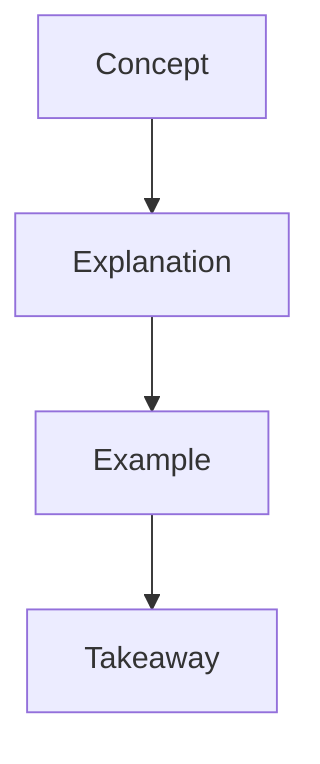
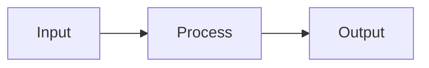
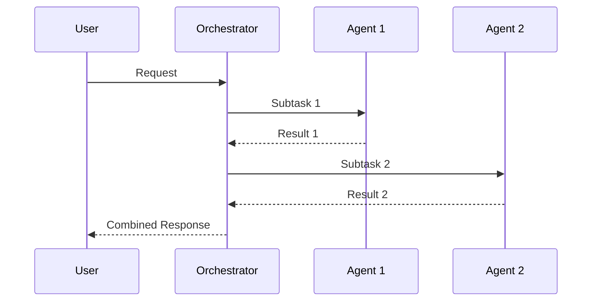

# Content Automation Skill

Agent-powered content factory for personal brand building and multi-platform content distribution.

## When to Use This Skill

- Creating technical articles for blog/GitHub Pages
- Generating platform-optimized social posts (LinkedIn, Facebook)
- Producing YouTube video scripts from articles
- Creating diagrams and visual content
- Setting up publishing automation pipelines
- Managing content calendar and cross-linking

---

## Core Principles

### 1. Single Source of Truth (SSOT)

**Always start with a Markdown source file**. All derivative content flows from this:

```
/articles/topic-name.md   ← THE SOURCE
    │
    ├─▶ Blog (full article)
    ├─▶ LinkedIn (professional summary)
    ├─▶ Facebook (community teaser)
    └─▶ YouTube (video script)
```

### 2. Platform-Native Optimization

Each platform has different requirements. **Never copy-paste across platforms**:

| Platform | Format | Tone | Length |
|----------|--------|------|--------|
| Blog | Full Markdown | Educational, thorough | 2000-2500 words |
| LinkedIn | Text + emoji | Professional, insightful | 200-300 words |
| Facebook | Conversational | Community, discussion | 100-200 words |
| YouTube | Script format | Engaging, visual | 8-12 min script |

### 3. Visual-First Content

Technical content should include diagrams. Use Mermaid syntax:



---

## Content Templates

### Article Template

```markdown
# [Title]

> [One-line hook - the key insight]

## The Problem。

Why this matters. What pain point does it solve?

## The Concept

Core idea explained simply. Use analogies.

## How It Works

High-level explanation with diagrams.



## When to Use It

Decision framework. Clear use cases.

## Example

Brief, practical code or architecture example.

## Key Takeaways

- Takeaway 1
- Takeaway 2
- Takeaway 3

## What's Next

- 📹 Watch the demo: [YouTube link]
- 📖 Related article: [link]
```

### LinkedIn Post Template

```markdown
🧠 [Title - with emoji]

[1-2 sentence hook revealing the key insight]

[Brief context - why this matters]

Key takeaway:
→ [The most important point in one line]

Read the full article: [link]

#Tag1 #Tag2 #Tag3
```

### Facebook Post Template

```markdown
🚀 New article: [Title]

[Question that sparks discussion]

[1-2 sentences teasing the content]

What's your experience with [topic]? 👇

[link]
```

### YouTube Script Template

```markdown
# [Video Title]

## Hook (0:00 - 0:30)
[Attention-grabbing opening - state the problem]

## Problem (0:30 - 2:00)
[Expand on why this matters - pain points]

## Solution Overview (2:00 - 4:00)
[High-level solution - the concept]

## Deep Dive (4:00 - 7:00)
[Detailed explanation with visuals]

## Demo (7:00 - 9:00)
[Live demonstration or walkthrough]

## Summary & CTA (9:00 - 10:00)
[Key takeaways + call to action]
- Like and subscribe
- Read the full article: [link]
- Comment your questions
```

---

## Automation Workflows

### Workflow 1: Article → Social Posts

When user provides an article, generate platform-specific social posts:

1. **Extract key insights** from the article
2. **Identify the hook** - the most compelling insight
3. **Generate LinkedIn post** - professional, insightful
4. **Generate Facebook post** - conversational, discussion-oriented
5. **Include proper hashtags and CTA**

### Workflow 2: Article → YouTube Script

Transform article into video-optimized script:

1. **Extract main sections** from article
2. **Create hook** from problem statement
3. **Structure for video** (hook → problem → solution → demo → CTA)
4. **Add timing markers**
5. **Include B-roll/visual suggestions**

### Workflow 3: Video Transcript → Article

When video transcript is provided:

1. **Clean up transcript** (remove filler words, fix grammar)
2. **Structure into article format**
3. **Add headers and sections**
4. **Create diagrams from explained concepts**
5. **Add code examples if mentioned**

### Workflow 4: Diagram Generation

Generate Mermaid diagrams from content:

1. **Identify concepts** that benefit from visualization
2. **Choose appropriate diagram type**:
   - `flowchart` for processes
   - `sequenceDiagram` for interactions
   - `classDiagram` for relationships
   - `mindmap` for concept maps
3. **Generate clean Mermaid syntax**
4. **Embed in article**

---

## Content Repository Structure

Recommended structure for content workspace:

```
/content
├── /articles/              # Source of truth
│   ├── YYYY-MM-topic.md    # Named with date prefix
│   └── ...
├── /videos/
│   ├── topic-name/
│   │   ├── script.md
│   │   ├── timestamps.md
│   │   └── thumbnail.png
│   └── ...
├── /social/
│   ├── linkedin/
│   │   └── YYYY-MM-DD-topic.md
│   └── facebook/
│       └── YYYY-MM-DD-topic.md
└── /assets/
    ├── diagrams/
    └── images/
```

---

## Publishing Pipeline

### Manual Publishing Checklist

1. [ ] Article reviewed and proofread
2. [ ] Diagrams rendered correctly
3. [ ] Cross-links updated
4. [ ] Social posts generated
5. [ ] YouTube script created (if applicable)
6. [ ] Scheduled publication dates

### Automated Pipeline (GitHub Actions)

```yaml
name: Publish Content

on:
  push:
    paths:
      - 'content/articles/**'

jobs:
  publish:
    runs-on: ubuntu-latest
    steps:
      - name: Build Blog
        run: npm run build
      
      - name: Deploy to GitHub Pages
        uses: peaceiris/actions-gh-pages@v3
      
      - name: Generate Social Posts
        run: node scripts/generate-social.js
```

---

## Quality Checklist

Before publishing any content:

### Article Quality
- [ ] Clear, compelling title
- [ ] Hook in first paragraph
- [ ] Problem clearly stated
- [ ] Solution explained with diagrams
- [ ] Practical examples included
- [ ] Key takeaways summarized
- [ ] Cross-links to related content

### Social Post Quality
- [ ] Platform-appropriate tone
- [ ] Key insight highlighted
- [ ] Clear call to action
- [ ] Relevant hashtags (LinkedIn)
- [ ] Discussion prompt (Facebook)

### Video Script Quality
- [ ] Strong hook in first 30 seconds
- [ ] Clear structure with timing
- [ ] Visual suggestions included
- [ ] Demo section planned
- [ ] CTA at the end

---

## Integration with Other Skills

This skill works well with:

- **ai-multimodal**: For video transcription and image generation
- **mermaidjs-v11**: For diagram creation
- **media-processing**: For thumbnail and video processing
- **web-frameworks**: For blog setup (Astro, Next.js)

---

## Examples

### Example: Generate LinkedIn Post from Article

**Input**: Article about multi-agent architecture

**Output**:
```
🧠 Multi-Agent Architecture: The Orchestra Analogy

Why do orchestras outperform one-man bands? 
The same principle applies to AI systems.

After building production multi-agent systems, 
here's the key insight:

→ Specialized agents with clear roles beat 
   monolithic models trying to do everything.

The secret? Think conductor, not performer.

Read the full breakdown: [link]

#MultiAgentAI #LLMArchitecture #AIEngineering
```

### Example: Generate Mermaid Diagram

**Input**: "Explain the agent orchestration flow"

**Output**:


---

## Related Resources

- [Content Automation Strategy](file:///docs/content-automation-strategy.md)
- [Content Strategy](file:///content-strategy.md)
- [Mermaid.js Skill](../.agent/skills/mermaidjs-v11/SKILL.md)
