> "Your agents can call tools. But can they call each other?"

---

## The Problem

You've built a multi-agent system. Your agents work beautifully together—until you need to add an agent from a different vendor.

- Your LangChain agent can't talk to your CrewAI agent.
- Your internal assistant can't collaborate with your vendor's support agent.
- Every integration is custom code.

**The issue**: Agents are siloed by framework.

| The Failure Mode | What Happens |
|------------------|--------------|
| 🔒 **Vendor Lock-in** | Agents only work within their ecosystem |
| 🔧 **Custom Integration Tax** | N agents × M vendors = N×M integrations |
| 🚫 **No Discovery** | Agents can't find or understand each other |
| 🔀 **Protocol Mismatch** | Different data formats, auth schemes, capabilities |

---

## Enter A2A: The Agent Interoperability Protocol

In April 2025, Google released the **Agent-to-Agent (A2A) Protocol**—an open standard for agents to discover, communicate, and collaborate across vendors and frameworks.

### A2A vs. MCP: Complementary Protocols

| Protocol | Connects | Purpose |
|----------|----------|---------|
| **MCP** (Anthropic) | Agents ↔ Tools/Data | Give agents capabilities |
| **A2A** (Google) | Agents ↔ Agents | Let agents collaborate |

```mermaid
flowchart LR
    subgraph AgentA["🤖 Agent A"]
        A1["LangChain"]
    end
    
    subgraph AgentB["🤖 Agent B"]
        B1["CrewAI"]
    end
    
    subgraph Tools["🔧 Tools"]
        T1["Database"]
        T2["API"]
    end
    
    AgentA <-->|"A2A"| AgentB
    AgentA -->|"MCP"| Tools
    AgentB -->|"MCP"| Tools
```



> **Key Insight**: MCP lets agents use tools. A2A lets agents use *each other*.

---

## The 5 Design Principles

A2A was built on five core principles:

| Principle | What It Means |
|-----------|---------------|
| **1. Natural Agentic Capabilities** | Agents communicate as agents, not as tools |
| **2. Built on Existing Standards** | HTTP, SSE, JSON-RPC—no new infrastructure |
| **3. Enterprise Security by Default** | Authentication, authorization, audit trails |
| **4. Long-Running Task Support** | Tasks can span minutes, hours, or days |
| **5. Modality Agnostic** | Text, audio, video, structured data |

---

## Core Concepts

### 1. Agent Cards: The Agent's Resume

Every A2A-compatible agent publishes an **Agent Card**—a JSON document describing its capabilities.

```json
{
  "name": "Customer Support Agent",
  "description": "Handles customer inquiries, refunds, and escalations",
  "capabilities": [
    "answer_faq",
    "process_refund",
    "escalate_to_human"
  ],
  "input_modalities": ["text", "image"],
  "output_modalities": ["text"],
  "authentication": {
    "type": "oauth2",
    "scopes": ["customer:read", "orders:write"]
  },
  "endpoint": "https://support-agent.example.com/a2a"
}
```

**Why It Matters**: Agents can discover each other's capabilities without prior integration.

### 2. Client vs. Remote Agents

| Role | Description |
|------|-------------|
| **Client Agent** | Initiates collaboration, sends tasks |
| **Remote Agent** | Receives tasks, returns results |

An agent can be both—receiving tasks from one agent while delegating to another.

```mermaid
flowchart TD
    U["👤 User"] --> C["🤖 Client Agent\n(Orchestrator)"]
    C --> R1["🤖 Remote Agent\n(Research)"]
    C --> R2["🤖 Remote Agent\n(Writing)"]
    R1 --> C
    R2 --> C
```



### 3. Task Lifecycle

A2A defines clear task states:


**Long-Running Tasks**: Unlike synchronous APIs, A2A supports tasks that take hours. The client can poll for status or receive streaming updates.

---

## How A2A Communication Works

### The Request Flow


### Streaming Updates

For real-time collaboration, A2A supports Server-Sent Events (SSE):

```
POST /tasks/{id}/stream

event: progress
data: {"status": "working", "message": "Analyzing input..."}

event: progress
data: {"status": "working", "message": "Generating response..."}

event: complete
data: {"status": "completed", "result": {...}}
```

---

## Enterprise Security

A2A was designed for enterprise from day one:

| Security Feature | Implementation |
|-----------------|----------------|
| **Authentication** | OAuth 2.0, API keys, mutual TLS |
| **Authorization** | Scope-based permissions per capability |
| **Audit Trail** | Every task logged with full context |
| **Data Governance** | PII handling policies in Agent Card |

### Example: Scoped Access

```json
{
  "capabilities": [
    {
      "name": "process_refund",
      "required_scopes": ["orders:write", "payments:refund"],
      "max_amount": 500
    }
  ]
}
```

---

## A2A vs. Direct Integration

| Approach | Effort | Flexibility | Security |
|----------|--------|-------------|----------|
| **Custom API Integration** | High (per vendor) | Low | Variable |
| **Shared Database** | Medium | Low | Low |
| **Message Queue** | Medium | Medium | Medium |
| **A2A Protocol** | Low (once) | High | Built-in |

---

## When to Use A2A

### ✅ Good Fit

| Scenario | Why A2A Works |
|----------|---------------|
| Multi-vendor agent ecosystem | Standard protocol, no custom integration |
| Long-running collaborative tasks | Built-in task lifecycle |
| Cross-department agent mesh | Enterprise security and discovery |
| Partner/customer agent integration | Agent Cards enable dynamic discovery |

### ❌ Not a Fit

| Scenario | Better Alternative |
|----------|-------------------|
| Agents in same codebase | Direct function calls |
| Simple tool calling | MCP |
| Real-time sub-second responses | Direct API |

---

## The A2A Ecosystem

As of 2025, A2A has support from 50+ partners:

| Category | Partners |
|----------|----------|
| **Enterprise** | Salesforce, SAP, ServiceNow, Workday |
| **Developer** | LangChain, MongoDB, Box |
| **Finance** | PayPal, Intuit |
| **AI Providers** | Cohere, Google |

---

## Key Takeaways

- ✅ **A2A complements MCP**: MCP for tools, A2A for agent collaboration.
- ✅ **Agent Cards enable discovery**: Agents describe their capabilities in JSON.
- ✅ **Task lifecycle is first-class**: Built for long-running, async operations.
- ✅ **Enterprise security by default**: OAuth, scopes, audit trails.
- ✅ **Built on standards**: HTTP, SSE, JSON-RPC—nothing proprietary.

---

## What's Next

- 📖 **Previous article**: [Context Engineering: Sessions & Memory](/Harry-the-architect/blog/context-engineering-sessions-memory/)
- 📖 **Next article**: [Agentic Coding Assistants](/Harry-the-architect/blog/agentic-coding-assistants/) — Cursor, Windsurf, and Copilot patterns.
- 💬 **Discuss**: Are you using A2A or MCP in your agent systems?

---

## References

1.  **Google Cloud** — *Announcing the Agent-to-Agent (A2A) Protocol* (April 2025). The official launch announcement.

2.  **Google Developers** — *A2A Protocol Specification*. Technical documentation and JSON schemas.

3.  **Gravitee** — *A2A and MCP: Two Protocols to Rule the Agentic Web* (2025). Analysis of how the protocols complement each other.

4.  **Platform Engineering** — *A2A Deep Dive* (2025). Enterprise implementation patterns.
