> "Judging an agent by its final answer is like judging a chef by the last bite. You miss the entire process that got you there."

---

## The Problem

You're evaluating your agent. You check the final output—it's correct!

But wait:
- The agent took 47 steps when 5 would have worked.
- It called the wrong tool twice before finding the right one.
- It got the right answer... by accident.

**LLM-as-Judge catches the last problem. It misses the first two.**

| What LLM-as-Judge Sees | What It Misses |
|------------------------|----------------|
| ✅ Final output quality | ❌ Reasoning efficiency |
| ✅ Answer correctness | ❌ Tool selection quality |
| ✅ Response format | ❌ Planning soundness |
| ✅ Tone and style | ❌ Self-correction patterns |

**Agent-as-a-Judge evaluates the entire trajectory, not just the destination.**

---

## The Paradigm Shift

Google's *Agent Quality* guide introduces this evolution:

| Paradigm | What It Evaluates | Best For |
|----------|-------------------|----------|
| **Rule-Based** | Format, syntax, constraints | Structural validation |
| **LLM-as-Judge** | Output quality, semantics | Text generation |
| **Agent-as-a-Judge** | Full trajectory + outcome | Agentic systems |

```mermaid
flowchart LR
    subgraph Traditional["LLM-as-Judge"]
        I1["Input"] --> O1["Output"]
        O1 --> J1["⚖️ Judge Output"]
    end
    
    subgraph Agentic["Agent-as-Judge"]
        I2["Input"] --> T["Trajectory"]
        T --> O2["Output"]
        T --> J2["⚖️ Judge Process"]
        O2 --> J2
    end
```



---

## The Two-View Framework

### View 1: Outside-In (The Black Box)

Start by evaluating the final result:

| Metric | What It Measures |
|--------|------------------|
| **Task Success Rate** | Did the agent achieve the goal? |
| **User Satisfaction** | Thumbs up/down, CSAT scores |
| **Output Quality** | Accuracy, completeness, correctness |

> **If the agent scores 100% here, you may be done.**

But in complex systems, it rarely will. When failures occur, we open the box.

### View 2: Inside-Out (The Glass Box)

Analyze the trajectory—every step the agent took:

```mermaid
flowchart TD
    subgraph Trajectory["🧠 Agent Trajectory"]
        S1["Step 1: Understand goal"]
        S2["Step 2: Make plan"]
        S3["Step 3: Call tool A"]
        S4["Step 4: Observe result"]
        S5["Step 5: Adjust plan"]
        S6["Step 6: Call tool B"]
        S7["Step 7: Generate response"]
    end
    
    S1 --> S2 --> S3 --> S4 --> S5 --> S6 --> S7
```



**Trajectory evaluation asks:**

| Dimension | Question |
|-----------|----------|
| **Planning** | Was the plan logical and efficient? |
| **Tool Selection** | Did it choose the right tools? |
| **Tool Usage** | Were parameters correct? |
| **Adaptation** | Did it adjust when things failed? |
| **Efficiency** | Minimum steps to goal? |

---

## The Quality Metrics

### Trajectory-Specific Metrics

| Metric | Formula | Target |
|--------|---------|--------|
| **Tool Call Accuracy** | Correct calls / Total calls | >90% |
| **Planning Efficiency** | Actual steps / Optimal steps | <1.5x |
| **Self-Correction Rate** | Errors recovered / Errors made | >80% |
| **Hallucination Rate** | Unsupported claims / Total claims | <5% |

### The Agent Quality Flywheel

Google defines a continuous improvement cycle:

```mermaid
flowchart LR
    E["📊 Evaluate"] --> A["📈 Analyze"]
    A --> I["💡 Improve"]
    I --> D["🚀 Deploy"]
    D --> O["👁️ Observe"]
    O --> E
```



Each iteration:
1. **Evaluate** production samples
2. **Analyze** failure patterns
3. **Improve** prompts, tools, or logic
4. **Deploy** the update
5. **Observe** the impact

---

## Building an Agent-as-Judge

### Step 1: Define Your Rubric

```yaml
trajectory_rubric:
  planning:
    5: "Optimal plan, minimal steps"
    3: "Reasonable plan, some inefficiency"
    1: "No clear plan, random actions"
  
  tool_usage:
    5: "Correct tool, correct parameters"
    3: "Correct tool, minor parameter issues"
    1: "Wrong tool or major parameter errors"
  
  adaptation:
    5: "Smoothly recovered from errors"
    3: "Eventually recovered with retries"
    1: "Failed to adapt, gave up"
```

### Step 2: Design the Judge Prompt

```markdown
You are evaluating an AI agent's execution trajectory.

## Task
{original_task}

## Trajectory
{step_by_step_log}

## Final Output
{agent_output}

## Evaluation Criteria

For each dimension, score 1-5 with justification:

1. **Planning Quality**: Was the approach logical?
2. **Tool Selection**: Were the right tools chosen?
3. **Execution Efficiency**: How many steps vs. optimal?
4. **Error Handling**: Did it recover from mistakes?
5. **Final Quality**: Is the output correct and complete?

Provide:
- Scores for each dimension
- Overall verdict: PASS / FAIL
- Key improvements suggested
```

### Step 3: Implement Multi-Aspect Evaluation

```mermaid
flowchart TD
    T["📋 Trajectory Log"] --> J1["🧠 Planning Judge"]
    T --> J2["🔧 Tool Usage Judge"]
    T --> J3["🔄 Adaptation Judge"]
    O["📤 Final Output"] --> J4["✅ Quality Judge"]
    
    J1 & J2 & J3 & J4 --> A["📊 Aggregate Score"]
    A --> V{{"Pass?"}}
    V -->|Yes| P["✅ Approved"]
    V -->|No| F["🔄 Flag for Review"]
```



---

## When to Use Each Paradigm

| Scenario | Best Evaluator |
|----------|----------------|
| Simple Q&A | Rule-based + LLM-as-Judge |
| Content generation | LLM-as-Judge |
| Multi-step workflows | **Agent-as-a-Judge** |
| Tool-heavy agents | **Agent-as-a-Judge** |
| High-stakes decisions | **Agent-as-a-Judge** + Human |

---

## The Three Pillars of Agent Quality

Google's framework defines three pillars:

| Pillar | Focus | Key Question |
|--------|-------|--------------|
| **Capability** | Can the agent do the task? | Does it have the right tools and knowledge? |
| **Reliability** | Does it work consistently? | Does it succeed under varied conditions? |
| **Safety** | Does it avoid harm? | Does it stay within bounds? |

```mermaid
flowchart TD
    subgraph Quality["🏛️ Agent Quality"]
        C["💪 Capability"]
        R["🔄 Reliability"]
        S["🛡️ Safety"]
    end
    
    C --> Q["✅ Quality Agent"]
    R --> Q
    S --> Q
```



---

## Key Takeaways

- ✅ **Judge the journey, not just the destination**: Trajectory matters
- ✅ **Outside-In first**: Check final output before opening the box
- ✅ **Multi-aspect rubrics**: Planning, tools, adaptation, quality
- ✅ **Agent-as-Judge for agents**: LLM-as-Judge was built for text, not actions
- ✅ **The Quality Flywheel**: Evaluate → Analyze → Improve → Deploy → Observe
- ✅ **Three Pillars**: Capability, Reliability, Safety

> 📖 **Deep Dive**: For LLM-as-Judge techniques like rubrics, pairwise comparison, and bias mitigation, see [LLM-as-a-Judge Deep Dive](/Harry-the-architect/blog/llm-as-judge-deep-dive/).

---

## What's Next

- 📖 **Previous article**: [AgentOps: Observability in Production](/Harry-the-architect/blog/agentops-observability-production/)
- 📖 **Next article**: [CI/CD for AI Agents: The Deployment Pipeline](/Harry-the-architect/blog/cicd-ai-agents-pipeline/) — Building pipelines that handle prompts, tools, and models.
- 💬 **Discuss**: Are you evaluating your agents' trajectories or just their outputs?

---

## References

1.  **Google Cloud Research** — *Agent Quality* (2025). Defines the Agent-as-a-Judge paradigm and the Quality Flywheel framework.

2.  **Google** — *Agent Development Kit (ADK)* (2025). Tooling for trajectory capture and evaluation.

3.  **Anthropic** — *Building Effective Agents* (2024). Emphasizes process evaluation over output-only metrics.

4.  **ArXiv** — *Trajectory Evaluation for Autonomous Agents* (2025). Academic foundations for step-by-step assessment.
