> "The best code assistant doesn't just complete your line—it completes your thought."

---

## The Problem

Traditional code completion tools are reactive. You type, they predict. You accept or reject. Repeat.

But modern development demands more:

| The Old Model | What We Actually Need |
|---------------|----------------------|
| Predict the next token | Understand the task |
| Complete this line | Complete this feature |
| Suggest a snippet | Refactor this module |
| Answer one question | Debug this entire flow |

**The gap**: We've been using AI as a fancy autocomplete when we need an AI *teammate*.

---

## Enter Agentic Coding Assistants

A new generation of tools has emerged: **Cursor**, **Windsurf**, and **GitHub Copilot** (with Agent Mode). These aren't just code completers—they're autonomous coding agents.

### What Makes Them "Agentic"?

| Capability | Traditional Copilot | Agentic Assistant |
|------------|--------------------|--------------------|
| **Scope** | Single line/function | Entire codebase |
| **Action** | Suggests code | *Executes* changes |
| **Context** | Current file | All files + terminal + docs |
| **Autonomy** | You drive | It can drive (with guardrails) |
| **Iteration** | One-shot | Loop until success |

---

## The Big Three: A Comparison

### Cursor

**Philosophy**: VS Code fork with deep AI integration and controllable autonomy.

| Feature | How It Works |
|---------|--------------|
| **Agent Mode** | Writes functions, refactors across files, runs terminal commands |
| **Autonomy Slider** | Control how independent the AI is—from basic completion to full agentic |
| **Project Understanding** | Indexes entire codebase, learns patterns and conventions |
| **Rules Engine** | `.cursor/rules` for customized AI behavior per project |

**Best For**: Developers who want power + control in a familiar VS Code environment.

```mermaid
flowchart LR
    D["👤 Developer"] --> C["🤖 Cursor Agent"]
    C --> A["📁 Codebase Analysis"]
    C --> T["📄 Terminal Commands"]
    C --> E["✏️ Multi-file Edits"]
    A --> C
    T --> C
    E --> C
```



### Windsurf

**Philosophy**: "AI teammate" with proactive suggestions and full-context awareness.

| Feature | How It Works |
|---------|--------------|
| **Cascade** | Multi-file editing with checkpoints—like AutoGPT for code |
| **Supercomplete** | Predicts intent, generates full functions with docstrings |
| **Proactive Mode** | Suggests refactors without being asked |
| **Memories** | Stores style guidelines for consistency across sessions |
| **MCP Support** | Connects to external tools and services |

**Best For**: Teams wanting a collaborative AI that learns their conventions.

### GitHub Copilot (Agent Mode)

**Philosophy**: Deeply integrated with GitHub ecosystem, evolving toward full lifecycle support.

| Feature | How It Works |
|---------|--------------|
| **Agent Mode** | Converts prompts to code, runs commands, fixes errors in real-time |
| **Cross-Agent Memory** | Remembers context across coding, CLI, and code review |
| **Multi-Model** | GPT-4o, Claude 3.7, Gemini 2.0 available in premium tiers |
| **Copilot Edits** | Multi-file changes with conversational context |
| **MCP Support** | Integrates with custom LLMs and GitHub features |

**Best For**: Teams already invested in GitHub, wanting end-to-end workflow integration.

---

## Comparison Matrix

| Dimension | Cursor | Windsurf | Copilot |
|-----------|--------|----------|---------|
| **Base IDE** | VS Code fork | Standalone | VS Code extension |
| **Autonomy Control** | Slider (very granular) | Mode-based | Task-based |
| **Proactive Suggestions** | On request | Automatic | Emerging |
| **Multi-file Editing** | ✅ Strong | ✅ Strong | ✅ Growing |
| **Terminal Integration** | ✅ | ✅ | ✅ |
| **Custom Rules** | ✅ .cursor/rules | ✅ Memories | ✅ Custom Instructions |
| **MCP Support** | ❌ | ✅ | ✅ |
| **Enterprise Security** | Standard | SOC-2, on-premise | GitHub Enterprise |
| **Pricing** | $20/mo Pro | $15/mo Pro | $19/mo Business |

---

## The Workflow Shift

### Before: You Drive, AI Assists

```
You type → AI predicts → You accept/reject → You type more
```

### After: You Direct, AI Executes

```mermaid
flowchart TD
    U["👤 Developer: 'Add user authentication'"] --> A["🤖 Agent"]
    A --> P["📋 Plans changes"]
    P --> E["✏️ Edits files"]
    E --> T["🖥️ Runs tests"]
    T --> F{Pass?}
    F -->|No| D["🔧 Debug & retry"]
    D --> E
    F -->|Yes| R["✅ Reports completion"]
```



---

## Best Practices for Agentic Coding

### 1. Start with Clear Intent

| ❌ Vague | ✅ Specific |
|----------|-------------|
| "Fix the bug" | "The login form submits twice when Enter is pressed. Debug and fix." |
| "Add tests" | "Add unit tests for the UserService class, covering edge cases for null inputs." |
| "Refactor this" | "Extract the validation logic from handleSubmit into a separate validateForm function." |

### 2. Use Project Rules

All three tools support project-specific customization:

**Cursor** (`.cursor/rules`):
```yaml
# Prefer async/await over .then()
# Use TypeScript strict mode
# Follow kebab-case for file names
```

**Windsurf** (Memories):
```
Always use named exports
Use Tailwind for styling
Error messages must be user-friendly
```

**Copilot** (Custom Instructions):
```
Prefer functional components
Use React Query for data fetching
Follow our internal API naming conventions
```

### 3. Review Checkpoints

Agentic assistants often work in steps. Review at each checkpoint:

```mermaid
flowchart LR
    subgraph "Agent Workflow"
        S["Start"] --> C1["Checkpoint 1\n(Plan)"]
        C1 --> C2["Checkpoint 2\n(Changes)"]
        C2 --> C3["Checkpoint 3\n(Tests)"]
        C3 --> E["Complete"]
    end
    
    D["👤 Review"] -.-> C1
    D -.-> C2
    D -.-> C3
```



### 4. Trust But Verify

| What the Agent Does Well | What You Should Double-Check |
|--------------------------|------------------------------|
| Boilerplate generation | Security implications |
| Pattern-following | Business logic correctness |
| Multi-file consistency | Edge cases |
| Test scaffolding | Test coverage quality |

---

## When to Use Which

| Scenario | Best Choice |
|----------|-------------|
| Deep refactor across 20+ files | Windsurf Cascade or Cursor Agent |
| Quick function completion | Any (all excel here) |
| GitHub PR workflow integration | Copilot |
| Need on-premise/SOC-2 | Windsurf |
| Want maximum control over autonomy | Cursor |
| Already in VS Code, minimal setup | Copilot |

---

## The Future: What's Coming

| Trend | What It Means |
|-------|---------------|
| **Cross-Agent Memory** | Agents that remember your coding patterns across sessions |
| **Multi-Model Routing** | Automatically select GPT/Claude/Gemini based on task |
| **Autonomous Background Tasks** | Agents fixing issues while you sleep |
| **A2A Integration** | Your coding agent calling your infrastructure agent |

---

## Key Takeaways

- ✅ **Agentic ≠ autocomplete**: These tools execute, iterate, and learn.
- ✅ **All three are competitive**: Cursor for control, Windsurf for collaboration, Copilot for GitHub integration.
- ✅ **Clear prompts win**: Specificity beats vagueness.
- ✅ **Project rules matter**: Customize the AI to your conventions.
- ✅ **Trust but verify**: Review at checkpoints, especially for security and logic.

---

## What's Next

- 📖 **Previous article**: [A2A Protocol: Agent-to-Agent Collaboration](/Harry-the-architect/blog/a2a-protocol-agent-collaboration/)
- 📖 **Next article**: [Eval & Benchmarking: Measuring Agent Quality](/Harry-the-architect/blog/eval-benchmarking-agent-quality/) — How do you know your agent is good?
- 💬 **Discuss**: Which agentic coding assistant do you use?

---

## References

1.  **Cursor** — *Agent Mode Documentation* (2025). Official docs on Cursor's agentic capabilities.

2.  **Windsurf (Codeium)** — *Supercomplete and Cascade Features* (2025). Product documentation.

3.  **GitHub** — *Copilot Agent Mode and Cross-Agent Memory* (2025). GitHub Blog announcements.

4.  **DataCamp** — *Windsurf AI: Features and Capabilities* (2025). Third-party analysis.
