> "You can't fix what you can't see. And in production, everything that can go wrong, will."

---

## The Problem

Your agent passed all tests. You deployed it. Users love it.

Then something breaks:
- A customer reports nonsense responses.
- Costs spike unexpectedly.
- The agent starts calling the wrong tools.

**You have no idea why.**

| The Visibility Gap | What Happens |
|--------------------|--------------|
| 🔍 **No Request Tracing** | You can't see the chain of decisions that led to the failure |
| 📊 **No Metrics** | You discover cost overruns from the invoice, not alerts |
| 🧠 **No Reasoning Logs** | The agent's "thinking" is a black box |
| 🔧 **No Tool Audit** | Which tools were called? With what parameters? |

**AgentOps is the discipline of making your agent's behavior visible, measurable, and debuggable in production.**

---

## The Ops Framework: Observe → Act → Evolve

Google's *Prototype to Production* guide defines three core operational pillars:

```mermaid
flowchart LR
    subgraph Observe["👁️ Observe"]
        L["Logs"]
        M["Metrics"]
        T["Traces"]
    end
    
    subgraph Act["⚡ Act"]
        A["Alerts"]
        C["Controls"]
        F["Fallbacks"]
    end
    
    subgraph Evolve["🔄 Evolve"]
        E["Evaluation"]
        I["Improvement"]
        D["Deploy"]
    end
    
    Observe --> Act --> Evolve --> Observe
```



---

## Pillar 1: Observe — Your Agent's Sensory System

### What to Log

Every agent interaction should capture:

| Layer | What to Log | Why |
|-------|-------------|-----|
| **Request** | session_id, user_id, timestamp, input | Correlate issues to users/sessions |
| **Reasoning** | Model's plan, chain-of-thought | Debug *why* the agent chose an action |
| **Tool Calls** | tool_name, parameters, latency, result | Audit external system interactions |
| **Response** | output, token_count, total_latency | Measure quality and cost |
| **Errors** | error_type, stack_trace, retry_count | Root cause analysis |

### Structured Logging Pattern

```python
log_entry = {
    "session_id": "abc123",
    "timestamp": "2026-01-21T10:30:00Z",
    "event_type": "tool_call",
    "tool_name": "query_database",
    "parameters": {"table": "users", "filter": "active=true"},
    "latency_ms": 245,
    "success": True,
    "token_count": {"input": 150, "output": 320}
}
```

### The Trace: Connecting the Dots

A **trace** links all events in a single agent interaction:

```mermaid
flowchart TD
    R["📥 Request: 'Find active users'"] --> P["🧠 Plan: Query DB → Format → Respond"]
    P --> T1["🔧 Tool: query_database"]
    T1 --> T2["🔧 Tool: format_results"]
    T2 --> O["📤 Response: '42 active users'"]
    
    style R fill:#e1f5fe
    style O fill:#e8f5e9
```



**Why traces matter**: When a request fails, you can replay the exact sequence of decisions.

---

## Pillar 2: Act — The Levers of Control

### Key Metrics and Alerts

| Metric | Target | Alert Threshold |
|--------|--------|-----------------|
| **Success Rate** | >99% | <95% |
| **P50 Latency** | <2s | >5s |
| **P99 Latency** | <10s | >30s |
| **Token Cost/Request** | <$0.02 | >$0.10 |
| **Tool Error Rate** | <1% | >5% |

### Operational Controls

When things go wrong, you need levers to respond:

| Control | When to Use |
|---------|-------------|
| **Rate Limiting** | Cost running away, abuse detected |
| **Circuit Breaker** | Downstream service failing |
| **Feature Flags** | Disable risky capabilities instantly |
| **Model Fallback** | Primary model degraded → switch to backup |
| **Human Escalation** | High-stakes decisions, unusual requests |

### The Response Playbook


---

## Pillar 3: Evolve — Learning from Production

### The Feedback Loop

Production data is your best teacher:

```mermaid
flowchart LR
    P["📊 Production Logs"] --> A["📈 Analyze Patterns"]
    A --> I["💡 Identify Issues"]
    I --> F["🔧 Fix/Improve"]
    F --> E["✅ Evaluate"]
    E --> D["🚀 Deploy"]
    D --> P
```



### What to Analyze

| Pattern | What It Reveals | Action |
|---------|-----------------|--------|
| **Frequent tool failures** | Integration issues | Fix connector or add fallback |
| **Token count spikes** | Prompt bloat, verbose responses | Optimize prompts |
| **Repeated user clarifications** | Ambiguous first responses | Improve understanding |
| **Long traces** | Inefficient reasoning | Simplify agent logic |

### Continuous Evaluation

> **Key Practice**: Run your evaluation suite on production samples regularly.

Compare production behavior against your "golden dataset" to catch drift:

| Metric | Baseline | Current | Status |
|--------|----------|---------|--------|
| Task Success Rate | 94% | 91% | ⚠️ Degraded |
| Average Latency | 1.8s | 2.3s | ⚠️ Slower |
| User Satisfaction | 4.2/5 | 4.1/5 | ✅ Stable |

---

## The AgentOps Stack

A production-ready observability setup:

| Layer | Tools | Purpose |
|-------|-------|---------|
| **Logging** | Cloud Logging, Datadog | Structured event capture |
| **Tracing** | OpenTelemetry, LangSmith | Request-level correlation |
| **Metrics** | Prometheus, Grafana | Dashboards and alerts |
| **Evaluation** | Vertex AI Eval, Braintrust | Automated quality checks |

```mermaid
flowchart TD
    subgraph Agent["🤖 Agent"]
        A["Agent Code"]
    end
    
    subgraph Observability["📊 Observability Stack"]
        L["Logs"]
        T["Traces"]
        M["Metrics"]
    end
    
    subgraph Analysis["🔍 Analysis"]
        D["Dashboards"]
        AL["Alerts"]
        E["Evaluation"]
    end
    
    A --> L & T & M
    L & T & M --> D & AL & E
```



---

## Key Takeaways

- ✅ **Log everything structured**: session_id, tool calls, reasoning traces
- ✅ **Trace requests end-to-end**: Connect the dots from input to output
- ✅ **Alert on business metrics**: Success rate, cost, latency—not just errors
- ✅ **Have operational levers**: Rate limits, circuit breakers, fallbacks
- ✅ **Evolve from production data**: Your best training data comes from real usage
- ✅ **Evaluate continuously**: Catch drift before users report it

---

## What's Next

- 📖 **Previous article**: [Cost Optimization: Token Budgeting and Caching](/Harry-the-architect/blog/cost-optimization/)
- 📖 **Next article**: [Agent-as-a-Judge: Beyond LLM Evaluation](/Harry-the-architect/blog/agent-as-judge-evaluation/) — Evaluate the trajectory, not just the output.
- 💬 **Discuss**: What observability tools are you using for your agents?

---

## References

1.  **Google Cloud Research** — *Prototype to Production* (2025). Defines the Observe → Act → Evolve framework for agent operations.

2.  **OpenTelemetry** — *Distributed Tracing for LLM Applications*. Standard for request-level observability.

3.  **LangSmith** — *LLM Observability Platform*. Purpose-built tracing for agent workflows.

4.  **Anthropic** — *Building Effective Agents* (2024). Emphasizes logging and debugging patterns.
