> "An AI agent is a composite system. Testing just the code is like testing a car's engine without the wheels."

---

## The Problem

You've built your agent. Time to deploy.

You set up a standard CI/CD pipeline:
- Lint the code ✅
- Run unit tests ✅
- Deploy on merge ✅

**A week later, production is broken.** The code didn't change—the prompt did. Or the model version. Or the tool schema.

| What CI/CD Usually Tests | What Agents Need |
|--------------------------|------------------|
| ✅ Source code | Prompts, schemas, configs |
| ✅ API contracts | Model behavior consistency |
| ✅ Unit logic | End-to-end task success |
| ✅ Build success | Evaluation score thresholds |

**Agent CI/CD must treat prompts, tools, and model versions as first-class artifacts.**

---

## The Agent Artifact Stack

Every component must be versioned:

```mermaid
flowchart TD
    subgraph Artifacts["📦 Agent Artifacts"]
        C["💻 Code"]
        P["📝 Prompts"]
        T["🔧 Tool Schemas"]
        M["🧠 Model Version"]
        E["📊 Eval Datasets"]
    end
    
    Artifacts --> V["🏷️ Version Control"]
    V --> D["🚀 Deployment"]
```



| Artifact | Version Strategy |
|----------|------------------|
| **Code** | Git (standard) |
| **Prompts** | Git + semantic versioning |
| **Tool Schemas** | JSON Schema + Git |
| **Model Version** | Lock to specific model ID |
| **Eval Datasets** | Git LFS or dedicated storage |

---

## The Pipeline Architecture

### The Funnel: Fail Fast, Fail Cheap

```mermaid
flowchart TD
    subgraph Stage1["⚡ Fast Checks"]
        L["Lint"]
        U["Unit Tests"]
        S["Schema Validation"]
    end
    
    subgraph Stage2["🧪 Integration"]
        M["Mock Tool Tests"]
        P["Prompt Regression"]
    end
    
    subgraph Stage3["📊 Evaluation"]
        E["Golden Dataset Eval"]
        Q["Quality Gate"]
    end
    
    subgraph Stage4["🚀 Deploy"]
        C["Canary 1%"]
        R["Rollout"]
    end
    
    Stage1 --> Stage2 --> Stage3 --> Stage4
```



**Principle**: Catch cheap errors early. Expensive evaluations run last.

---

## Stage 1: Fast Checks (Seconds)

### Lint and Format

Standard code quality checks:

```yaml
- name: Lint
  run: |
    ruff check .
    black --check .
```

### Schema Validation

Ensure tool definitions are valid:

```python
def test_tool_schemas_valid():
    for tool in load_tools():
        jsonschema.validate(tool.schema, TOOL_SCHEMA_SPEC)
```

### Prompt Structure Checks

Verify prompts follow your standards:

```python
def test_prompts_have_required_sections():
    for prompt in load_prompts():
        assert "## Role" in prompt
        assert "## Output Format" in prompt
```

---

## Stage 2: Integration Tests (Minutes)

### Mock Tool Testing

Test agent logic without real tool calls:

```python
def test_agent_selects_correct_tool():
    agent = Agent(tools=mock_tools)
    result = agent.run("Query the user database")
    
    assert result.tool_calls[0].name == "query_database"
    assert "users" in result.tool_calls[0].params["table"]
```

### Prompt Regression Tests

Ensure prompt changes don't break behavior:

```python
def test_prompt_follows_format():
    response = agent.run("Summarize this document")
    
    # Check structure, not exact content
    assert response.startswith("## Summary")
    assert len(response) < 1000
```

---

## Stage 3: Evaluation Gate (Minutes to Hours)

### The Golden Dataset

A curated set of representative test cases:

```json
{
  "test_cases": [
    {
      "input": "What is our refund policy?",
      "expected_tool": "search_knowledge_base",
      "expected_contains": ["30 days", "full refund"]
    },
    {
      "input": "Transfer $500 to savings",
      "expected_tool": "bank_transfer",
      "requires_approval": true
    }
  ]
}
```

### Quality Gate Configuration

```yaml
evaluation:
  metrics:
    - name: task_success_rate
      threshold: 0.90
      blocking: true
    
    - name: tool_accuracy
      threshold: 0.85
      blocking: true
    
    - name: average_latency_ms
      threshold: 3000
      blocking: false
      
    - name: cost_per_request
      threshold: 0.05
      blocking: false
```

### Automated Evaluation

```python
def run_evaluation():
    results = evaluate_agent(
        agent=load_agent(),
        dataset=load_golden_dataset(),
        judges=[LLMJudge(), RuleBasedJudge()]
    )
    
    for metric in results.metrics:
        if metric.blocking and metric.value < metric.threshold:
            raise EvaluationFailed(f"{metric.name}: {metric.value}")
```

---

## Stage 4: Safe Deployment

### Deployment Strategies

| Strategy | Risk Level | When to Use |
|----------|------------|-------------|
| **Canary** | Low | Default for all changes |
| **Blue-Green** | Low | Major version updates |
| **A/B Testing** | Medium | Comparing approaches |
| **Feature Flags** | Flexible | Gradual rollout |

### Canary Deployment Flow


---

## Infrastructure as Code

### Example: Agent Deployment with Terraform

```hcl
resource "google_cloud_run_service" "agent" {
  name     = "my-agent"
  location = "us-central1"
  
  template {
    spec {
      containers {
        image = "gcr.io/${var.project}/agent:${var.version}"
        
        env {
          name  = "MODEL_VERSION"
          value = var.model_version
        }
        
        env {
          name = "PROMPT_VERSION"
          value = var.prompt_version
        }
      }
    }
  }
}
```

### Secrets Management

Never hardcode API keys:

```yaml
- name: Deploy
  env:
    OPENAI_API_KEY: ${{ secrets.OPENAI_API_KEY }}
    ANTHROPIC_API_KEY: ${{ secrets.ANTHROPIC_API_KEY }}
```

---

## The Complete Pipeline

```yaml
# .github/workflows/agent-ci.yml
name: Agent CI/CD

on:
  push:
    branches: [main]
  pull_request:

jobs:
  fast-checks:
    runs-on: ubuntu-latest
    steps:
      - uses: actions/checkout@v4
      - run: pip install -r requirements.txt
      - run: ruff check .
      - run: pytest tests/unit -v

  integration:
    needs: fast-checks
    runs-on: ubuntu-latest
    steps:
      - uses: actions/checkout@v4
      - run: pytest tests/integration -v

  evaluation:
    needs: integration
    runs-on: ubuntu-latest
    steps:
      - uses: actions/checkout@v4
      - run: python scripts/run_evaluation.py
      - run: python scripts/check_quality_gate.py

  deploy:
    needs: evaluation
    if: github.ref == 'refs/heads/main'
    runs-on: ubuntu-latest
    steps:
      - uses: actions/checkout@v4
      - run: ./deploy.sh --canary
```

---

## Key Takeaways

- ✅ **Version everything**: Code, prompts, tools, models, eval datasets
- ✅ **Funnel structure**: Cheap checks first, expensive evals last
- ✅ **Golden datasets**: Curated test cases for automated evaluation
- ✅ **Quality gates**: Block deployment if metrics fall below thresholds
- ✅ **Canary deployments**: Roll out gradually, monitor, and rollback fast
- ✅ **Infrastructure as Code**: Reproducible, auditable deployments

---

## What's Next

- 📖 **Previous article**: [Agent-as-a-Judge: Beyond LLM Evaluation](/Harry-the-architect/blog/agent-as-judge-evaluation/)
- 📖 **Next article**: [Safe Rollout Strategies for AI Agents](/Harry-the-architect/blog/safe-rollout-strategies/) — Canary, Blue-Green, A/B, and Feature Flags.
- 💬 **Discuss**: What does your agent CI/CD pipeline look like?

---

## References

1.  **Google Cloud Research** — *Prototype to Production* (2025). Defines the CI/CD pipeline structure and quality gate patterns.

2.  **GitHub Actions** — *CI/CD Best Practices* (2025). Modern pipeline configuration.

3.  **Terraform** — *Infrastructure as Code for AI Systems* (2025). Agent deployment automation.

4.  **Anthropic** — *Building Effective Agents* (2024). Emphasizes versioning and testing.
