> "Context engineering is what separates agents that forget mid-conversation from agents that remember you for years."

---

## The Problem

Your agent works great in testing. Single-turn queries? Perfect answers.

Then users have *conversations*:
- "What did we discuss yesterday?"
- "Update the recommendations based on what I told you earlier."
- "Remember my preferences for next time."

Your agent draws a blank. **Every conversation starts from zero.**

| The Failure Mode | Root Cause |
|------------------|------------|
| 🧠 **Mid-Conversation Amnesia** | No session management |
| 📅 **No Cross-Session Memory** | No persistent storage |
| 🔀 **Context Overflow** | Conversation exceeds token limit |
| 🎭 **Lost Personalization** | User preferences not retained |

---

## The Shift: Prompt Engineering → Context Engineering

> **Key Insight**: What information reaches the model matters more than how you phrase the prompt.

**Prompt Engineering** focuses on crafting the perfect instruction.

**Context Engineering** focuses on curating the optimal information for each moment:
- What does the model need to know *right now*?
- What should be loaded on-demand vs. pre-loaded?
- What should persist across conversations?

```mermaid
flowchart TD
    subgraph PromptEng["❌ Prompt Engineering"]
        P["Craft perfect prompt"]
    end
    
    subgraph ContextEng["✅ Context Engineering"]
        S["📋 Session State"]
        M["🧠 Long-term Memory"]
        T["🔧 Tool Results"]
        R["📚 Retrieved Knowledge"]
    end
    
    P --> LLM1["🤖 Model"]
    S --> C["Context Window"]
    M --> C
    T --> C
    R --> C
    C --> LLM2["🤖 Model"]
```

---

## Part 1: Sessions — Short-Term Memory

### What is a Session?

A **session** is the complete context for a single conversation:
- User messages
- Agent responses
- Tool calls and results
- Working state (e.g., items in a cart)

### The Session Lifecycle

### Production Session Requirements

| Requirement | Why It Matters |
|-------------|----------------|
| **Strict Isolation** | User A cannot see User B's session |
| **Persistence** | Survive server restarts |
| **Ordering** | Events must be chronological |
| **TTL Policy** | Sessions expire after inactivity |
| **PII Redaction** | Remove sensitive data before storage |

---

## Part 2: Memory Types — Long-Term Knowledge

Google's research defines three types of long-term memory:

### The Memory Taxonomy

| Memory Type | What It Stores | Example | Time Horizon |
|-------------|----------------|---------|--------------|
| 🧠 **Semantic** | Facts, knowledge | "The user is a vegetarian" | Permanent |
| 📋 **Procedural** | How-to knowledge | "How to deploy to production" | Stable |
| 📔 **Episodic** | Past experiences | "Last week we debugged the login issue" | Decaying |

```mermaid
flowchart TD
    subgraph Memory["🧠 Long-Term Memory"]
        SEM["📚 Semantic<br/>(Facts & Knowledge)"]
        PROC["📋 Procedural<br/>(How-To)"]
        EPIS["📔 Episodic<br/>(Past Events)"]
    end
    
    subgraph Examples["Examples"]
        S1["User preferences"]
        S2["Company policies"]
        P1["Coding standards"]
        P2["Deploy procedures"]
        E1["Past conversations"]
        E2["Previous decisions"]
    end
    
    SEM --> S1
    SEM --> S2
    PROC --> P1
    PROC --> P2
    EPIS --> E1
    EPIS --> E2
```

### Semantic Memory (Facts)

> **What the agent knows about the world and the user.**

| Source | Examples |
|--------|----------|
| **User Profile** | Name, role, preferences, timezone |
| **Domain Knowledge** | Product catalog, company policies |
| **External Knowledge** | Via RAG from documents |

**Storage**: User profiles, vector databases, knowledge graphs.

### Procedural Memory (How-To)

> **What the agent knows how to do.**

This maps directly to **Skills** (see [Article 3](/Harry-the-architect/blog/skills-progressive-context-disclosure/)):
- Coding standards
- Review procedures
- Deployment workflows

**Storage**: Skill files (`.agent/skills/`), runbooks, SOPs.

### Episodic Memory (Past Events)

> **What the agent remembers from past interactions.**

| Pattern | Implementation |
|---------|----------------|
| **Conversation Summaries** | Compress old sessions into key points |
| **Decision Logs** | "On Jan 15, we chose option B because..." |
| **Preference Learning** | "User consistently prefers concise answers" |

**Storage**: Summarized session archives, decision logs.

---

## Part 3: Managing the Context Window

### The Context Budget

Every model has a finite context window. You must budget it:

### Context Overflow Strategies

When history exceeds your budget:

| Strategy | How It Works | Trade-off |
|----------|--------------|-----------|
| **Truncation** | Keep last N messages | Loses early context |
| **Summarization** | LLM summarizes old messages | Loses detail, costs tokens |
| **Sliding Window** | Fixed window that moves | Simple, may miss key context |
| **Semantic Selection** | Keep most relevant messages | Complex, more accurate |

### The Summarization Pattern

```mermaid
flowchart LR
    H["📜 Full History<br/>(10,000 tokens)"] --> S["🤖 Summarize"]
    S --> C["📝 Compressed<br/>(500 tokens)"]
    C --> N["➕ New Messages"]
    N --> CTX["📋 Context Window"]
```

**When to Summarize**:
- When history reaches 70% of context budget
- At conversation milestones (topic changes)
- Before archiving a session

---

## Part 4: Multi-Agent Context Sharing

In multi-agent systems, context becomes more complex.

### Shared vs. Private Context

| Context Type | Who Sees It | Examples |
|--------------|-------------|----------|
| **Global** | All agents | User identity, session goals |
| **Shared** | Agent subsets | Research results, intermediate data |
| **Private** | Single agent | Internal reasoning, tool credentials |

```mermaid
flowchart TD
    subgraph Global["🌐 Global Context"]
        G1["User ID"]
        G2["Session Goal"]
    end
    
    subgraph Shared["🔗 Shared Context"]
        S1["Research Results"]
        S2["Draft Document"]
    end
    
    subgraph Private["🔒 Private"]
        P1["Agent A Reasoning"]
        P2["Agent B Credentials"]
    end
    
    A1["🤖 Agent A"] --> Global
    A1 --> Shared
    A1 --> P1
    
    A2["🤖 Agent B"] --> Global
    A2 --> Shared
    A2 --> P2
```

### The Handoff Pattern

When Agent A hands off to Agent B:

1. **Summarize** Agent A's work
2. **Transfer** relevant context (not everything)
3. **Preserve** the user's original intent
4. **Clear** Agent A's private state

---

## Part 5: Production Best Practices

### Security & Privacy

| Practice | Implementation |
|----------|----------------|
| **PII Redaction** | Remove before storage (Model Armor) |
| **Strict Isolation** | ACLs per user session |
| **Encryption** | At rest and in transit |
| **Audit Logging** | Track all context access |

### Data Lifecycle

| Stage | Policy |
|-------|--------|
| **Active Session** | Full context in working memory |
| **Paused Session** | Persist to durable storage |
| **Archived Session** | Summarize + move to cold storage |
| **Expired Session** | Delete per retention policy |

### Performance Optimization

| Technique | Benefit |
|-----------|---------|
| **Lazy Loading** | Load memories only when needed |
| **Caching** | Cache frequent retrievals |
| **Prefetching** | Anticipate likely context needs |
| **Compression** | Summarize before archiving |

---

## The Context Engineering Checklist

### For Every Agent

- [ ] **Session Management**: How is conversation history persisted?
- [ ] **Memory Strategy**: What's stored permanently vs. session-scoped?
- [ ] **Overflow Handling**: What happens when context exceeds limits?
- [ ] **Privacy Controls**: Is PII redacted before storage?
- [ ] **TTL Policies**: When do sessions expire?

### For Multi-Agent Systems

- [ ] **Shared State**: What context do agents share?
- [ ] **Handoff Protocol**: How is context transferred between agents?
- [ ] **Isolation**: What's private to each agent?

---

## Key Takeaways

- ✅ **Sessions = Short-term**: Current conversation state.
- ✅ **Memory = Long-term**: Semantic (facts), Procedural (how-to), Episodic (past events).
- ✅ **Budget your context**: Allocate tokens intentionally across system prompt, history, and knowledge.
- ✅ **Summarize, don't truncate**: Preserve important context by compressing, not cutting.
- ✅ **In multi-agent systems**: Define what's global, shared, and private.
- ✅ **Security first**: Redact PII, enforce isolation, encrypt storage.

---

## What's Next

- 📖 **Previous article**: [MCP Best Practices: Tools That Don't Overwhelm](/Harry-the-architect/blog/mcp-best-practices-tools/)
- 📖 **Next article**: [A2A Protocol: Agent-to-Agent Collaboration](/Harry-the-architect/blog/a2a-protocol-agent-collaboration/) — Google's protocol for agent interoperability.
- 💬 **Discuss**: How do you handle context overflow in your agents?

---

## References

1.  **Google Cloud Research** — *Context Engineering: Sessions & Memory* (2025). The primary reference for memory types and session management.

2.  **Anthropic** — *Building Effective Agents* (2024). Emphasizes context curation over prompt crafting.

3.  **Google Cloud Research** — *Introduction to Agents* (2025). Defines the role of context in the agentic loop.

4.  **Tulving, E.** — *Episodic and Semantic Memory* (1972). The foundational cognitive science research on memory types.
