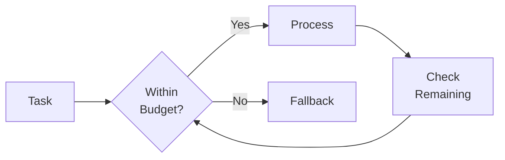
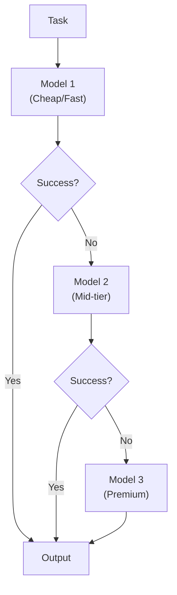
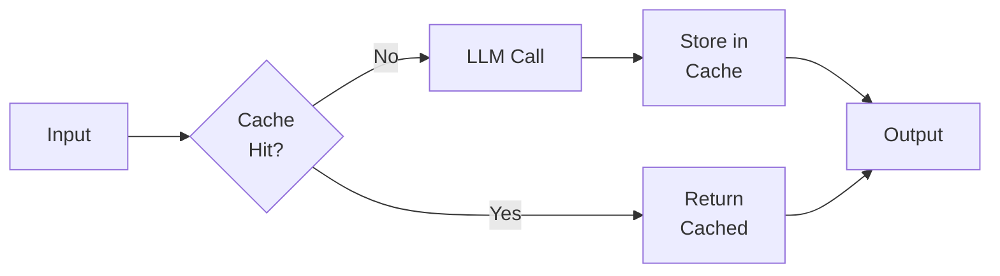
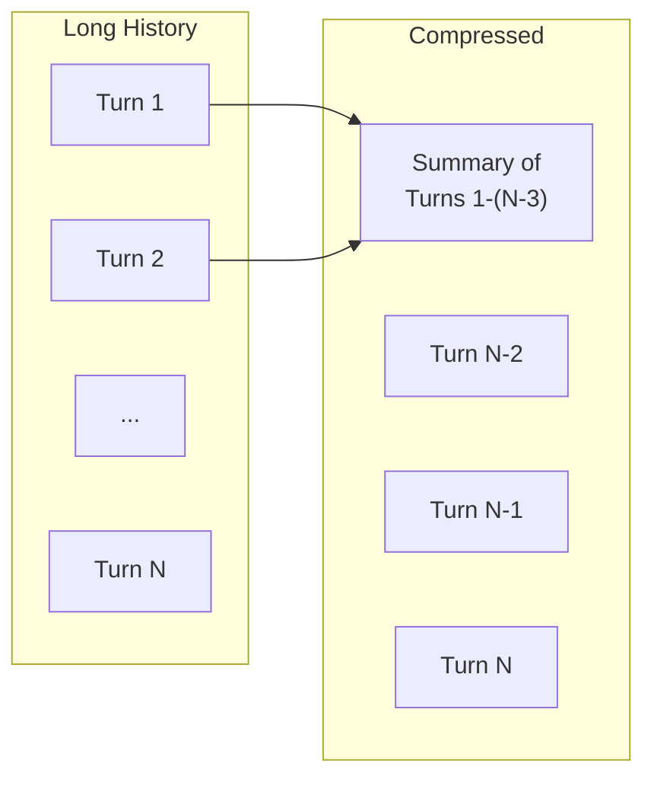
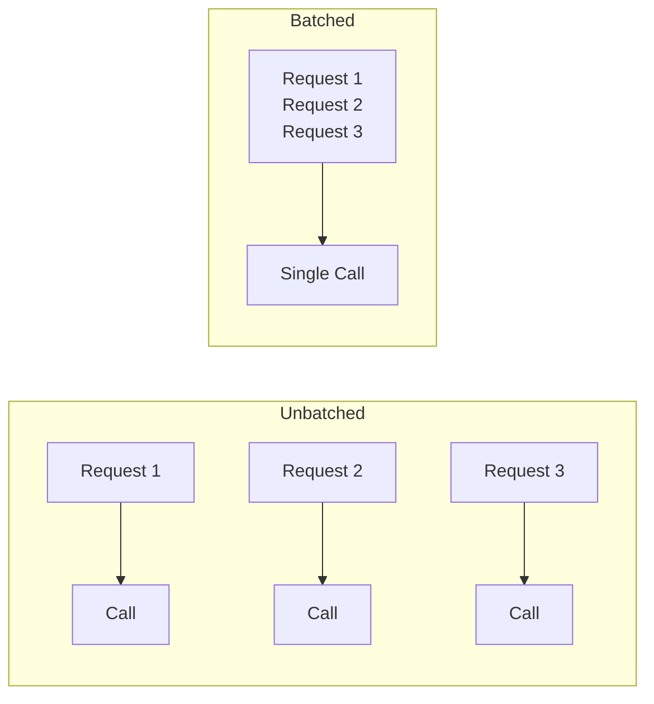

> "The cheapest token is the one you never send."

---

## The Problem

Agents are expensive. Unlike single-shot LLM calls, agents:

| Cost Driver | Why It Multiplies |
|-------------|------------------|
| **Multi-turn loops** | Agent iterates until success |
| **Tool calls** | Each tool may trigger more LLM calls |
| **Long contexts** | RAG, memory, history = more tokens |
| **Retries** | Failures mean re-processing |

**Reality check**: A single agent task can cost 10-100× more than a simple chat response.

---

## The Cost Equation

```
Cost = Σ (Input Tokens × Input Price + Output Tokens × Output Price)
       × Number of LLM Calls
       × Retry Rate
```

### Price Comparison (2025 Rates)

| Model | Input ($/M tokens) | Output ($/M tokens) | Quality/Speed |
|-------|-------------------|---------------------|---------------|
| GPT-4 Turbo | $10 | $30 | Top quality |
| Claude 3.5 Sonnet | $3 | $15 | Excellent |
| GPT-4o Mini | $0.15 | $0.60 | Good, fast |
| Gemini 1.5 Flash | $0.075 | $0.30 | Good, very fast |

---

## Strategy 1: Token Budgeting

### Set Hard Limits



### Budget Categories

| Category | Budget Allocation |
|----------|-------------------|
| **System prompt** | 20% (compress if needed) |
| **Context/RAG** | 30% (limit retrieved docs) |
| **Conversation history** | 20% (summarize old turns) |
| **Tool outputs** | 20% (truncate responses) |
| **Buffer** | 10% (for variability) |

### Implementation

```python
class TokenBudget:
    def __init__(self, max_tokens=8000):
        self.max_tokens = max_tokens
        self.system_prompt = int(max_tokens * 0.20)
        self.context = int(max_tokens * 0.30)
        self.history = int(max_tokens * 0.20)
        self.tools = int(max_tokens * 0.20)
        self.buffer = int(max_tokens * 0.10)
```

---

## Strategy 2: Smart Model Selection

### Cascade Pattern

Use cheap models first, escalate only when needed:



### Task-Based Routing

| Task Type | Recommended Model | Why |
|-----------|-------------------|-----|
| Classification | Flash/Mini | Simple pattern matching |
| Code generation | Sonnet | Balance of quality/cost |
| Complex reasoning | GPT-4/Opus | Needs full capability |
| Summarization | Flash | Volume, not depth |

---

## Strategy 3: Caching

### What to Cache

| Cache Target | TTL | Benefit |
|--------------|-----|---------|
| **RAG embeddings** | Days | Avoid re-embedding |
| **Identical prompts** | Hours | Skip LLM call entirely |
| **Tool outputs** | Minutes-Hours | Avoid redundant calls |
| **Semantic similarity** | Hours | Near-duplicate detection |

### Cache Architecture



### Semantic Caching

Don't just cache exact matches—cache semantically similar queries:

```python
def get_cached_or_call(query: str):
    # Check for exact match
    if query in cache:
        return cache[query]
    
    # Check for semantic similarity
    embedding = embed(query)
    similar = find_similar(embedding, threshold=0.95)
    if similar:
        return cache[similar.key]
    
    # No hit—call LLM
    result = llm.call(query)
    cache[query] = result
    return result
```

---

## Strategy 4: Context Compression

### Techniques

| Technique | How It Works | Savings |
|-----------|--------------|---------|
| **Summarization** | Condense long history | 50-80% |
| **Selective inclusion** | Only relevant chunks | 30-60% |
| **Hybrid prompting** | Reference docs, don't inline | 40-70% |
| **Progressive disclosure** | Load details on demand | Varies |

### History Summarization



---

## Strategy 5: Retry Reduction

### Why Retries Are Expensive

```
Failed Task = Original Cost + Retry Cost + Retry Cost + ...
```

### Reduce Retries By

| Method | Impact |
|--------|--------|
| **Better prompts** | Fewer clarification loops |
| **Output validation** | Catch errors early |
| **Few-shot examples** | Guide correct format |
| **Structured output (JSON)** | Reduce parsing failures |

---

## Strategy 6: Batch Processing

### When Possible, Batch



**Cost savings**: System prompt tokens amortized across batch.

---

## Monitoring & Alerting

### Key Metrics

| Metric | Alert Threshold |
|--------|-----------------|
| **Cost per task** | > 150% of baseline |
| **Tokens per completion** | > 120% of expected |
| **Retry rate** | > 10% |
| **Cache hit rate** | < 60% |

### Dashboard

Track daily:
- Total spend
- Cost per task type
- Model usage distribution
- Cache efficiency

---

## Cost Reduction Checklist

| Strategy | Implemented? | Est. Savings |
|----------|--------------|--------------|
| ☐ Token budgets | | 10-30% |
| ☐ Model cascading | | 30-60% |
| ☐ Semantic caching | | 20-50% |
| ☐ Context compression | | 20-40% |
| ☐ Retry reduction | | 10-20% |
| ☐ Batch processing | | 10-30% |

---

## Key Takeaways

- ✅ **Set token budgets**: Hard limits prevent runaway costs.
- ✅ **Use model cascading**: Cheap first, expensive only when needed.
- ✅ **Cache aggressively**: Semantic caching catches near-duplicates.
- ✅ **Compress context**: Summarize history, selective RAG.
- ✅ **Monitor continuously**: Catch cost spikes early.

---

## What's Next

- 📖 **Previous article**: [Guardrails & Safety](/Harry-the-architect/blog/guardrails-safety/)
- 📖 **Series complete!** Check the [full series index](/Harry-the-architect/blog/).
- 💬 **Discuss**: What's your biggest cost driver in agent systems?

---

## References

1.  **OpenAI** — *Token Usage and Pricing* (2025). Official pricing documentation.

2.  **Anthropic** — *Prompt Caching* (2025). Caching implementation guide.

3.  **LangChain** — *Cost Optimization Patterns* (2025). Framework best practices.

4.  **Google Cloud** — *Gemini Pricing Optimization* (2025). Model selection strategies.
