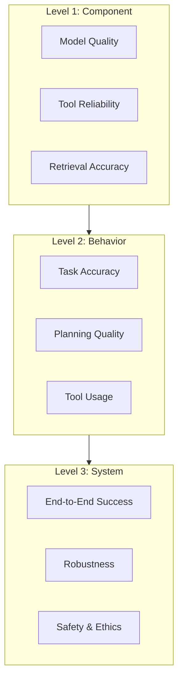
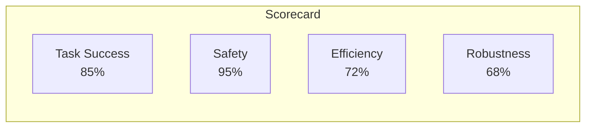
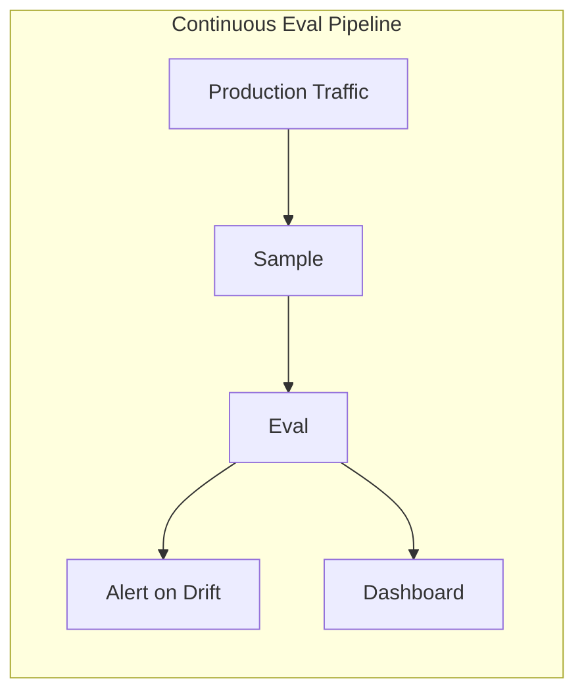
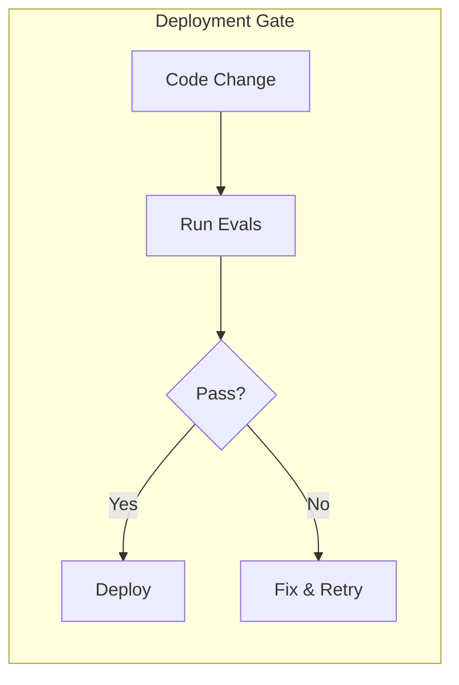

> "You can't improve what you can't measure—but measuring agents is harder than you think."

---

## The Problem

You've built an agent. It "works" on your test cases. But how do you know it's actually good?

The old metrics don't apply:

| What We Used to Measure | Why It Fails for Agents |
|------------------------|------------------------|
| BLEU/ROUGE scores | Agents don't just generate text—they act |
| Perplexity | Low perplexity ≠ correct actions |
| Accuracy on Q&A | Agents have multi-step, open-ended tasks |
| Response time | Agents may take hours on complex tasks |

**The challenge**: Agents are more than models. They're systems that reason, plan, use tools, and iterate. Evaluation must match this complexity.

---

## The Eval Hierarchy

Agent evaluation requires multiple levels of assessment:

---

## Core Metrics for Agent Evaluation

### 1. Task Completion

| Metric | What It Measures |
|--------|-----------------|
| **Success Rate** | % of tasks completed correctly |
| **Partial Completion** | How far did the agent get before failing? |
| **Goal Accuracy** | Did the final state match the goal? |

### 2. Reasoning & Planning

| Metric | What It Measures |
|--------|-----------------|
| **Plan Validity** | Is the plan logically sound? |
| **Plan Efficiency** | Minimum steps to achieve goal? |
| **Adaptation** | Does agent adjust when plans fail? |

### 3. Tool Usage

| Metric | What It Measures |
|--------|-----------------|
| **Tool Selection Accuracy** | Chose the right tool? |
| **Tool Execution Success** | Tool called correctly? |
| **Tool Output Utilization** | Was the output used appropriately? |

### 4. Safety & Alignment

| Metric | What It Measures |
|--------|-----------------|
| **Harmful Action Prevention** | Refuses dangerous requests |
| **Jailbreak Resistance** | Withstands manipulation attempts |
| **Bias & Fairness** | Consistent across demographics |

### 5. Efficiency

| Metric | What It Measures |
|--------|-----------------|
| **Latency** | Time to complete task |
| **Token Usage** | Cost per task |
| **API Calls** | External resource consumption |

---

## Benchmark Landscape

### For Coding Agents

| Benchmark | What It Tests |
|-----------|--------------|
| **SWE-bench** | Real GitHub issue resolution |
| **SWE-Lancer** | Freelance-style coding tasks |
| **Aider-Polyglot** | Multi-language code editing |

### For General Agents

| Benchmark | What It Tests |
|-----------|--------------|
| **GAIA** | General AI assistants on real-world tasks |
| **AgentBench** | 8 environments: OS, DB, web, games, etc. |
| **WebArena** | Web navigation and task completion |

### For Reasoning & Planning

| Benchmark | What It Tests |
|-----------|--------------|
| **PlanBench** | Planning quality and efficiency |
| **MINT** | Multi-turn interaction reasoning |
| **ACPBench** | Agent capability profiling (IBM) |

### For RAG Systems

| Benchmark | What It Tests |
|-----------|--------------|
| **RAGAS** | Retrieval-augmented generation quality |
| **LoCoMo** | Long-context memory handling |

---

## The Eval Framework

### Step 1: Define Success Criteria

Before running any benchmark, define what "good" means for your use case:

| Criterion | Example Target |
|-----------|---------------|
| **Must achieve** | 90%+ success on happy path |
| **Should achieve** | 70%+ on edge cases |
| **Nice to have** | <5s latency |

### Step 2: Multi-Dimensional Assessment

Never rely on a single metric. Use a scorecard:

### Step 3: Domain-Specific Testing

Supplement public benchmarks with your own test sets:

| Test Type | Purpose |
|-----------|---------|
| **Golden set** | Core functionality—must always pass |
| **Edge cases** | Unusual inputs, boundary conditions |
| **Adversarial** | Jailbreaks, prompt injections |
| **Production samples** | Real queries from production logs |

### Step 4: Continuous Evaluation

---

## Best Practices

### 1. System vs. Model Evaluation

| Model Eval | System Eval |
|------------|-------------|
| "Is the LLM good?" | "Does the agent system work?" |
| Static prompts | Dynamic, multi-step tasks |
| Single output | End-to-end outcomes |

**Key insight**: A great model in a bad system still fails. Evaluate the whole pipeline.

### 2. Human Evaluation Matters

Automated metrics can't catch everything:

| What Automation Misses | Why Humans Still Matter |
|-----------------------|------------------------|
| Subtle reasoning errors | Domain experts catch nuance |
| Tone/style issues | Users perceive quality differently |
| Novel failure modes | Humans spot patterns |

**Recommendation**: Combine LLM-as-a-Judge with periodic human review.

### 3. Document Everything

For every eval run, record:

- Benchmark version
- Model version
- Scores and failure cases
- Mitigation actions taken
- Deployment rationale

### 4. Test Before Deploy

---

## Common Pitfalls

| Pitfall | Why It's Dangerous |
|---------|-------------------|
| **Only testing happy path** | Production has edge cases |
| **Single metric obsession** | High accuracy can mask safety issues |
| **Static test sets** | Agents evolve; tests should too |
| **Ignoring latency** | Users abandon slow agents |
| **No adversarial testing** | Jailbreaks will happen |

---

## Key Takeaways

- ✅ **Agents need multi-level evaluation**: Component → Behavior → System.
- ✅ **Use domain-specific + public benchmarks**: Golden sets for your use case.
- ✅ **Multi-dimensional scorecards**: Never rely on one metric.
- ✅ **Continuous evaluation**: Production traffic reveals drift.
- ✅ **Human review complements automation**: Especially for safety.

---

## What's Next

- 📖 **Previous article**: [Agentic Coding Assistants](/Harry-the-architect/blog/agentic-coding-assistants/)
- 📖 **Next article**: [LLM-as-a-Judge Deep Dive](/Harry-the-architect/blog/llm-as-judge-deep-dive/) — Building robust automated evaluation.
- 💬 **Discuss**: What benchmarks are you using for your agents?

---

## References

1.  **Confident AI** — *Evaluating LLM Agents* (2025). Comprehensive metrics framework.

2.  **Responsible AI Labs** — *LLM Benchmarking Best Practices* (2025). Enterprise evaluation guide.

3.  **IBM Research** — *ACPBench: Agent Capability Profiling* (2025). Benchmark for planning and reasoning.

4.  **Maxim AI** — *Best LLM Evaluation Tools* (2025). Tools and platform comparison.

5.  **DeepChecks** — *Key LLM Metrics for Production* (2025). Production monitoring focus.

6.  **Google Cloud Research** — *Agent Quality* (2025). Defines the evaluation hierarchy, trajectory evaluation, and the "Agent Quality Flywheel."
