> "Should I put this in RAG, a Skill, or the Persona?"

Every engineer building agents hits this wall. You have domain knowledge—a PDF, a database, a rule—and you don't know where it belongs.

Get it wrong, and you get **Context Overflow** (expensive, slow agents) or **Context Amnesia** (hallucinations).

---

## The Problem

Most developers treat the LLM context window like a junk drawer. They stuff strict rules, messy docs, and JSON schemas into one massive system prompt.

**This is the "Swiss Army Knife" trap.** It works for a demo, but in production, it fails because: -> **Cognitive Load**.

Just as humans struggle to multitask, LLMs degrade when instructions conflict. We need an architecture that separates concerns.

---

## The Concept

There are **four distinct pillars** of agent context. Each solves a specific problem.

| Pillar | Solving For... | The Authority Anchor |
|--------|----------------|----------------------|
| 🎭 **Persona** | **Identity** & Reasoning Style | "Role Prompting" improves reasoning accuracy (research). |
| 📚 **Skills** | **Capabilities** (How-to) | Tool Use / Function Calling standards. |
| 📖 **RAG** | **Knowledge** (What) | Lewis et al. (2020) original RAG paper. |
| 🔌 **MCP** | **Interoperability** (Action) | Anthropic's Model Context Protocol. |

### Validated by Google's Framework

This structure mirrors the cognitive architecture defined in Google's *Context Engineering* guide:

| Our Pillar | Google's Equivalent | The Function |
|------------|---------------------|--------------|
| 🎭 **Persona** | **System Instructions** | Defines the "Role" and behavioral constraints. |
| 📚 **Skills** | **Procedural Memory** | Stores "How-to" knowledge (tools, code, workflows). |
| 📖 **RAG** | **Semantic Memory** | Stores "What-is" knowledge (facts, docs, data). |
| 🔌 **MCP** | **Tool Interoperability** | The standardized interface for action. |

```mermaid
flowchart TD
    subgraph Input["👤 User Request"]
        Q["Can you fix the database query in this repo?"]
    end

    subgraph Pillars["🏛️ The 4 Pillars"]
        P["🎭 Persona\n(WHO am I?)"]
        S["📚 Skills\n(HOW do I code?)"]
        R["📖 RAG\n(WHAT is the schema?)"]
        M["🔌 MCP\n(ACT on the DB)"]
    end

    Q --> P
    P --> S
    S --> R
    S --> M
    M --> Output["✅ Result"]
```

---

## Pillar 1: Persona 🎭

**Purpose**: Define WHO the agent IS.
**When**: Always present (System Prompt).

Recent research on **Role Prompting** shows that assigning a specific persona (e.g., "You are a Senior Security Engineer") significantly improves reasoning capabilities, sometimes by over 20%.

**The Mistake**: Using Persona for *mechanics*.
*   ❌ "You are an agent that outputs JSON with keys x, y, z..."
*   ✅ "You are a pragmatist who values working code over theoretical purity."

**Governance Rule**: The Persona defines the *values* the agent uses to make trade-offs.

---

## Pillar 2: Skills 📚

**Purpose**: Teach HOW to do things.
**When**: Loaded on demand (Tool Definitions).

Skills are procedural knowledge. If Persona is the "character," Skills are the "script." In modern terms, these are **Tools** or **Functions** that the model can call.

**The Mistake**: Hardcoding steps in the System Prompt.
**The Fix**: Encapsulate logic in a tool. instead of telling the detailed steps of "How to valid email", just give the agent a `validate_email()` tool.

> **Why?** It moves complexity from *probabilistic* tokens (the LLM guessing) to *deterministic* code (the function executing).

---

## Pillar 3: RAG 📖

**Purpose**: Access WHAT to know—facts and documents.
**When**: Retrieved at query time.

Patrick Lewis et al. introduced **RAG** in 2020 to solve the "knowledge cutoff" problem.

**The Enterprise Litmus Test for RAG**:
If the information changes faster than your deployment cycle, it implies **RAG**.

*   Company Policies? **RAG.**
*   Yesterday's Sales Data? **RAG.**
*   Java Syntax? **Training Data (Model).**

---

## Pillar 4: MCP 🔌

**Purpose**: Connect to external ACTIONS.
**When**: Invoked to change the world.

The **Model Context Protocol (MCP)** is the new standard for connecting AI models to data sources. It's the "USB-C" for agents.

**Why it matters**: Before MCP, every agent needed custom glue code to talk to GitHub, Slack, or Postgres. With MCP, you write the connector once, and any agent can use it.

---

## The Decision Framework

How do you decide? Use the **Time-Horizon Heuristic**:

| If the information changes... | Use this Pillar... |
|-------------------------------|--------------------|
| **Never** (Values, Style) | 🎭 **Persona** |
| **Quarterly** (Procedures) | 📚 **Skills** |
| **Daily/Weekly** (Facts) | 📖 **RAG** |
| **Real-time** (System State) | 🔌 **MCP** |

---

## Key Takeaways

- ✅ **Don't clutter context**: Use the right pillar to keep the "reasoning brain" clear.
- ✅ **Persona is for values**: Use it to guide *decisions*, not just format output.
- ✅ **Skills are deterministic**: Move complex logic out of prompts and into code.
- ✅ **Standardize with MCP**: Don't build custom integrations if an open standard exists.

---

## What's Next

- 📖 **Previous article**: [The Orchestra: Why Multi-Agent AI Works](/Harry-the-architect/blog/the-orchestra-why-multi-agent-works/)
- � **Next article**: [Skills: Progressive Context Disclosure](/Harry-the-architect/blog/skills-progressive-context-disclosure/) — Escape the "Prompt Blob Monster" with on-demand procedural knowledge.
- �💬 **Discuss**: Which pillar is the biggest bottleneck in your current agents?

---

## References

1.  **Google Cloud Research** — *Context Engineering: Sessions & Memory* (2025). Defines the distinction between Procedural Memory (Skills) and Semantic Memory (RAG) in agentic architectures.
2.  **Anthropic** — *Prompt Engineering Guidelines*. Source for Role Prompting effectiveness.
3.  **Lewis et al.** — *Retrieval-Augmented Generation for Knowledge-Intensive NLP Tasks* (NeurIPS 2020).
