> "The best evaluator is another LLM—if you know how to ask."

---

## The Problem

Human evaluation is the gold standard. But it's:

| Challenge | Impact |
|-----------|--------|
| **Expensive** | $50-200/hour for domain experts |
| **Slow** | Days to weeks for large datasets |
| **Inconsistent** | Different reviewers, different standards |
| **Unscalable** | Can't run on every production request |

**The solution**: Use LLMs to judge LLM outputs—but do it right.

---

## LLM-as-a-Judge Paradigms

### 1. Single-Output Grading

The LLM evaluates one output against a rubric:

```
Input: [User query]
Output: [Agent response]
Rubric: [Criteria]
→ Score: 1-5
```

**Best for**: Absolute quality assessment, production monitoring.

### 2. Pairwise Comparison

The LLM compares two outputs and picks the better one:

```
Input: [User query]
Output A: [Response A]
Output B: [Response B]
→ Winner: A or B (or tie)
```

**Best for**: Model comparisons, A/B testing, preference learning.

### 3. Reference-Based Grading

The LLM compares output to a ground-truth reference:

```
Input: [User query]
Output: [Agent response]
Reference: [Correct answer]
→ Score: 0-100%
```

**Best for**: Factual tasks, RAG evaluation.

---

## Building Effective Rubrics

### Rubric Anatomy

A good rubric has:

| Component | Purpose |
|-----------|---------|
| **Dimension** | What aspect to evaluate (accuracy, completeness, tone) |
| **Scale** | Numeric range (1-5, 0-100) |
| **Anchors** | Specific descriptions for each score level |
| **Examples** | Illustrative cases for each level |

### Example: Helpfulness Rubric

```markdown
## Helpfulness (1-5)

**5 - Excellent**: Fully addresses the user's intent with clear, actionable, and accurate information. Anticipates follow-up questions.

**4 - Good**: Addresses the main request correctly. Minor gaps in detail or clarity.

**3 - Adequate**: Provides a relevant response but misses important aspects or contains minor errors.

**2 - Poor**: Partially addresses the request but with significant omissions or inaccuracies.

**1 - Unacceptable**: Fails to address the request, provides incorrect information, or is incoherent.
```

### Multi-Dimensional Rubrics

For complex tasks, evaluate multiple dimensions:


---

## Pairwise Comparison Best Practices

### The Position Bias Problem

LLMs exhibit **position bias**—they prefer outputs shown first (or last):

| Bias Type | What Happens |
|-----------|--------------|
| **Primacy bias** | First option is favored |
| **Recency bias** | Last option is favored |
| **Verbosity bias** | Longer responses score higher |
| **Authority bias** | Confident tone wins |

### Mitigation: Order Randomization

Run each comparison twice with swapped positions:


**Agreement rule**: If both runs agree, confident result. If they disagree, mark as tie.

---

## Multi-Judge Panels

### Why Multiple Judges?

Single judges have blind spots. Use panels:

| Strategy | How It Works |
|----------|--------------|
| **Same model, different prompts** | Vary rubric phrasing |
| **Different model families** | GPT-4, Claude, Gemini |
| **Majority voting** | 3 judges → 2 agree wins |
| **Weighted average** | Weight by judge calibration |

### Panel Architecture


---

## Prompt Engineering for Judges

### The Evaluation Prompt Template

```markdown
You are an expert evaluator assessing [TASK TYPE].

## Input
[USER QUERY]

## Response to Evaluate
[AGENT RESPONSE]

## Rubric
[DETAILED RUBRIC WITH ANCHORS]

## Instructions
1. Read the input and response carefully.
2. Evaluate against each rubric dimension.
3. Provide a brief justification.
4. Output a JSON with scores.

## Output Format
{
  "accuracy": {"score": 1-5, "reason": "..."},
  "completeness": {"score": 1-5, "reason": "..."},
  "overall": {"score": 1-5, "reason": "..."}
}
```

### Key Prompt Techniques

| Technique | Why It Helps |
|-----------|--------------|
| **Explicit rubric in prompt** | Reduces ambiguity |
| **Require justification** | Catches reasoning errors |
| **Structured output (JSON)** | Easier to parse |
| **Examples in prompt** | Few-shot calibration |

---

## Calibration: Aligning with Human Judgment

### The Calibration Gap

LLM judges often disagree with humans on edge cases. Close the gap:

| Method | How It Works |
|--------|--------------|
| **Calibration set** | 50-100 human-scored examples to tune prompts |
| **Score adjustment** | Learn a mapping function from LLM → human scores |
| **Threshold tuning** | Find optimal pass/fail cutoffs |

### Calibration Workflow

```mermaid
flowchart LR
    H["Human-Scored\nGolden Set"] --> C["Compare to\nLLM Scores"]
    C --> A["Adjust\nPrompt/Thresholds"]
    A --> T["Test on\nHeldout Set"]
    T --> D{Correlation\n≥ 0.8?}
    D -->|No| A
    D -->|Yes| P["Deploy"]
```



---

## Common Pitfalls

| Pitfall | How to Avoid |
|---------|--------------|
| **Treating LLM scores as ground truth** | Always validate against human samples |
| **Ignoring bias** | Randomize order, use multiple judges |
| **Vague rubrics** | Specific anchors with examples |
| **Single-dimension scoring** | Multi-dimensional assessment |
| **No justification required** | Always ask for reasoning |

---

## When to Use Which Method

| Scenario | Recommended Approach |
|----------|---------------------|
| **Production monitoring** | Single-output grading |
| **Model comparison** | Pairwise + panel |
| **RAG accuracy** | Reference-based |
| **High-stakes decisions** | Human-in-the-loop |
| **Large-scale eval** | Automated + sampling for human review |

---

## Key Takeaways

- ✅ **Choose the right paradigm**: Single, pairwise, or reference-based.
- ✅ **Build detailed rubrics**: Anchors and examples reduce ambiguity.
- ✅ **Mitigate bias**: Order randomization, multi-model panels.
- ✅ **Calibrate against humans**: Golden sets are essential.
- ✅ **Require justification**: Forces the judge to reason.

---

## What's Next

- 📖 **Previous article**: [Eval & Benchmarking: Measuring Agent Quality](/Harry-the-architect/blog/eval-benchmarking-agent-quality/)
- 📖 **Next article**: [Multi-Agent Orchestration Patterns](/Harry-the-architect/blog/multi-agent-orchestration-patterns/) — Supervisor, Voting, and Hierarchical designs.
- 💬 **Discuss**: Are you using LLM-as-a-Judge in production?

---

## References

1.  **Anthropic** — *Model-Based Evaluation* (2025). Best practices for rubric design.

2.  **Confident AI** — *LLM as a Judge: Complete Guide* (2025). Comprehensive paradigm comparison.

3.  **Emergent Mind** — *Pairwise Comparison Bias Mitigation* (2025). Research on position bias.

4.  **ArXiv** — *Multi-Judge Panels for LLM Evaluation* (2025). Academic study on panel effectiveness.

5.  **Google Cloud Research** — *Agent Quality* (2025). Introduces the "Agent-as-a-Judge" paradigm and the quality flywheel framework.
