> "The problem isn't that your agent has too few capabilities. It's that it has too many—all at once."

---

## The Problem

You've connected your agent to everything:
- File system access
- Database queries
- Slack integration
- GitHub operations
- Email sending
- Calendar management
- ...and 44 more tools

Your agent now has 50 tools available. And it's **worse** at everything.

| The Failure Mode | What Happens |
|------------------|--------------|
| 🧠 **Context Window Bloat** | Tool definitions consume 30% of available tokens |
| 🎯 **Choice Paralysis** | Too many options = suboptimal selection |
| 💸 **Cost Explosion** | Every request pays for unused tool definitions |
| 🐢 **Latency Increase** | More tokens = slower responses |

**Real Limits**: Cursor caps at 40 tools. GitHub Copilot caps at 128. There's a reason.

---

## What is MCP?

The **Model Context Protocol (MCP)**, introduced by Anthropic in November 2024, is an open standard for connecting AI models to external tools and data.

### The N×M Problem

Before MCP:
- N different AI clients (Claude, Gemini, Cursor, etc.)
- M different data sources (GitHub, Slack, databases, etc.)
- = N×M custom integrations

After MCP:
- Each client implements MCP once
- Each data source implements MCP once
- = Universal interoperability

```mermaid
flowchart TD
    subgraph After["✅ After MCP"]
        C1["Client 1"] --> MCP["🔌 MCP Protocol"]
        C2["Client 2"] --> MCP
        MCP --> D1["Data Source 1"]
        MCP --> D2["Data Source 2"]
    end
```




### MCP Primitives

| Primitive | What It Provides | Example |
|-----------|------------------|---------|
| **Tools** | Executable functions | `read_file()`, `query_database()` |
| **Resources** | Data sources | File contents, API responses |
| **Prompts** | Reusable templates | System prompts, few-shot examples |

---

## Tool Design Best Practices

### 1. The Magic Number: 10-15 Active Tools

> **Rule**: Activate only the tools needed for the current task.

| Tool Count | Effect on Performance |
|------------|----------------------|
| 1-10 | ✅ Agent selects well, fast responses |
| 10-20 | ⚠️ Some selection confusion, acceptable |
| 20-40 | ❌ Frequent wrong tool choices |
| 40+ | 💀 Agent overwhelmed, unreliable |

**Solution**: Dynamic tool loading based on task context.

### 2. Describe Actions, Not Implementations

> **Bad**: "Calls the PostgreSQL database using pg_connect with SSL."  
> **Good**: "Retrieves customer information by email address."

The model doesn't care *how* the tool works. It needs to know *what problem it solves*.

| ❌ Implementation-Focused | ✅ Action-Focused |
|---------------------------|-------------------|
| "Uses REST API to POST /api/v2/messages" | "Sends a message to a Slack channel" |
| "Executes SQL SELECT with JOIN" | "Finds all orders for a customer" |
| "Calls subprocess with git args" | "Creates a new branch from main" |

### 3. Publish Tasks, Not API Calls

Combine low-level operations into meaningful tasks:

```mermaid
flowchart LR
    subgraph Bad["❌ Too Granular"]
        A["git_checkout"]
        B["git_add"]
        C["git_commit"]
        D["git_push"]
    end
    
    subgraph Good["✅ Task-Level"]
        E["create_and_push_branch"]
    end
```



| Approach | Tool Count | Agent Confusion |
|----------|------------|-----------------|
| **API-level** | 12 tools | High—agent must orchestrate sequence |
| **Task-level** | 3 tools | Low—each tool is self-contained |

### 4. Design for Concise Output

> **Tool responses consume context too.**

| ❌ Verbose Response | ✅ Concise Response |
|---------------------|---------------------|
| Full JSON dump of 500 records | Top 10 records with summary |
| Complete file contents | Relevant snippet + line numbers |
| Full HTTP response | Status + extracted data |

**Implement**: Pagination, filtering, and summarization in your tool responses.

### 5. Use Semantic Descriptions

MCP servers provide natural language descriptions. Use them well:

```json
{
  "name": "search_documents",
  "description": "Searches the knowledge base for documents matching a query. Returns titles, snippets, and relevance scores. Use when user asks about company policies, procedures, or documentation."
}
```

**Include**:
- What the tool does
- When to use it
- What it returns

### 6. Validate Inputs Strictly

> **Never trust model-generated parameters.**

```python
def search_database(query: str, limit: int = 10):
    # Validate inputs
    if not query or len(query) > 500:
        raise ValueError("Query must be 1-500 characters")
    if limit < 1 or limit > 100:
        limit = min(max(limit, 1), 100)  # Clamp, don't error
    
    # Sanitize to prevent injection
    query = sanitize_sql(query)
    
    return execute_query(query, limit)
```

---

## Discovery Patterns

### The Tool Explosion Problem

As your tool ecosystem grows, you face a dilemma:
- **Pre-load everything**: Context bloat, slow responses
- **Load nothing**: Agent can't act

**Solution**: Dynamic discovery.

### Pattern 1: Hierarchical Tool Categories

Organize tools into categories and load categories on demand:

```mermaid
flowchart TD
    A["🤖 Agent"] --> Q{"Query type?"}
    
    Q -->|"Code task"| C["📦 Load: code-tools"]
    Q -->|"Data task"| D["📦 Load: database-tools"]
    Q -->|"Comms task"| E["📦 Load: messaging-tools"]
    
    C --> CT["git, file, test, lint"]
    D --> DT["query, insert, schema"]
    E --> ET["slack, email, calendar"]
```



### Pattern 2: Search-Discovery Tool

Create a meta-tool that searches available tools:

```json
{
  "name": "search_available_tools",
  "description": "Searches for tools matching a capability. Use this when you need a capability not in your current tool set.",
  "parameters": {
    "capability": "What you want to do (e.g., 'send email', 'query database')"
  }
}
```

The agent asks for tools rather than having them all loaded.

### Pattern 3: Context-Aware Activation

Automatically activate tools based on conversation context:

| Detected Context | Activated Tools |
|------------------|-----------------|
| User mentions code/files | file, git, test |
| User mentions data/queries | database, cache |
| User mentions communication | slack, email |
| User mentions scheduling | calendar, reminders |

---

## Security Best Practices

### The Principle of Least Privilege

> **Give agents only the permissions they need.**

| High Risk | Lower Risk Alternative |
|-----------|------------------------|
| Full file system access | Read/write to project folder only |
| DELETE permissions | Read + parameterized writes only |
| Send email to anyone | Pre-approved domains/recipients |
| Execute arbitrary code | Sandboxed execution environment |

### Human-in-the-Loop for Critical Actions

```mermaid
flowchart TD
    A["🤖 Agent wants to:"] --> B{"Action type?"}
    
    B -->|Read-only| R["✅ Auto-execute"]
    B -->|Low-risk write| W["✅ Auto-execute + log"]
    B -->|High-risk action| H["⚠️ Request approval"]
    
    H --> U["👤 Human reviews"]
    U -->|Approve| E["Execute"]
    U -->|Reject| C["Cancel + explain"]
```



**High-Risk Actions Requiring Approval**:
- Database DELETE/DROP
- Sending external communications
- Modifying access controls
- Financial transactions

---

## Key Takeaways

- ✅ **Limit active tools**: 10-15 is optimal. More = confusion.
- ✅ **Describe actions**: What it does, not how it works.
- ✅ **Task-level tools**: Combine API calls into meaningful operations.
- ✅ **Concise outputs**: Paginate and filter. Don't dump everything.
- ✅ **Dynamic discovery**: Load tools on demand, not all upfront.
- ✅ **Least privilege**: Limit permissions. Add human approval for high-risk.

---

## What's Next

- 📖 **Previous article**: [Building Knowledge Bases: RAG Done Right](/Harry-the-architect/blog/rag-best-practices-knowledge-bases/)
- 📖 **Next article**: [Context Engineering: Sessions & Memory](/Harry-the-architect/blog/context-engineering-sessions-memory/) — Managing short-term and long-term agent memory.
- 💬 **Discuss**: How many tools does your most complex agent use?

---

## References

1.  **Anthropic** — *Model Context Protocol Specification* (2024). The official MCP standard for tool interoperability.

2.  **Google Cloud Research** — *Agent Tools & Interoperability with MCP* (2025). Best practices for tool design and documentation.

3.  **Demiliani** — *MCP Context Window Bloat* (2024). Research on tool limits and performance degradation.

4.  **Philipp Schmid** — *Dynamic Context Discovery* (2025). Patterns for on-demand tool loading.
