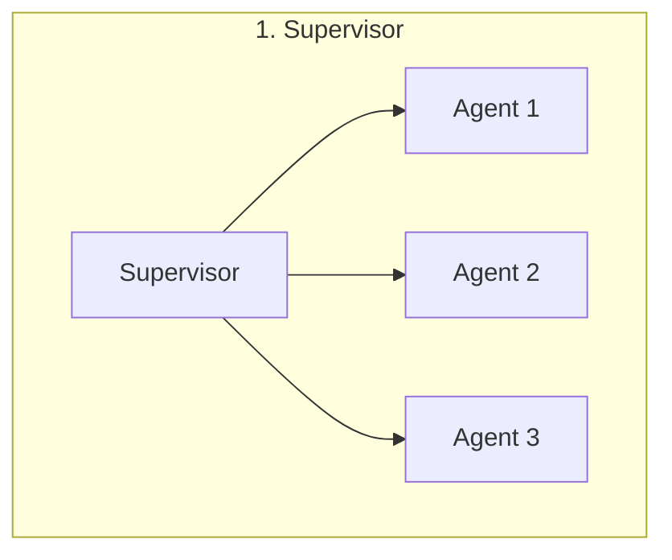
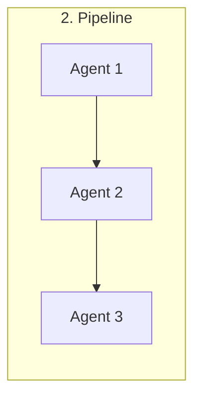
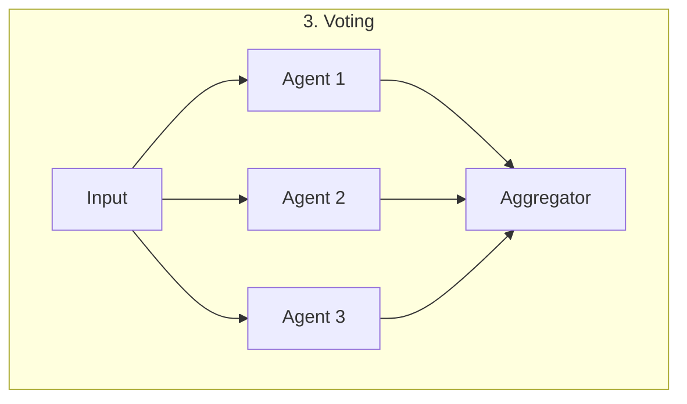
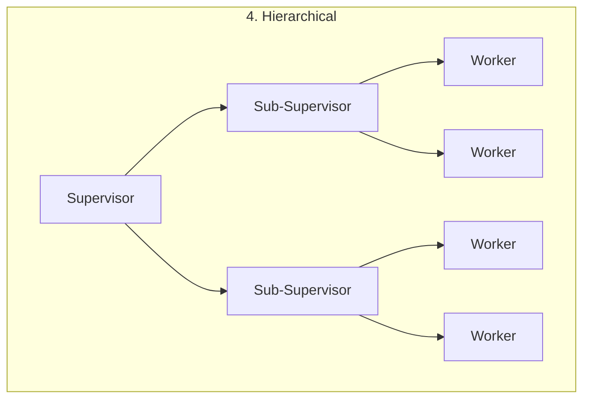
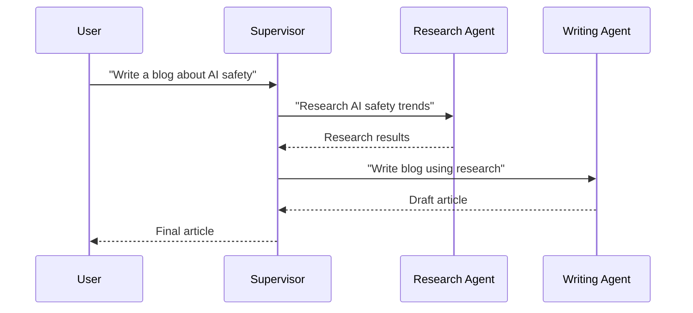
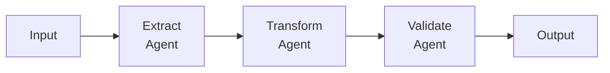
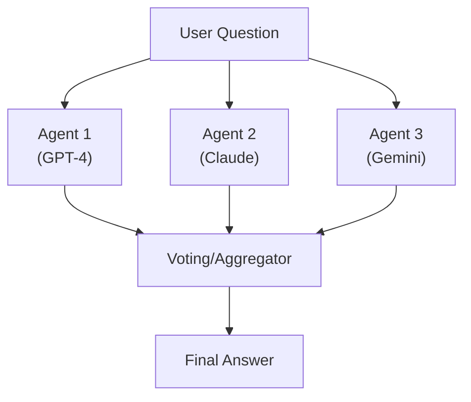
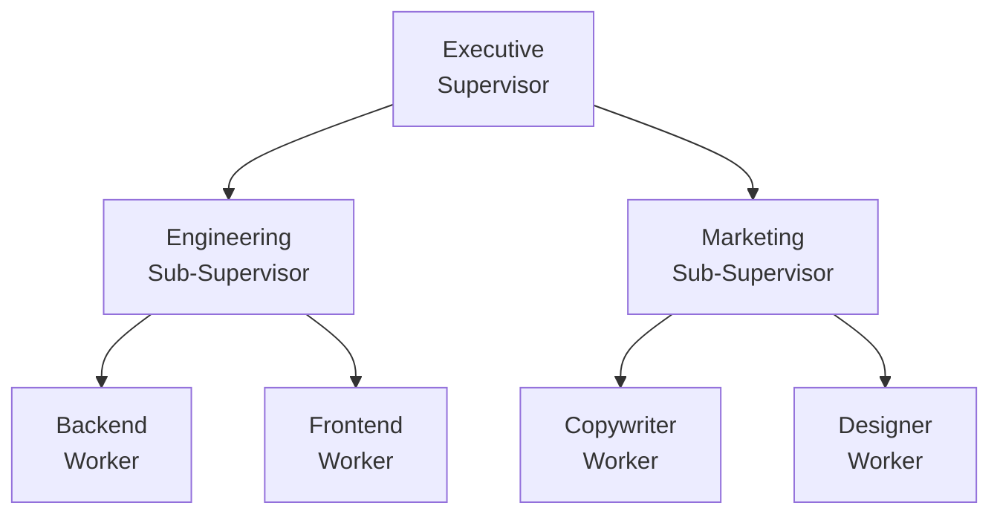
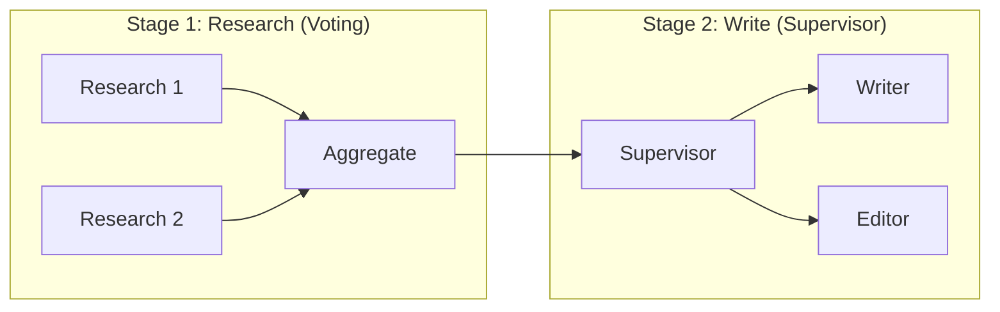

> "A conductor doesn't play instruments—they make the orchestra play together."

---

## The Problem

You've built multiple specialized agents. Now what? How do they work together?

| Challenge | What Goes Wrong |
|-----------|----------------|
| **Who decides?** | Conflicting outputs from agents |
| **Who goes first?** | Dependencies between agent tasks |
| **Who resolves errors?** | Agent A fails—now what? |
| **How to scale?** | 2 agents → 20 agents |

**The need**: Orchestration patterns that define how agents coordinate.

---

## The Four Orchestration Patterns

---

## Pattern 1: Supervisor

### How It Works

A central "supervisor" agent receives tasks and delegates to specialized workers.

### When to Use

| ✅ Good Fit | ❌ Poor Fit |
|-------------|------------|
| Clear task decomposition | Agents need real-time collaboration |
| Workers are independent | High-frequency inter-agent communication |
| Need centralized control | Workers must negotiate |

### Implementation Tips

- **Supervisor prompt**: Include explicit routing logic
- **Worker isolation**: Workers shouldn't call each other directly
- **Error handling**: Supervisor owns retry/fallback decisions

---

## Pattern 2: Pipeline (Sequential)

### How It Works

Agents process in sequence, each transforming the output of the previous.

### When to Use

| ✅ Good Fit | ❌ Poor Fit |
|-------------|------------|
| Clear transformation stages | Steps can run in parallel |
| Each stage has distinct expertise | Order doesn't matter |
| Output of A is input to B | Complex branching logic |

### Implementation Tips

- **Schema enforcement**: Define clear contracts between stages
- **Checkpoints**: Save state between stages for recovery
- **Feedback loops**: Allow later stages to request re-processing

---

## Pattern 3: Voting (Ensemble)

### How It Works

Multiple agents process the same input. Results are aggregated.

### Aggregation Methods

| Method | When to Use |
|--------|-------------|
| **Majority vote** | Discrete choices (A, B, C) |
| **Weighted vote** | Some agents more trusted |
| **LLM synthesizer** | Free-form outputs → combine best parts |
| **Consistency filter** | Only accept if all agree |

### When to Use

| ✅ Good Fit | ❌ Poor Fit |
|-------------|------------|
| High-stakes decisions | Speed-critical tasks |
| Need confidence estimates | Budget-constrained |
| Diverse perspectives help | Single authoritative source exists |

---

## Pattern 4: Hierarchical

### How It Works

Multi-level delegation. Top-level supervisor manages sub-supervisors who manage workers.

### When to Use

| ✅ Good Fit | ❌ Poor Fit |
|-------------|------------|
| Large-scale systems (10+ agents) | Simple 2-3 agent systems |
| Clear organizational domains | Flat task structure |
| Need to isolate failures | Tight cross-domain coupling |

### Implementation Tips

- **Span of control**: Each supervisor manages 3-7 agents
- **Clear boundaries**: Sub-supervisors own their domain
- **Escalation paths**: Define when to bubble up

---

## Pattern Comparison

| Pattern | Complexity | Latency | Use Case |
|---------|-----------|---------|----------|
| **Supervisor** | Low | Medium | Most common, good default |
| **Pipeline** | Low | High | ETL, document processing |
| **Voting** | Medium | Low | High-stakes, need consensus |
| **Hierarchical** | High | Variable | Large systems, enterprise |

---

## Hybrid Patterns

Real systems often combine patterns:

### Common Hybrids

| Hybrid | Structure |
|--------|-----------|
| **Voting + Supervisor** | Vote on plan, supervisor executes |
| **Pipeline + Voting** | Each stage has ensemble |
| **Hierarchical + Pipeline** | Sub-supervisors form a chain |

---

## Anti-Patterns

| Anti-Pattern | What Goes Wrong |
|--------------|-----------------|
| **Everyone talks to everyone** | N² communication, chaos |
| **No clear owner** | Tasks fall through cracks |
| **Deep hierarchies** | Latency, information loss |
| **Rigid patterns** | Can't adapt to task |

---

## Key Takeaways

- ✅ **Start with Supervisor**: Simplest, works for most cases.
- ✅ **Pipeline for transformations**: When order matters.
- ✅ **Voting for consensus**: High-stakes, need confidence.
- ✅ **Hierarchical for scale**: 10+ agents, clear domains.
- ✅ **Hybrid when needed**: Real systems combine patterns.

---

## What's Next

- 📖 **Previous article**: [LLM-as-a-Judge Deep Dive](/Harry-the-architect/blog/llm-as-judge-deep-dive/)
- 📖 **Next article**: [Guardrails & Safety](/Harry-the-architect/blog/guardrails-safety/) — Protecting your agents from misuse.
- 💬 **Discuss**: Which orchestration pattern do you use most?

---

## References

1.  **LangGraph** — *Multi-Agent Orchestration* (2025). Framework documentation.

2.  **CrewAI** — *Hierarchical Agent Systems* (2025). Best practices guide.

3.  **Google** — *Agent Orchestration Patterns* (2025). Enterprise patterns.

4.  **Antonio Gulli** — *Agentic Design Patterns: A Hands-On Guide to Building Intelligent Systems* (Springer, 2025). Comprehensive patterns reference.
