> Building agents is easy. Building agents that *work* in production is hard. These 9 principles are the difference.

---

## The Problem

You've built an agent. It handles the demo perfectly.

Then users get creative:
- They ask multi-step questions.
- They provide ambiguous context.
- They expect it to remember what happened 10 turns ago.

**Your agent falls apart.**

The issue isn't your code. It's that you're building with *intuition* instead of *principles*.

---

## The 9 Principles

These principles, distilled from Google's agent research and production experience, form the foundation of intelligent agent design.

### Principle 1: Model as Brain, Tools as Hands

> **The model reasons. The tools act.**

| Component | Role | Anti-Pattern |
|-----------|------|--------------|
| 🧠 **Model** | Reasoning, planning, deciding | Letting the model do file I/O directly |
| 🤲 **Tools** | Executing actions, retrieving data | Having tools make decisions |

**The Rule**: Your LLM should *decide what to do*, not *do it directly*. Move execution to deterministic code.

---

### Principle 2: The Agentic Loop

> **Perceive → Reason → Act → Observe → Repeat**

Every intelligent agent follows this cycle:

```mermaid
flowchart LR
    P["👁️ Perceive"] --> R["🧠 Reason"]
    R --> A["⚡ Act"]
    A --> O["📊 Observe"]
    O --> P
```

**Why It Matters**: This loop enables *self-correction*. The agent sees its own results and adjusts.

---

### Principle 3: Context Engineering > Prompt Engineering

> **What you give the model matters more than how you ask.**

Traditional prompting focuses on *phrasing*. Context engineering focuses on *information architecture*.

| Prompt Engineering | Context Engineering |
|-------------------|---------------------|
| "Please summarize this carefully..." | Give only the relevant 500 tokens, not 5000 |
| "You are an expert analyst..." | Load the `analyst` skill with actual procedures |
| "Remember to check the database..." | Actually query the database and inject results |

**The Shift**: Stop optimizing *instructions*. Start optimizing *what information reaches the model*.

> 📖 **Deep Dive**: For the complete treatment of sessions, memory types, and context management, see [Context Engineering: Sessions and Memory](/Harry-the-architect/blog/context-engineering-sessions-memory/).

---

### Principle 4: Grounding in Reality

> **Agents that don't touch reality hallucinate.**

Grounding connects the model to real data:

| Grounding Type | What It Provides | Example |
|----------------|------------------|---------|
| **RAG** | Document knowledge | "According to our policy doc..." |
| **Tools** | Live system state | "The current stock price is..." |
| **Observation** | Action results | "The file was successfully created." |

**The Anti-Pattern**: Agents that reason without grounding are "open-loop"—they generate plausible-sounding nonsense.

---

### Principle 5: Fail Explicitly, Recover Gracefully

> **Every tool call can fail. Plan for it.**

```mermaid
flowchart TD
    A["🔧 Tool Call"] --> B{"Success?"}
    B -->|Yes| C["✅ Continue"]
    B -->|No| D["🔄 Retry Logic"]
    D --> E{"Max Retries?"}
    E -->|No| A
    E -->|Yes| F["📋 Fallback / Escalate"]
```

**The Rules**:
1. Set **max retries** (typically 2-3)
2. Use **exponential backoff** for rate limits
3. Have a **fallback** when all else fails
4. **Log everything** for debugging

---

### Principle 6: Least Privilege for Tools

> **Give agents only the tools they need, only when they need them.**

| Scenario | ❌ Dangerous | ✅ Secure |
|----------|-------------|----------|
| Code assistant | Full file system access | Read/write to project folder only |
| Database agent | DELETE permissions | Read + parameterized writes only |
| Email agent | Send to anyone | Send to pre-approved domains only |

**Why**: Agents are non-deterministic. A confused agent with broad permissions is a security incident waiting to happen.

---

### Principle 7: Observability > Debuggability

> **You can't debug what you can't see.**

Production agents need full telemetry:

| Layer | What to Log |
|-------|-------------|
| **Request** | User input, session ID, timestamp |
| **Reasoning** | Model's internal plan/thoughts |
| **Tool Calls** | Which tool, parameters, response |
| **Response** | Final output, latency, token count |

**The Payoff**: When an agent misbehaves at 3 AM, logs tell you *exactly* where the chain broke.

---

### Principle 8: Trajectory Evaluation

> **Judge the journey, not just the destination.**

Traditional evaluation: *"Is the final answer correct?"*

Trajectory evaluation: *"Did the agent take sensible steps to get there?"*

| Evaluation Type | What It Checks | Catches |
|----------------|----------------|---------|
| **End-to-End** | Final output correctness | Wrong answers |
| **Trajectory** | Intermediate steps quality | Lucky guesses, inefficient paths |

**Example**: An agent might get the right answer by accident (hallucinated a number that happened to be correct). Trajectory evaluation catches this.

---

### Principle 9: Human-in-the-Loop by Design

> **Some decisions should never be fully automated.**

Build approval gates into high-stakes workflows:

```mermaid
flowchart TD
    A["🤖 Agent Analysis"] --> B{"High Stakes?"}
    B -->|No| C["✅ Auto-Execute"]
    B -->|Yes| D["👤 Human Review"]
    D --> E{"Approved?"}
    E -->|Yes| C
    E -->|No| F["🔄 Revise"]
```

**The Litmus Test**: Would you trust a junior employee to do this unsupervised? If not, add human approval.

---

## Key Takeaways

- ✅ **Model = Brain, Tools = Hands**: Separate reasoning from execution.
- ✅ **The Agentic Loop**: Perceive → Reason → Act → Observe creates self-correction.
- ✅ **Context Engineering**: What reaches the model matters more than how you phrase it.
- ✅ **Grounding**: Connect to reality or your agent hallucinates.
- ✅ **Fail Gracefully**: Every tool fails. Have retries and fallbacks.
- ✅ **Least Privilege**: Limit what agents can do to limit what can go wrong.
- ✅ **Observability**: Log everything. Debug with confidence.
- ✅ **Trajectory Evaluation**: Judge the process, not just the output.
- ✅ **Human-in-the-Loop**: Keep humans in control of high-stakes decisions.

---

## What's Next

- 📖 **Previous article**: [Skills: Progressive Context Disclosure](/Harry-the-architect/blog/skills-progressive-context-disclosure/) — On-demand procedural knowledge.
- 📖 **Next article**: [Production Patterns: Resilience & Quality](/Harry-the-architect/blog/production-patterns-resilience-quality/) — Build systems that catch failures before users do.
- 💬 **Discuss**: Which principle is most often violated in your experience?

---

## References

210: 1.  **Google Cloud Research** — [*Introduction to Agents*](https://cloud.google.com/vertex-ai/generative-ai/docs/agent-engine/overview) (2025). Defines the Agentic Loop and 5-level taxonomy.
211: 
212: 2.  **Google Cloud Research** — [*Agent Quality*](https://cloud.google.com/vertex-ai/generative-ai/docs/agent-engine/agent-monitor) (2025). Introduces trajectory evaluation and LLM-as-a-Judge patterns.
213: 
214: 3.  **Anthropic** — [*Building Effective Agents*](https://www.anthropic.com/engineering/building-effective-agents) (2024). Emphasizes tool design and failure handling.
