> Your agent works in the demo. Now make it work at 3 AM when the API is slow, the model hallucinates, and no one is watching.

---

## The Problem

Production is unforgiving.

You've built a beautiful agent. Then reality hits:
- The API times out.
- The model confidently returns nonsense.
- Rate limits kick in at peak load.
- A user finds a prompt that breaks everything.

**Demos test happy paths. Production tests everything else.**

| The Failure Mode | What Happens | User Experience |
|------------------|--------------|-----------------|
| 🌐 **API Timeout** | External service is slow or down | Agent hangs or crashes |
| 🎲 **Hallucination** | Model generates confident nonsense | User trusts wrong info |
| 🚦 **Rate Limit** | Too many requests | Requests fail intermittently |
| 💥 **Malformed Output** | Model returns unparseable JSON | Downstream logic breaks |

**You need patterns that handle failure as a first-class concern.**

---

## Pattern 1: Retry with Exponential Backoff

> **First-line defense against transient failures.**

Most API failures are *transient*—they succeed on retry. But naive retries can make things worse (hammering a struggling service).

```mermaid
flowchart TD
    A["📤 API Call"] --> B{"Success?"}
    B -->|Yes| C["✅ Continue"]
    B -->|No| D["⏱️ Wait (2^n seconds)"]
    D --> E{"Max Retries?"}
    E -->|No| A
    E -->|Yes| F["🚨 Fail / Escalate"]
```



### The Rules

| Setting | Recommended Value | Why |
|---------|-------------------|-----|
| **Max Retries** | 3 | Diminishing returns after 3 |
| **Base Delay** | 1 second | Allows service recovery |
| **Backoff Factor** | 2x | 1s → 2s → 4s prevents thundering herd |
| **Jitter** | ±20% random | Prevents synchronized retries |

**Code Pattern**:
```python
import time
import random

def call_with_retry(fn, max_retries=3):
    for attempt in range(max_retries):
        try:
            return fn()
        except TransientError:
            if attempt == max_retries - 1:
                raise
            delay = (2 ** attempt) * (1 + random.uniform(-0.2, 0.2))
            time.sleep(delay)
```

---

## Pattern 2: Output Validation

> **Trust, but verify—before the user sees it.**

Never assume the model's output is correct or well-formed.

### Structural Validation

```python
import json
from pydantic import BaseModel, ValidationError

class AgentResponse(BaseModel):
    answer: str
    confidence: float
    sources: list[str]

def validate_output(raw_output: str) -> AgentResponse:
    try:
        data = json.loads(raw_output)
        return AgentResponse(**data)
    except (json.JSONDecodeError, ValidationError) as e:
        raise MalformedOutputError(f"Invalid output: {e}")
```

### Semantic Validation

Structural validation catches *syntax*. You also need to catch *nonsense*:

| Check | Implementation |
|-------|----------------|
| **Length bounds** | Answer between 10-1000 chars |
| **Required fields** | All citations must have URLs |
| **Format patterns** | Dates must match ISO format |
| **Blocklist** | No competitor mentions, no PII |

---

## Pattern 3: LLM-as-a-Judge

> **Use one model to critique another.**

When rule-based validation isn't enough, use a second LLM to evaluate quality.

```mermaid
flowchart TD
    U["👤 User Query"] --> A["🤖 Agent"]
    A --> R["📝 Draft Response"]
    R --> J["⚖️ Judge LLM"]
    J --> D{"Quality OK?"}
    D -->|Yes| O["✅ Send to User"]
    D -->|No| F["🔄 Regenerate"]
```



### Judge Prompt Template

```
You are a quality evaluator. Score this response 1-5 on:
1. Factual accuracy (does it match provided sources?)
2. Completeness (does it fully answer the question?)
3. Safety (any harmful or inappropriate content?)

Response to evaluate:
{agent_response}

Context/Sources:
{sources}

Provide scores and brief justification. If any score is below 3, 
output REJECT. Otherwise output ACCEPT.
```

### When to Use

| Scenario | Use LLM-as-Judge? |
|----------|-------------------|
| High-stakes outputs (legal, medical) | ✅ Yes |
| Customer-facing content | ✅ Yes |
| Internal tooling, low risk | ❌ Overkill |
| Real-time chat (latency-sensitive) | ⚠️ Consider async |

---

## Pattern 4: Circuit Breaker

> **Stop calling a service that's clearly broken.**

When a dependency fails repeatedly, stop trying. Give it time to recover.


### States

| State | Behavior |
|-------|----------|
| **Closed** | Normal operation. Count failures. |
| **Open** | Reject requests immediately. Return fallback. |
| **Half-Open** | Allow one test request. If success → Closed. If fail → Open. |

**Why**: Prevents wasting resources on a dead service and gives it time to recover.

---

## Pattern 5: Graceful Degradation

> **When you can't give the best answer, give *an* answer.**

Design fallback hierarchies:

| Tier | What It Provides | Example |
|------|------------------|---------|
| **Tier 1** | Full capability | GPT-4 with all tools |
| **Tier 2** | Reduced capability | GPT-3.5 with limited tools |
| **Tier 3** | Minimal capability | Cached/static responses |
| **Tier 4** | Honest failure | "I can't help with that right now" |

**The Rule**: Always reach Tier 4. Never crash silently.

---

## Pattern 6: Observability Stack

> **You can't fix what you can't see.**

### What to Log

| Event | Key Fields |
|-------|------------|
| **Request Start** | session_id, user_id, timestamp, input_tokens |
| **Tool Call** | tool_name, parameters, latency_ms, success |
| **Model Call** | model_id, prompt_tokens, completion_tokens, latency_ms |
| **Response** | output_tokens, total_latency, quality_score |
| **Error** | error_type, stack_trace, retry_count |

### Key Metrics

| Metric | Target | Alert Threshold |
|--------|--------|-----------------|
| **Success Rate** | >99% | <95% |
| **P50 Latency** | <1s | >3s |
| **P99 Latency** | <5s | >10s |
| **Token Cost/Request** | <$0.01 | >$0.05 |

---

## Putting It All Together

A production-ready agent calls stack:

```mermaid
flowchart TD
    U["👤 User"] --> G["🛡️ Input Guard"]
    G --> A["🤖 Agent + Retry"]
    A --> T["🔧 Tools + Circuit Breaker"]
    T --> A
    A --> V["✅ Output Validation"]
    V --> J["⚖️ LLM-as-Judge"]
    J --> D{"Pass?"}
    D -->|Yes| R["📤 Response"]
    D -->|No| F["🔄 Retry or Fallback"]
    F --> A
```



---

## Key Takeaways

- ✅ **Retry with backoff**: Most failures are transient. Retry smartly.
- ✅ **Validate outputs**: Structure (Pydantic) + Semantics (rules).
- ✅ **LLM-as-a-Judge**: Use a second model to catch quality issues.
- ✅ **Circuit breakers**: Stop calling broken services.
- ✅ **Graceful degradation**: Have fallback tiers. Never crash silently.
- ✅ **Observability**: Log everything. Alert on degradation.

---

## What's Next

- 📖 **Previous article**: [The 9 Principles of Intelligent Agents](/Harry-the-architect/blog/nine-principles-intelligent-agents/) — Core design principles.
- 📖 **Next article**: [Prompt Engineering That Scales](/Harry-the-architect/blog/prompt-engineering-that-scales/) — From demo prompts to production systems.
- 💬 **Discuss**: What's the worst production failure you've seen with an AI agent?

---

## References

1.  **Google Cloud Research** — *Agent Quality* (2025). Defines LLM-as-a-Judge and trajectory evaluation patterns.

2.  **Google Cloud Research** — *Prototype to Production* (2025). Covers observability, deployment, and reliability patterns.

3.  **Martin Fowler** — *Circuit Breaker Pattern*. The classic reference for fault-tolerant distributed systems.

4.  **Anthropic** — *Building Effective Agents* (2024). Emphasizes validation and failure handling.
