> "The most dangerous phrase in prompt engineering is 'it works on my machine.'"

---

## The Problem

You've crafted the perfect prompt. ChatGPT gives you exactly what you want.

Then you deploy it:
- Different users get wildly different results.
- Edge cases break your carefully tuned instructions.
- In a multi-agent system, prompts conflict and contradict.

**The issue**: You optimized for the *happy path*, not for *scale*.

| The Failure Mode | What Happens |
|------------------|--------------|
| 🎲 **Inconsistency** | Same prompt, different results across users/sessions |
| 🔀 **Instruction Conflict** | Multiple prompts fight for the model's attention |
| 📏 **Context Overflow** | Prompts grow until they exceed sensible limits |
| 🤷 **Ambiguity Creep** | "Be helpful" means different things in different contexts |

---

## The Shift: Prompt Engineering → Context Engineering

> **Key Insight**: What you *give* the model matters more than *how you ask*.

Traditional prompt engineering focuses on phrasing. **Context engineering** focuses on **information architecture**.

| Prompt Engineering | Context Engineering |
|-------------------|---------------------|
| "Please summarize carefully..." | Give only the 500 relevant tokens |
| "You are an expert analyst..." | Load the `analyst` skill with procedures |
| "Remember our policies..." | Actually inject the policy document |

**The Rule**: Stop optimizing *instructions*. Start optimizing *what information reaches the model*.

> 📖 **Deep Dive**: For sessions, memory types, and full context management patterns, see [Context Engineering: Sessions and Memory](/Harry-the-architect/blog/context-engineering-sessions-memory/).

---

## The 7 Principles of Scalable Prompts

### Principle 1: Clarity Over Cleverness

> **Bad**: "Engage thoughtfully with the user's query."  
> **Good**: "Answer the question in 2-3 sentences. Cite sources."

| Anti-Pattern | Better Pattern |
|--------------|----------------|
| "Be helpful and friendly" | "Use a professional tone. Start with the answer." |
| "Consider all aspects" | "List the top 3 factors. Explain each in one sentence." |
| "Don't make mistakes" | "If unsure, say 'I don't have enough information.'" |

**Why**: Ambiguity compounds. In a 10-step agent workflow, vague instructions become chaos by step 5.

---

### Principle 2: Structured Output = Reliable Parsing

> **Always specify the output format.**

```markdown
❌ "Give me the analysis."
✅ "Return your analysis as JSON with keys: summary, confidence (0-1), sources (list)."
```

**For Multi-Agent Systems**: Structured outputs are *mandatory*. Downstream agents need to parse the upstream output programmatically.

| Format | Best For | Example |
|--------|----------|---------|
| **JSON** | Machine parsing, APIs | `{"answer": "...", "confidence": 0.85}` |
| **Markdown** | Human reading, documentation | `## Summary<br/>- Point 1<br/>- Point 2` |
| **XML Tags** | Claude, complex structures | `<analysis><summary>...</summary></analysis>` |

---

### Principle 3: Decompose Complex Tasks

> **One prompt, one job.**

Instead of:
```
"Research this topic, analyze the findings, write a report, and suggest next steps."
```

Use:
```
Prompt 1: "List 5 key facts about {topic}. Output as JSON."
Prompt 2: "Given these facts: {facts}. Identify the 3 most important insights."
Prompt 3: "Write a 200-word summary highlighting: {insights}."
```

**Why**: Each step can be validated, retried, and debugged independently.

---

### Principle 4: Use Examples (Few-Shot Prompting)

> **Show, don't tell.**

```markdown
You are a code reviewer. Analyze code for security issues.

Example 1:
Input: `user_input = request.GET['id']; cursor.execute(f"SELECT * FROM users WHERE id={user_input}")`
Output: `{"issue": "SQL Injection", "severity": "Critical", "fix": "Use parameterized queries"}`

Example 2:
Input: `password = hashlib.md5(user_password).hexdigest()`
Output: `{"issue": "Weak Hashing", "severity": "High", "fix": "Use bcrypt or argon2"}`

Now analyze:
Input: {code}
```

**The Research**: Few-shot prompting consistently outperforms zero-shot for complex tasks across all major models.

---

### Principle 5: Assign Roles Strategically

> **Role prompting improves reasoning—but be specific.**

| ❌ Generic Role | ✅ Specific Role |
|-----------------|------------------|
| "You are an expert." | "You are a senior security engineer with 10 years of experience in banking systems." |
| "You are helpful." | "You are a technical writer who values clarity over jargon." |
| "You are smart." | "You are a pragmatist who prefers working code over theoretical purity." |

**For Multiple Agents**: Each agent should have a distinct role that doesn't overlap with others.

```mermaid
flowchart LR
    subgraph Roles["🎭 Distinct Agent Roles"]
        A["🏗️ Architect<br/>(Design decisions)"]
        B["💻 Developer<br/>(Implementation)"]
        C["🔍 Reviewer<br/>(Quality checks)"]
    end
    A --> B --> C
```



---

### Principle 6: Chain-of-Thought for Complex Reasoning

> **Make the model think step by step.**

```markdown
Before answering, think through the problem:
1. What is being asked?
2. What information do I have?
3. What are the possible approaches?
4. Which approach is best and why?

Then provide your final answer.
```

**Advanced Pattern** (Anthropic's `<thinking>` tags):
```xml
<thinking>
The user is asking about database optimization.
I need to consider: query patterns, indexing, caching.
The main bottleneck appears to be...
</thinking>

Based on my analysis, here are 3 recommendations...
```

---

### Principle 7: Fail Explicitly

> **Tell the model what to do when it doesn't know.**

```markdown
If you cannot answer with confidence:
- Say "I don't have enough information to answer this."
- Explain what additional context would help.
- Do NOT guess or make up information.
```

**Why**: In production, a confident wrong answer is worse than admitting uncertainty.

---

## Platform-Specific Patterns

### OpenAI (GPT-4, GPT-4o)

| Pattern | Implementation |
|---------|----------------|
| **System Message** | Use for role, constraints, output format |
| **Delimiters** | `###` or `"""` to separate sections |
| **Temperature** | 0.0-0.3 for factual; 0.7-1.0 for creative |

### Anthropic (Claude)

| Pattern | Implementation |
|---------|----------------|
| **XML Tags** | Claude is fine-tuned to respect `<tags>` |
| **Thinking Tags** | Use `<thinking></thinking>` for CoT |
| **Explicit Uncertainty** | "Say 'I don't know' if uncertain" works well |

### Google (Gemini)

| Pattern | Implementation |
|---------|----------------|
| **Concise Prompts** | ~21 words average for best results |
| **Four Elements** | Persona + Task + Context + Format |
| **Self-Critique** | "Evaluate your answer before responding" |

---

## Multi-Agent Prompt Architecture

In multi-agent systems, prompts must be **coordinated**, not just individually optimized.

### The Prompt Hierarchy

```mermaid
flowchart TD
    subgraph System["🌐 System Level"]
        G["Global Constraints<br/>(Safety, Format)"]
    end
    
    subgraph Agent["🤖 Agent Level"]
        P["Persona<br/>(Role, Values)"]
        S["Skills<br/>(Procedures)"]
    end
    
    subgraph Task["📋 Task Level"]
        T["Task Prompt<br/>(Current Job)"]
    end
    
    G --> P --> T
    S -.-> T
```



### The Coordination Rules

1. **No Contradictions**: If the Architect says "optimize for security," the Developer can't be told "move fast and break things."
2. **Clear Handoffs**: Each agent's output format must match the next agent's expected input.
3. **Scoped Authority**: Each agent knows what decisions it can make vs. escalate.

---

## Key Takeaways

- ✅ **Clarity over cleverness**: Specific instructions beat vague guidance.
- ✅ **Structured outputs**: JSON/XML for machine parsing, Markdown for humans.
- ✅ **Decompose tasks**: One prompt, one job. Chain them.
- ✅ **Use examples**: Few-shot beats zero-shot for complex tasks.
- ✅ **Role specificity**: "Senior security engineer" not "expert."
- ✅ **Chain-of-thought**: Make the model show its work.
- ✅ **Fail explicitly**: "I don't know" is better than a wrong guess.

---

## What's Next

- 📖 **Previous article**: [Production Patterns: Resilience & Quality](/Harry-the-architect/blog/production-patterns-resilience-quality/)
- 📖 **Next article**: [Building Knowledge Bases: RAG Done Right](/Harry-the-architect/blog/rag-best-practices-knowledge-bases/) — Standard RAG, Graph RAG, and hybrid approaches.
- 💬 **Discuss**: What's your most effective prompt pattern?

---

## References

1.  **Anthropic** — *Prompt Engineering Guidelines* (2024). Emphasizes XML tags and explicit uncertainty handling for Claude.

2.  **OpenAI** — *Best Practices for Prompt Engineering* (2024). Covers system messages, delimiters, and few-shot patterns.

3.  **Google** — *Gemini Prompt Design Best Practices* (2025). Defines the 4-element framework: Persona, Task, Context, Format.

4.  **Anthropic** — *Context Engineering* (2025). The shift from prompt crafting to information architecture.

5.  **Google Cloud Research** — *Prompt Engineering v7* (2025). Comprehensive guide to prompt design patterns and agentic prompting.
