> "The quality of your RAG is 80% data preparation and 20% model choice. Most teams have this backwards."

---

## The Problem

You've built a RAG system. You ask it about your company policies.

It returns:
- Irrelevant paragraphs from the wrong document
- Outdated information from 2019
- Technically correct but contextually useless answers

**The symptom**: "Our RAG doesn't work."  
**The cause**: You're retrieving garbage and expecting gold.

| The Failure Mode | Root Cause |
|------------------|------------|
| 🎯 **Irrelevant Results** | Poor chunking—splitting ideas mid-sentence |
| 🕸️ **Missing Connections** | Vector search can't follow relationships |
| 📅 **Stale Information** | No update pipeline for your knowledge base |
| 🔍 **Wrong Granularity** | Chunks too small (no context) or too big (noise) |

---

## The RAG Hierarchy: Three Approaches

### Standard RAG vs. Graph RAG vs. Hybrid

| Approach | Best For | Trade-off |
|----------|----------|-----------|
| 🔍 **Standard RAG** | Factual lookups, documentation | Fast, simple; misses relationships |
| 🕸️ **Graph RAG** | Complex reasoning, connected data | Rich context; more setup |
| ⚡ **Hybrid RAG** | Production systems | Best of both; higher complexity |

```mermaid
flowchart TD
    Q["👤 User Query"] --> R{"Retrieval Strategy"}
    R -->|Simple lookup| SR["🔍 Vector Search"]
    R -->|Complex reasoning| GR["🕸️ Graph Traversal"]
    R -->|Production| HR["⚡ Hybrid"]
    
    SR --> G["📄 Retrieved Chunks"]
    GR --> G
    HR --> G
    G --> LLM["🤖 Generate Answer"]
```



---

## Part 1: Standard RAG — Getting the Basics Right

### The Chunking Problem

Your RAG is only as good as your chunks.

| Chunking Strategy | How It Works | Best For |
|-------------------|--------------|----------|
| **Fixed-Size** | Split every 500 tokens | Simple documents |
| **Recursive** | Split by paragraphs, then sentences | Structured text |
| **Semantic** | Split by meaning (embedding similarity) | Narrative content |
| **Page-Level** | Preserve document pages | PDFs, formatted docs |

**The Sweet Spot**: 400-512 tokens with 10-20% overlap.

### The Overlap Rule

> **Never split a thought.**

```
Chunk 1: "The company requires all employees to..."
Chunk 2: "...submit expenses within 30 days of travel."

❌ Without overlap: Query "expense deadline" misses both chunks.
✅ With overlap: Chunk 2 starts with context from Chunk 1.
```

### Domain-Aware Chunking

| Document Type | Recommended Chunk Size | Why |
|---------------|------------------------|-----|
| Legal/Patents | 1,000-1,500 tokens | Preserve full clauses |
| Chat logs | 200-400 tokens | Short, focused exchanges |
| Technical docs | 400-600 tokens | Balance detail and context |
| Knowledge articles | 500-800 tokens | Complete sections |

---

## Part 2: Graph RAG — When Relationships Matter

### When Standard RAG Fails

Standard RAG retrieves chunks based on **semantic similarity**. But some questions need **relationship reasoning**:

- "Who reports to the VP of Engineering?"
- "What products depend on this microservice?"
- "Which policies apply to contractors?"

**Vector search can't follow edges.** You need a graph.

### How Graph RAG Works

```mermaid
flowchart LR
    D["📄 Documents"] --> E["🔧 Extract Entities"]
    E --> R["🔗 Extract Relations"]
    R --> G["🕸️ Knowledge Graph"]
    
    Q["❓ Query"] --> GQ["Graph Query"]
    GQ --> G
    G --> C["📋 Context"]
    C --> LLM["🤖 Answer"]
```



### The Graph RAG Advantage

| Query Type | Standard RAG | Graph RAG |
|------------|--------------|-----------|
| "What is our refund policy?" | ✅ Direct lookup | ✅ Works |
| "Which teams share this policy?" | ❌ Misses connections | ✅ Follows relationships |
| "What happens if Policy A conflicts with Policy B?" | ❌ Can't reason across | ✅ Multi-hop reasoning |

### Building the Knowledge Graph

1. **Entity Extraction**: Use an LLM to identify entities (people, products, policies)
2. **Relationship Extraction**: Identify connections (reports_to, depends_on, applies_to)
3. **Hierarchical Clustering**: Group related entities for efficient retrieval
4. **Hybrid Indexing**: Store both vector embeddings and graph relationships

---

## Part 3: Hybrid RAG — Production Architecture

### Why Hybrid?

Neither vector search nor graph traversal is sufficient alone:

| Search Type | Strength | Weakness |
|-------------|----------|----------|
| **Vector (Dense)** | Conceptual similarity | Misses exact terms |
| **Keyword (Sparse)** | Exact matches, codes | No semantic understanding |
| **Graph** | Relationship reasoning | Setup complexity |

**Hybrid RAG** combines all three.

### The Hybrid Pipeline

```mermaid
flowchart TD
    Q["❓ Query"] --> A["🔍 Analyze Query Type"]
    
    A --> V["📊 Vector Search\n(Semantic)"]
    A --> K["🔤 Keyword Search\n(BM25)"]
    A --> G["🕸️ Graph Query\n(Relationships)"]
    
    V --> F["⚖️ Fusion\n(RRF Scoring)"]
    K --> F
    G --> F
    
    F --> R["📋 Top-K Results"]
    R --> LLM["🤖 Generate Answer"]
```



### Reciprocal Rank Fusion (RRF)

Combine results from multiple retrievers:

```python
def rrf_score(rankings, k=60):
    """Combine multiple ranking lists using RRF."""
    scores = {}
    for ranking in rankings:
        for rank, doc_id in enumerate(ranking):
            scores[doc_id] = scores.get(doc_id, 0) + 1 / (k + rank + 1)
    return sorted(scores.items(), key=lambda x: -x[1])
```

**Typical Weights**:
- Dense vectors: 70%
- Sparse (BM25): 30%
- (Adjust based on your domain)

---

## Part 4: Advanced Patterns

### Adaptive RAG

Assess query complexity and choose the retrieval strategy dynamically:

| Query Complexity | Strategy |
|------------------|----------|
| **Simple** ("What is X?") | Direct vector lookup |
| **Moderate** ("Compare X and Y") | Multi-query retrieval |
| **Complex** ("What if X changes Y?") | Graph + iterative refinement |

### Self-Reflective RAG (Self-RAG)

The system critiques its own retrieval:

1. **Retrieve** candidate documents
2. **Evaluate** relevance with a smaller model
3. **Decide**: Use, refine, or discard + web search
4. **Generate** answer from validated context

### Corrective RAG (CRAG)

When retrieval quality is uncertain:

```mermaid
flowchart TD
    R["📄 Retrieved Docs"] --> E["⚖️ Evaluate Quality"]
    E -->|High| U["✅ Use as-is"]
    E -->|Medium| REF["🔧 Refine + Supplement"]
    E -->|Low| W["🌐 Web Search Fallback"]
    
    U --> G["🤖 Generate"]
    REF --> G
    W --> G
```



---

## Evaluation Metrics

You can't improve what you don't measure.

| Metric | What It Measures | Target |
|--------|------------------|--------|
| **Precision@K** | % of top-K results that are relevant | >80% |
| **Recall@K** | % of relevant docs found in top-K | >70% |
| **Faithfulness** | Does the answer match the sources? | >90% |
| **Answer Rate** | % of queries that get an answer | >95% |

---

## Key Takeaways

- ✅ **Chunking is everything**: 400-512 tokens with overlap. Domain-aware splitting.
- ✅ **Standard RAG for lookups**: When you need "What is X?"
- ✅ **Graph RAG for reasoning**: When you need to follow relationships.
- ✅ **Hybrid for production**: Combine vector + keyword + graph.
- ✅ **Evaluate continuously**: Precision, recall, faithfulness.
- ✅ **Adaptive retrieval**: Match strategy to query complexity.

---

## What's Next

- 📖 **Previous article**: [Prompt Engineering That Scales](/Harry-the-architect/blog/prompt-engineering-that-scales/)
- 📖 **Next article**: [MCP Best Practices: Tools That Don't Overwhelm](/Harry-the-architect/blog/mcp-best-practices-tools/) — Designing tool ecosystems that scale.
- 💬 **Discuss**: What's your biggest RAG challenge?

---

## References

1.  **Lewis et al.** — *Retrieval-Augmented Generation for Knowledge-Intensive NLP Tasks* (NeurIPS 2020). The foundational RAG paper.

2.  **Microsoft Research** — *GraphRAG: Unlocking LLM Discovery* (2024). Introduces hierarchical graph-based retrieval.

3.  **Google Cloud Research** — *Context Engineering: Sessions & Memory* (2025). Defines Semantic Memory as the knowledge layer for agents.

4.  **NVIDIA** — *Chunking Benchmarks* (2024). Research showing page-level chunking effectiveness.

5.  **Databricks** — *RAG Chunking Best Practices* (2024). Production guidelines for chunk sizing.
