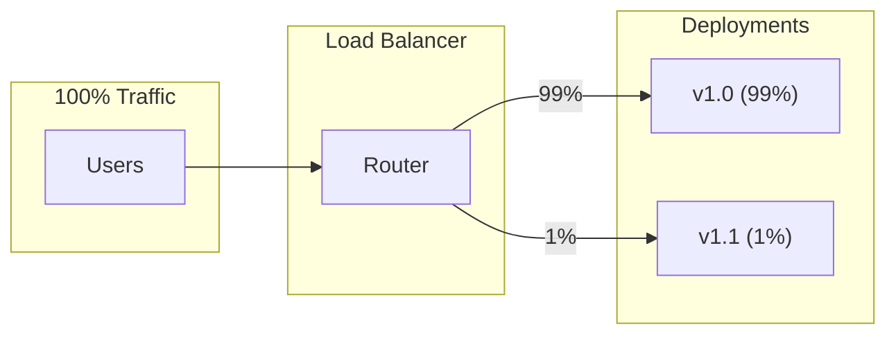
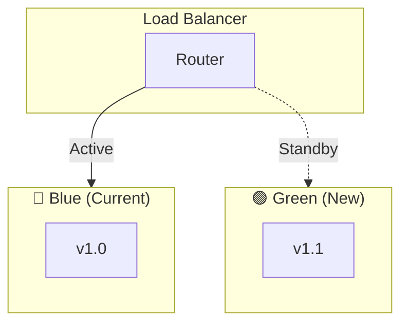
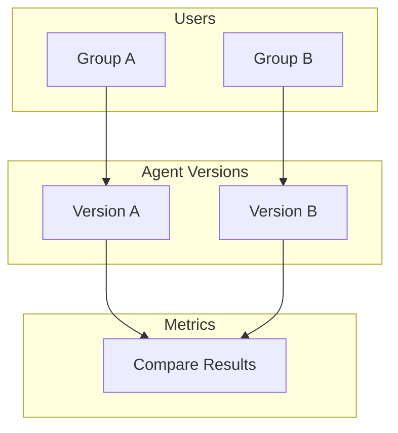
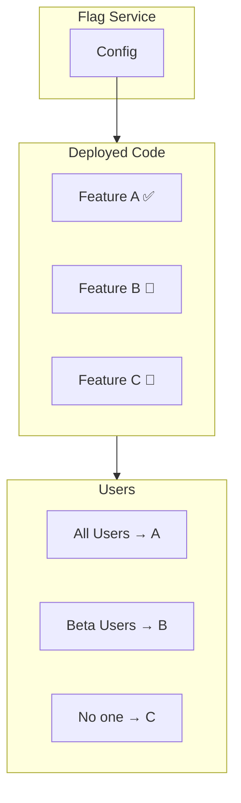
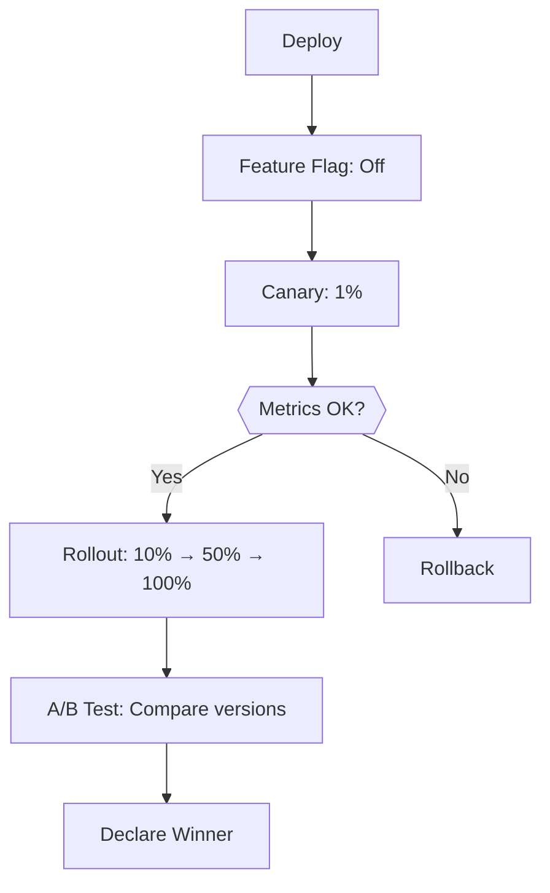

> "The goal isn't to never fail. It's to fail small, fail fast, and fail forward."

---

## The Problem

Your agent passed all tests. CI/CD is green. You hit deploy.

**100% of users now have the new version.**

Then:
- A prompt change causes unexpected behavior
- The new model generates longer responses (3x cost spike)
- Edge cases you never tested start failing

**By the time you notice, thousands of users are affected.**

| The Risk | What Happens |
|----------|--------------|
| 💥 **Big bang deployment** | All users affected by any bug |
| ⏱️ **Slow detection** | Hours before alerts fire |
| 🔄 **Painful rollback** | Complex, error-prone process |
| 💸 **Cost explosion** | Uncontrolled resource usage |

---

## The Four Rollout Strategies

Google's *Prototype to Production* guide defines four proven patterns:

| Strategy | Risk Level | Rollback Speed | Best For |
|----------|------------|----------------|----------|
| 🐤 **Canary** | Low | Instant | Default for all changes |
| 🔵🟢 **Blue-Green** | Low | Instant | Major version updates |
| ⚖️ **A/B Testing** | Medium | N/A | Comparing approaches |
| 🚩 **Feature Flags** | Flexible | Instant | Gradual capability rollout |

---

## Strategy 1: Canary Deployment 🐤

### The Concept

Deploy to a small percentage of traffic first. Monitor. Expand or rollback.



### The Rollout Stages

| Stage | Traffic | Duration | Gate |
|-------|---------|----------|------|
| **Canary** | 1% | 1 hour | Error rate <1% |
| **Early Adopters** | 10% | 4 hours | Latency <P99 |
| **Rollout** | 50% | 8 hours | Costs stable |
| **Full** | 100% | - | All metrics green |

### Implementation Example

```python
class CanaryDeployment:
    def __init__(self, new_version: str, stages: list):
        self.new_version = new_version
        self.stages = stages
        self.current_stage = 0
    
    def advance(self, metrics: Metrics) -> bool:
        stage = self.stages[self.current_stage]
        
        if not self.check_gates(metrics, stage.gates):
            self.rollback()
            return False
        
        self.current_stage += 1
        self.set_traffic_percentage(
            self.stages[self.current_stage].traffic_pct
        )
        return True
    
    def rollback(self):
        self.set_traffic_percentage(0)
        alert("Canary failed, rolling back")
```

---

## Strategy 2: Blue-Green Deployment 🔵🟢

### The Concept

Run two identical environments. Switch traffic instantly between them.



### The Switch

1. Deploy new version to Green (inactive)
2. Run smoke tests on Green
3. Switch router from Blue → Green
4. Keep Blue warm for instant rollback

### When to Use

| Scenario | Blue-Green? |
|----------|-------------|
| Major version update | ✅ Yes |
| Database schema change | ✅ Yes |
| Small prompt tweak | ❌ Overkill |
| Experimental feature | ❌ Use Feature Flags |

---

## Strategy 3: A/B Testing ⚖️

### The Concept

Run two versions simultaneously, measure business metrics, choose the winner.



### What to Measure

| Metric | Version A | Version B | Winner |
|--------|-----------|-----------|--------|
| Task Success Rate | 89% | 93% | B |
| Average Latency | 1.2s | 1.8s | A |
| User Satisfaction | 4.1/5 | 4.4/5 | B |
| Cost per Task | $0.02 | $0.03 | A |

### Statistical Significance

**Don't call a winner too early!**

```python
def is_statistically_significant(
    group_a: Results, 
    group_b: Results,
    confidence: float = 0.95
) -> bool:
    # Minimum sample size
    if group_a.count < 1000 or group_b.count < 1000:
        return False
    
    # Chi-squared or t-test
    p_value = run_significance_test(group_a, group_b)
    return p_value < (1 - confidence)
```

---

## Strategy 4: Feature Flags 🚩

### The Concept

Deploy code but control activation separately. Enable features for specific users or percentages.



### Feature Flag Configuration

```yaml
flags:
  new_reasoning_engine:
    enabled: true
    rollout_percentage: 10
    user_segments: ["beta_testers"]
  
  experimental_tool:
    enabled: true
    rollout_percentage: 0
    user_segments: ["internal_only"]
  
  legacy_mode:
    enabled: true
    rollout_percentage: 100
    # Gradual deprecation
```

### Implementation Pattern

```python
def agent_respond(request: Request) -> Response:
    flags = get_feature_flags(request.user_id)
    
    if flags.is_enabled("new_reasoning_engine"):
        return new_reasoning_engine.respond(request)
    else:
        return legacy_engine.respond(request)
```

---

## The Safety Checklist

Before every deployment:

| Check | Action |
|-------|--------|
| ✅ **Evaluation passed** | Quality gate green |
| ✅ **Rollback plan** | One-click or automated |
| ✅ **Monitoring ready** | Dashboards and alerts |
| ✅ **On-call aware** | Team knows deployment is happening |
| ✅ **Off-peak timing** | Not Friday 5 PM |

---

## Combining Strategies

Real-world deployments often combine multiple patterns:



---

## Key Takeaways

- ✅ **Never deploy 100% at once**: Canary is your default
- ✅ **Instant rollback**: Always have a one-click escape
- ✅ **Measure business metrics**: Not just technical health
- ✅ **Feature flags for flexibility**: Decouple deploy from release
- ✅ **Statistical significance**: Don't call winners too early
- ✅ **Combine strategies**: Canary → A/B → Full rollout

---

## What's Next

- 📖 **Previous article**: [CI/CD for AI Agents: The Deployment Pipeline](/Harry-the-architect/blog/cicd-ai-agents-pipeline/)
- 📖 **Series continues!** Check the [full article index](/Harry-the-architect/blog/).
- 💬 **Discuss**: What's your rollout strategy for agent updates?

---

## References

1.  **Google Cloud Research** — *Prototype to Production* (2025). Defines the four rollout strategies and safety patterns.

2.  **Martin Fowler** — *Feature Toggles* (2025). The canonical reference for feature flag patterns.

3.  **LaunchDarkly** — *Progressive Delivery for ML Systems* (2025). Feature flag implementation guide.

4.  **Netflix** — *Safe Deployment Practices* (2025). Enterprise-scale rollout strategies.
