> Your system prompt is 5,000 tokens and growing. Every new feature makes your agent slower, more expensive, and dumber. There's a better way.

---

## The Problem

You start with a simple agent. A few rules. A persona. It works.

Then requirements grow:
- "Add database query syntax."
- "Add our coding standards."
- "Add the API documentation."
- "Add error handling patterns."

Before you know it, you've created **The Prompt Blob Monster**—a 10,000-token system prompt that tries to do everything.

| The Enterprise Risk | What Happens |
|---------------------|--------------|
| 💸 **Cost Explosion** | Every request pays for tokens the agent doesn't need right now. |
| 🐢 **Latency Creep** | More tokens = slower first-token-time, especially at scale. |
| 🧠 **Context Rot** | Research shows LLMs lose reasoning quality in the "middle" of long contexts. |
| 🎯 **Instruction Fog** | Too many rules = the model forgets which ones matter *now*. |

**The villain isn't the LLM. It's the architecture.**

---

## The Concept

**Skills are procedural memory—loaded on demand.**

Instead of stuffing everything into one system prompt, you organize knowledge into discrete **Skill files**. The agent loads only what it needs, *when* it needs it.

> 💡 **The Key Insight**: Google's *Context Engineering* guide defines this as **Procedural Memory**—"How-to" knowledge that's retrieved just-in-time, not pre-loaded.

Think of it like a senior engineer's bookshelf:
- They don't memorize every API doc.
- They *know where to look* when they need it.
- The knowledge is **available**, not **active**.

This is **Progressive Context Disclosure**.

---

## How It Works

### The Skills Architecture

```mermaid
flowchart TD
    subgraph System["🎯 Always Active"]
        P["🎭 Persona"]
    end
    
    subgraph OnDemand["📚 Loaded When Needed"]
        S1["Skill: Git"]
        S2["Skill: Database"]
        S3["Skill: Code Review"]
    end
    
    U["👤 User: 'Review this PR'"] --> A["🤖 Agent"]
    A --> P
    A -.->|loads| S3
    S3 --> R["✅ Review Complete"]
```



### The SKILL.md Pattern

Each skill lives in its own folder with a `SKILL.md` file:

```
.agent/skills/
├── code-review/
│   └── SKILL.md
├── database/
│   └── SKILL.md
└── git-operations/
    └── SKILL.md
```

### Anatomy of a SKILL.md

```yaml
---
name: code-review
description: Guidelines for reviewing pull requests
---

# Code Review Skill

## When to Apply
- User asks to review code, a PR, or a diff.

## Key Guidelines
1. Check for security vulnerabilities first.
2. Verify error handling is present.
3. Look for performance anti-patterns.

## Output Format
- Use inline comments for specific issues.
- Summarize overall assessment at the end.
```

**The frontmatter** (name, description) helps the agent decide *when* to load the skill.  
**The body** contains the actual procedural knowledge.

### The Loading Pattern

1. **User makes a request** → "Review this pull request."
2. **Agent checks available skills** → Sees `code-review` matches.
3. **Agent loads the skill** → SKILL.md content joins the context.
4. **Agent executes with specialized knowledge** → Review follows guidelines.

The key: **Most skills stay unloaded most of the time.**

---

## When to Use It

### The Skill Threshold

> **Litmus Test**: If knowledge is needed *sometimes but not always*, it's a Skill.

| Context Type | When Needed | Where It Goes |
|--------------|-------------|---------------|
| Core identity, values | **Always** | 🎭 Persona (System Prompt) |
| Procedures, workflows | **Sometimes** | 📚 Skills (On-demand) |
| Facts, documents | **Per-query** | 📖 RAG (Retrieved) |
| Live system state | **Real-time** | 🔌 MCP (Connected) |

### Real-World Examples

| Scenario | ❌ Blob Approach | ✅ Skills Approach |
|----------|------------------|-------------------|
| **Multi-language support** | 5,000 tokens of Python + TypeScript + Go syntax in every request | Load only the language skill matching the current file |
| **Database operations** | All SQL dialects in the prompt | Load `postgres.md` or `mysql.md` based on detected connection |
| **Code review** | Review guidelines always present | Load `code-review` skill only when reviewing |

### The Token Math

Consider an agent with 10 specialized capabilities:
- **Blob approach**: 10 × 500 tokens = **5,000 tokens every request**
- **Skills approach**: 500 tokens base + 500 tokens loaded = **1,000 tokens average**

**Result**: 80% token reduction. Faster. Cheaper. Sharper focus.

---

## Key Takeaways

- ✅ **Skills = Procedural Memory**: "How-to" knowledge loaded on demand, not pre-stuffed.
- ✅ **Folder structure > prompt engineering**: Organize knowledge into files, not longer prompts.
- ✅ **Progressive disclosure reduces cost**: Only pay for context you're actually using.
- ✅ **Focus sharpens reasoning**: Fewer instructions = clearer execution.
- ✅ **Scalability by design**: Add 100 skills without bloating every request.

---

## What's Next

- 📖 **Previous article**: [The 4 Pillars: Persona, Skills, RAG, MCP](/Harry-the-architect/blog/four-pillars-persona-skills-rag-mcp/) — The decision framework for agent context.
- 📖 **Next article**: [The 9 Principles of Intelligent Agents](/Harry-the-architect/blog/nine-principles-intelligent-agents/) — Core design principles from Google research.
- 💬 **Discuss**: How are you organizing procedural knowledge in your agents?

---

## References

1.  **Google Cloud Research** — *Context Engineering: Sessions & Memory* (2025). Defines Procedural Memory as "How-to" knowledge distinct from Semantic Memory (facts).

2.  **Anthropic** — *CLAUDE.md Pattern*. The inspiration for skill-based context organization.

3.  **Galileo** — *The "Lost in the Middle" Phenomenon*. Research on context degradation in long prompts.
