> One model can't do everything. At enterprise scale, the "one-man band" isn't just inefficient—it's a reliability risk.

---

## The Problem

You ask an AI to help design a complex system.

It starts well—gives you requirements, sketches an architecture, even writes some code.

Then it forgets what it said earlier. Contradicts itself. Loses the thread.

**We've all been there.** But in an enterprise context, this isn't just annoying—it's critical.

This is the **Monolithic Model Paradox**: The more complex your task, the exponentially more likely a single model is to fail.

| The Enterprise Risk | Why It Happens |
|---------------------|----------------|
| 📉 **The "Context Rot"** | Even with 1M tokens, reasoning quality degrades in the "middle" of long contexts. |
| 🎲 **Non-Determinism** | A single model tackling 10 steps compounds a 5% error rate into a 40% failure rate. |
| 🛡️ **Auditability Gap** | When one "black box" does everything, you can't trace *why* a decision was made. |
| ⚠️ **Instruction Fog** | Too many tools/rules in one prompt confuses the model, leading to tool misuse. |

---

## The Insight

**Multi-agent AI systems work like orchestras.**

Instead of one performer trying to do everything, you have specialized musicians—each excellent at their instrument—working in harmony under a conductor.

> 💡 **The Key Principle**: Specialization isn't just about performance—it's the only way to achieve **reliability** at scale.

According to **Anthropic's internal research**, a multi-agent architecture (orchestrator + subagents) achieved a **90.2% increase in accuracy** on complex software tasks compared to a single-agent approach. 

That's the difference between a prototype and production.

---

## How It Works

Every enterprise-grade system needs structure. Multi-agent systems enforce it through three pillars.

### The Three Pillars

| Pillar | What It Is | Orchestra Equivalent | Enterprise Value |
|--------|------------|----------------------|------------------|
| 🧠 **Model** | The reasoning brain | Musician's talent | **Focus**: Smaller, cheaper models can handle specific sub-tasks better than one giant model. |
| 🤲 **Tools** | The ability to act | Instruments | **Security**: Agents only get the tools they *need*, enforcing Principle of Least Privilege. |
| 🎯 **Orchestration** | The coordination layer | The conductor | **Governance**: A central point to log, audit, and approve every decision. |

**The Conductor (Orchestrator)** is your governance layer. It ensures:
1.  **Routing**: The right task goes to the right specialist.
2.  **Synthesis**: Disparate outputs are merged coherently.
3.  **Quality Control**: Bad outputs are rejected *before* they reach the user.

In our systems, this implements the **Supervisor Pattern** documented by LangGraph:

```mermaid
flowchart TD
    subgraph Governance["🎯 Governance Layer"]
        C["🎼 Conductor"]
    end
    
    subgraph Specialists["🏭 Specialist Layer"]
        A1["🏗️ Architect"]
        A2["💻 Developer"]
        A3["🔍 Reviewer"]
    end
    
    U[👤 User Request] --> C
    C --> A1 & A2 & A3
    A1 & A2 & A3 --> C
    C --> R[📋 Final Result]
```

### The Agentic Loop

Each specialist follows a strict **Reasoning Cycle** (Perceive → Reason → Act → Learn). 

Why does this matter for valid enterprise use? **Observability.**
Because each agent is a distinct entity, you can see exactly *where* the process failed. Did the Researcher miss a fact? Did the Writer hallucinate? You can fix the specific component without retraining the entire system.

---

## When to Use It

Multi-agent systems add complexity. Use them only when the **Cost of Failure** exceeds the **Cost of Complexity**.

| Scenario | Recommendation | The Why (Enterprise Context) |
|----------|:--------------:|------------------------------|
| **Simple Q&A** | Single Agent | **Overhead.** Setting up an orchestra to answer "What is our Q3 revenue?" introduces unnecessary latency and cost. |
| **Document Summary** | Single Agent | **Linearity.** Summarization is a destructive transformation (reducing information). It doesn't require the *generative* conflict of multiple perspectives. |
| **Complex Research** | **Multi-Agent** | **Hallucination Risk.** A single model will "smooth over" gaps in its knowledge. Multiple agents (Searcher + Verifier) force factual grounding. |
| **End-to-End Design** | **Multi-Agent** | **Conflicting Constraints.** A "Creative" prompt fights with a "Security" prompt in one context. Separating them ensures both are respected. |
| **Production Workflows** | **Multi-Agent** | **Reliability.** You need a "Critic" agent to act as a unit test for intelligence. If the Critic rejects the output, the loop retries automatically. |

### Real-World Architecture: The "Coding Fabric"

Consider migrating a legacy Python script to Rust—a common enterprise modernization task.

#### ❌ Single Agent Approach
You dump the script into a 1M context window. The model translates 80% correctly but introduces subtle concurrency bugs because it lost track of the global state limitations.
*   **Result**: Code compiles but deadlocks in production. Debugging is impossible.

#### ✅ Multi-Agent Approach
1.  **Planner Agent**: Maps dependencies and defines interfaces. Use strictly for *architecture*.
2.  **Coder Agent**: Writes the Rust code for *one module at a time*.
3.  **Reviewer Agent**: Scans specifically for memory safety and idiomatic patterns. **Rejects** code that fails strict guidelines.
4.  **Test Agent**: Compiles and runs unit tests.
*   **Result**: Validated, modular code. The system "thought" about safety before writing a line.

> **The Enterprise Litmus Test:** If you can't define a **Standard Operating Procedure (SOP)** for a human team to do the task, a multi-agent system will fail too. Agents scale *process*, they don't invent it.

---

## Key Takeaways

- ✅ **Reliability requires redundancy**: A single model is a single point of failure. Agents working in loops provide self-healing.
- ✅ **Context needs boundaries**: "Context Rot" is real. Agents keep context short, focused, and effective.
- ✅ **Governance needs architectural support**: Orchestrators provide the audit trail compliance teams demand.
- ✅ **Scale capabilities, not prompts**: Don't build a bigger prompt; build a better team of agents.

---

## What's Next

- 📖 **Next article**: [The 4 Pillars: Persona, Skills, RAG, MCP](/Harry-the-architect/blog/four-pillars-persona-skills-rag-mcp/) — A decision framework effectively used in production.
- 💬 **Discuss**: How are you handling reliability in your agent workflows?

---

## References

1.  **Anthropic** — *Building Effective Agents* (2024). Highlights **90.2% accuracy** in multi-agent architectures vs single-agent baselines for complex tasks. [anthropic.com/research/building-effective-agents](https://www.anthropic.com/research/building-effective-agents)
    
2.  **LangGraph** — *Multi-Agent Supervisor Pattern*. The standard reference architecture for centralized orchestration and state management. [langchain-ai.github.io/langgraph](https://langchain-ai.github.io/langgraph/tutorials/multi_agent/agent_supervisor/)
    
3.  **Google Cloud** — *Vertex AI Agents*. Defines the "Perceive-Reason-Act" loop as the core of agentic reasoning. [cloud.google.com/vertex-ai/docs/agent-engine](https://cloud.google.com/vertex-ai/generative-ai/docs/agent-engine/overview)
    
4.  **Galileo** — *The "Lost in the Middle" Phenomenon*. Research on how LLM reasoning quality degrades as context window usage increases.
