# 🏛️ Building Best-in-Class Multi-Agent Systems

> *"Here's the thing about great AI systems. They don't start with code. They start with a **vision**."*
> — The Chief Architect

---

## Welcome

This presentation will take you on a journey through the art and science of building **best-in-class multi-agent systems**. Whether you're a C-suite leader making strategic decisions, a technical architect designing solutions, or an engineer writing your first agent—this is for you.

We've built something special here. Let me show you how.

---

# Foundation: The Building Blocks

Before we dive into patterns and principles, let's understand the **core technologies** that make this possible. Think of these as the ingredients in our recipe.

## The Technology Stack

```mermaid
flowchart TB
    subgraph ORCHESTRATION["🎯 ORCHESTRATION LAYER"]
        LG["LangGraph<br/>━━━━━━━━━━━━<br/>Workflow & State"]
    end
    
    subgraph CONTEXT["📝 CONTEXT ENGINEERING (into LLM prompt)"]
        PERSONA["🎭 Persona<br/>Identity & Tone"]
        SKILLS["📚 Skills<br/>Procedures"]
        RAG["📖 RAG<br/>Knowledge"]
    end
    
    subgraph CORE["🧠 REASONING"]
        LLM["LLM<br/>━━━━━━━━━━━━<br/>Reasoning Engine"]
    end
    
    subgraph TOOLS["🔌 TOOL LAYER"]
        MCP["MCP Servers<br/>━━━━━━━━━━━━<br/>External Actions"]
    end
    
    subgraph QUALITY["✅ QUALITY LAYER"]
        JUDGE["LLM as Judge<br/>━━━━━━━━━━━━<br/>Validation"]
    end
    
    LG -->|"orchestrates"| LLM
    PERSONA -->|"injected into<br/>system prompt"| LLM
    SKILLS -->|"loaded into<br/>context"| LLM
    RAG -->|"retrieved &<br/>injected"| LLM
    LLM -->|"tool calls"| MCP
    MCP -->|"results"| LLM
    LLM -->|"output"| JUDGE
    JUDGE -->|"feedback"| LLM
    
    style ORCHESTRATION fill:#e3f2fd,stroke:#1976d2
    style CONTEXT fill:#f3e5f5,stroke:#7b1fa2
    style CORE fill:#fff8e1,stroke:#ffa000
    style TOOLS fill:#fff3e0,stroke:#f57c00
    style QUALITY fill:#e8f5e9,stroke:#388e3c
```

**Key Insight:** Persona, Skills, and RAG all flow **into** the LLM as context. MCP is the **output** layer for tool actions. LangGraph **orchestrates** the whole flow.

---

## � Technology Stack Summary

Before diving into details, here's a quick overview of each component, its role, and relative importance:

| Component | Role | Weight | When It Matters Most |
|-----------|------|--------|---------------------|
| **LangGraph** | Orchestration | ⭐⭐⭐⭐⭐ | Multi-agent coordination, stateful workflows, approval gates |
| **RAG** | Knowledge | ⭐⭐⭐⭐ | Domain-specific data, company policies, past project retrieval |
| **Skills** | Expertise | ⭐⭐⭐⭐⭐ | Procedural knowledge, specialized workflows, reusable patterns |
| **Persona** | Identity | ⭐⭐⭐⭐ | Agent behavior, communication style, decision frameworks |
| **MCP** | Tool Protocol | ⭐⭐⭐⭐ | External integrations, standardized tool interfaces, ecosystem connectivity |
| **LLM as Judge** | Quality | ⭐⭐⭐ | Output validation, quality gates, self-correction |

### Weight Explanation

| Weight | Meaning | Impact if Missing |
|--------|---------|-------------------|
| ⭐⭐⭐⭐⭐ | **Critical** | System fundamentally broken |
| ⭐⭐⭐⭐ | **High** | Significant quality/capability loss |
| ⭐⭐⭐ | **Medium** | Reduced reliability, manual workarounds needed |
| ⭐⭐ | **Low** | Nice-to-have, minor impact |
| ⭐ | **Optional** | Edge cases only |

---

## 📊 RAG Types: Standard RAG vs Graph RAG

When implementing RAG, you have a choice of architecture. Here's when to use each:

```mermaid
flowchart LR
    subgraph QUERY["Your Query Needs"]
        Q1["Simple lookup?<br/>What is X?"]
        Q2["Multi-hop reasoning?<br/>How does X connect to Y through Z?"]
        Q3["Relationship discovery?<br/>What entities relate to this topic?"]
    end
    
    Q1 --> STANDARD["📚 STANDARD RAG<br/>Vector Search"]
    Q2 --> GRAPH["🕸️ GRAPH RAG<br/>NodeRAG / LightRAG"]
    Q3 --> GRAPH
    
    style STANDARD fill:#e8f5e9,stroke:#388e3c
    style GRAPH fill:#e3f2fd,stroke:#1976d2
```

### Comparison Table

| Aspect | Standard RAG | Graph RAG (NodeRAG/LightRAG) |
|--------|--------------|------------------------------|
| **Best For** | Direct Q&A, document lookup | Complex reasoning, relationship queries |
| **Query Type** | "What is X?" | "How does X relate to Y through Z?" |
| **Knowledge Structure** | Flat chunks | Nodes + Edges (relationships) |
| **Retrieval Method** | Vector similarity | Graph traversal + vector search |
| **Setup Complexity** | ⭐⭐ Lower | ⭐⭐⭐⭐ Higher |
| **Maintenance** | Re-embed on updates | Re-build graph on major updates |
| **Token Efficiency** | Good (top-k chunks) | Better (structured sub-graphs) |

### When to Use Standard RAG

| Use Case | Example |
|----------|---------|
| **Document lookup** | "What does our security policy say about passwords?" |
| **Fact retrieval** | "What's the API rate limit for service X?" |
| **Simple search** | "Find past projects using PostgreSQL" |
| **FAQ-style queries** | "How do I reset my deployment credentials?" |

**Frameworks:** LangChain, LlamaIndex, Haystack

### When to Use Graph RAG

| Use Case | Example |
|----------|---------|
| **Multi-hop reasoning** | "Which engineers worked on projects that used the same tech stack as Project Alpha?" |
| **Relationship discovery** | "What dependencies does Service A have, and what services depend on those?" |
| **Entity-centric queries** | "Show me everything related to the Payment module across all documents" |
| **Research synthesis** | "How do these 10 papers relate to each other? What are common themes?" |

**Frameworks:**
- **NodeRAG** - Graph-centric RAG with node-level retrieval
- **LightRAG** - Lightweight graph RAG optimized for speed
- **GraphRAG (Microsoft)** - Community-based summarization

### Decision Flowchart

```mermaid
flowchart TD
    START["Your Query Pattern"] --> Q1{"Does your query involve<br/>RELATIONSHIPS between entities?"}
    
    Q1 -->|Yes| GRAPH["🕸️ GRAPH RAG<br/>• NodeRAG<br/>• LightRAG<br/>• GraphRAG"]
    Q1 -->|No| Q2{"Do you need to combine<br/>info from multiple documents?"}
    
    Q2 -->|Yes| HYBRID["Consider GRAPH RAG<br/>or Hybrid"]
    Q2 -->|No| STANDARD["📚 STANDARD RAG<br/>(Simpler)"]
    
    style GRAPH fill:#e3f2fd,stroke:#1976d2
    style HYBRID fill:#fff3e0,stroke:#f57c00
    style STANDARD fill:#e8f5e9,stroke:#388e3c
```

### Hybrid Approach

In production, many systems use **both**:

```mermaid
flowchart LR
    USER["User Query"] --> CLASSIFIER{"Query<br/>Classifier"}
    CLASSIFIER -->|"Simple query"| STANDARD["📚 Standard RAG"]
    CLASSIFIER -->|"Complex/relationship"| GRAPH["🕸️ Graph RAG"]
```

### 🎯 Best Practices: Building a Query Classifier

The Query Classifier is the router that decides which RAG pipeline to use. Here's how to build one effectively:

#### Implementation Approaches

| Approach | Complexity | Accuracy | Best For |
|----------|------------|----------|----------|
| **Rule-based** | ⭐ Low | 70-80% | Quick MVP, clear patterns |
| **LLM-based** | ⭐⭐ Medium | 85-95% | Nuanced decisions, production |
| **Fine-tuned classifier** | ⭐⭐⭐ High | 90-98% | High volume, cost-sensitive |
| **Hybrid (rules + LLM)** | ⭐⭐ Medium | 90-95% | Best balance |

#### Classification Categories

Define clear categories for your classifier:

```python
class QueryType(Enum):
    SIMPLE_LOOKUP = "simple_lookup"      # → Standard RAG
    FACT_RETRIEVAL = "fact_retrieval"    # → Standard RAG
    MULTI_HOP = "multi_hop"              # → Graph RAG
    RELATIONSHIP = "relationship"         # → Graph RAG
    COMPARISON = "comparison"             # → Graph RAG or Hybrid
    AGGREGATION = "aggregation"           # → Graph RAG
```

#### Signals for Classification

| Signal | Indicates | Route To |
|--------|-----------|----------|
| "What is..." / "Define..." | Simple lookup | Standard RAG |
| "How does X relate to Y" | Relationship | Graph RAG |
| "Compare X and Y" | Multi-entity comparison | Graph RAG |
| "All projects that..." | Aggregation | Graph RAG |
| "Why did..." / "What caused..." | Causal reasoning | Graph RAG |
| Single entity mentioned | Simple lookup | Standard RAG |
| Multiple entities mentioned | Potential relationship | Graph RAG |
| Keywords: "connect", "link", "depend", "affect" | Relationship | Graph RAG |

#### Choosing the Right LLM Model for Classification

Query classification is a **fast, simple task** — use lightweight models, not reasoning models:

| Model Type | Examples | Suitable? | Why |
|------------|----------|-----------|-----|
| **Flash/Mini** | `gemini-2.0-flash`, `gpt-4o-mini`, `claude-3-haiku` | ✅ **Best** | Fast (<100ms), cheap, sufficient accuracy |
| **Standard** | `gemini-1.5-pro`, `gpt-4o`, `claude-3.5-sonnet` | ⚠️ OK | Overkill for classification, higher cost |
| **Reasoning** | `o1`, `o3-mini`, `gemini-2.0-flash-thinking` | ❌ **Avoid** | Too slow, expensive, unnecessary complexity |

**Recommended Models for Query Classification:**

| Provider | Model | Latency | Cost | Notes |
|----------|-------|---------|------|-------|
| **Google** | `gemini-2.0-flash` | ~50ms | Very low | Best for high-volume classification |
| **OpenAI** | `gpt-4o-mini` | ~80ms | Low | Good balance of speed and accuracy |
| **Anthropic** | `claude-3-haiku` | ~60ms | Low | Fast and reliable |
| **Local** | `llama-3.2-3b` | ~30ms | Free | If you have GPU, lowest latency |

> **Why NOT Reasoning Models?**
> 
> Reasoning models (o1, o3, flash-thinking) are designed for complex multi-step problems. Query classification is a **pattern matching task** — it doesn't benefit from chain-of-thought reasoning. Using a reasoning model would:
> - Add 2-10x latency (thinking tokens)
> - Cost 5-20x more per query
> - Provide no accuracy improvement
> 
> **Rule of thumb:** If your task can be described in one sentence, use a Flash model.

#### Implementation Example: LLM-based Classifier

```python
CLASSIFIER_PROMPT = """Analyze this query and classify it.

Query: {query}

Categories:
- SIMPLE: Direct fact lookup, single entity, "what is X" style
- RELATIONSHIP: Involves connections between entities, "how does X relate to Y"
- MULTI_HOP: Requires chaining information, traversing connections
- AGGREGATION: Needs to gather/summarize across multiple sources

Respond with ONLY the category name."""

async def classify_query(query: str) -> QueryType:
    # Use a fast, cheap model for classification
    response = await llm.invoke(
        CLASSIFIER_PROMPT.format(query=query),
        model="gpt-4o-mini",  # Fast and cheap
        temperature=0  # Deterministic
    )
    return QueryType(response.strip().lower())
```

#### Implementation Example: Rule-based Classifier

```python
import re

GRAPH_RAG_PATTERNS = [
    r"how does .+ relate to",
    r"what .+ connect.* to",
    r"relationship between",
    r"dependencies of",
    r"all .+ that .+ and",
    r"compare .+ (with|to|and)",
    r"(who|what|which) .+ worked on .+ (and|that)",
]

STANDARD_RAG_PATTERNS = [
    r"^what is ",
    r"^define ",
    r"^explain ",
    r"^how do I ",
    r"policy (on|for|about)",
]

def classify_query_rules(query: str) -> QueryType:
    query_lower = query.lower()
    
    # Check graph patterns first (more specific)
    for pattern in GRAPH_RAG_PATTERNS:
        if re.search(pattern, query_lower):
            return QueryType.RELATIONSHIP
    
    # Then check standard patterns
    for pattern in STANDARD_RAG_PATTERNS:
        if re.search(pattern, query_lower):
            return QueryType.SIMPLE_LOOKUP
    
    # Count entities as a heuristic
    entities = extract_entities(query)  # Your NER function
    if len(entities) > 2:
        return QueryType.MULTI_HOP
    
    # Default to standard (safer, faster)
    return QueryType.SIMPLE_LOOKUP
```

#### Hybrid Classifier (Best Practice)

```python
async def classify_query_hybrid(query: str) -> QueryType:
    # Step 1: Fast rule-based check for obvious cases
    rule_result = classify_query_rules(query)
    confidence = get_rule_confidence(query)
    
    if confidence > 0.9:
        return rule_result  # High-confidence rule match
    
    # Step 2: Use LLM for ambiguous cases
    llm_result = await classify_query_llm(query)
    
    # Step 3: Consensus or default
    if rule_result == llm_result:
        return rule_result
    
    # Trust LLM for complex cases, rules for simple
    if llm_result in [QueryType.MULTI_HOP, QueryType.RELATIONSHIP]:
        return llm_result
    return rule_result
```

#### Classifier Evaluation

Build a test set and measure:

```python
TEST_CASES = [
    ("What is our password policy?", QueryType.SIMPLE_LOOKUP),
    ("How does Service A depend on Service B?", QueryType.RELATIONSHIP),
    ("Which engineers worked on both Project X and Y?", QueryType.MULTI_HOP),
    ("List all APIs in the payment module", QueryType.AGGREGATION),
]

def evaluate_classifier(classifier_fn):
    correct = 0
    for query, expected in TEST_CASES:
        result = classifier_fn(query)
        if result == expected:
            correct += 1
        else:
            print(f"MISS: '{query}' → {result} (expected {expected})")
    
    accuracy = correct / len(TEST_CASES)
    print(f"Accuracy: {accuracy:.1%}")
    return accuracy
```

#### Key Metrics to Track

| Metric | Target | Why It Matters |
|--------|--------|----------------|
| **Accuracy** | >90% | Correct routing |
| **Latency** | <100ms | Don't delay the query |
| **Graph RAG %** | 20-40% | Too high = wasted compute |
| **Fallback rate** | <5% | Classifier confidence |

#### Common Pitfalls

| Pitfall | Problem | Solution |
|---------|---------|----------|
| Always routing to Graph RAG | Slow, expensive | Add rule-based fast path |
| Ignoring classifier confidence | Sends edge cases to wrong pipeline | Add confidence threshold + fallback |
| No monitoring | Can't catch drift | Log all classifications |
| Over-engineering | Diminishing returns | Start simple, iterate |

**In Our Product:** We primarily use Standard RAG for document retrieval (past projects, policies), but Graph RAG patterns could enhance:
- Architecture dependency analysis
- Cross-project pattern discovery
- Stakeholder relationship mapping

---

## 🔌 MCP: Model Context Protocol

**What it is:** A standardized protocol for connecting AI models to external tools, data sources, and services. Think of it as "USB for AI" — a universal interface that any tool can implement.

**Why we use it (future):** Instead of building custom integrations for every external service, MCP provides a standard interface. Write once, connect anywhere.

| Audience | What This Means For You |
|----------|------------------------|
| **Executive** | Future-proof investments — tools built to MCP standard work with any AI system that supports MCP. No vendor lock-in. |
| **Architect** | Standard protocol for tool discovery, invocation, and response handling. Supports resources, tools, and prompts as primitives. |
| **Engineer** | Implement `@mcp.tool()` decorators, handle JSON-RPC transport, manage tool schemas via `inputSchema`. |

```mermaid
flowchart LR
    AGENT["🤖 AI Agent<br/>(LangGraph)"] <--> CLIENT["🔌 MCP Client<br/>(Protocol)"]
    CLIENT <--> SERVER["🛠️ MCP Server<br/>(Tools)"]
    
    subgraph PROVIDES["MCP Servers Provide"]
        TOOLS["⚡ Tools<br/>Functions to call"]
        RESOURCES["📦 Resources<br/>Data to read"]
        PROMPTS["📝 Prompts<br/>Templates"]
    end
    
    SERVER --> PROVIDES
    
    style AGENT fill:#e3f2fd,stroke:#1976d2
    style CLIENT fill:#fff3e0,stroke:#f57c00
    style SERVER fill:#e8f5e9,stroke:#388e3c
```

### MCP vs Direct Tool Integration

| Aspect | Direct Integration | MCP |
|--------|-------------------|-----|
| **Implementation** | Custom per tool | Standardized protocol |
| **Discoverability** | Hardcoded in agent | Dynamic discovery |
| **Portability** | Locked to one agent | Works with any MCP client |
| **Ecosystem** | Build everything | Reuse community servers |
| **Maintenance** | N integrations × M agents | 1 server serves all |

### When to Use MCP

| Scenario | MCP? | Why |
|----------|------|-----|
| Internal database access | ✅ Yes | Standardized, reusable across agents |
| File system operations | ✅ Yes | Common patterns, community servers exist |
| One-off prototype tool | ⚠️ Maybe | Direct integration faster for MVP |
| Highly custom business logic | ⚠️ Maybe | May need custom implementation anyway |
| Third-party SaaS integration | ✅ Yes | Community servers often available |

### Example: MCP Tool Definition

```python
from mcp.server import Server
from mcp.types import Tool

server = Server("project-tools")

@server.tool()
async def search_projects(
    query: str,
    limit: int = 10
) -> list[dict]:
    """Search past projects by keyword.
    
    Args:
        query: Search term to find in project names/descriptions
        limit: Maximum number of results to return
    """
    # Implementation here
    return await db.search_projects(query, limit)
```

**In Our Product (Future):** We plan to migrate tool integrations to MCP for:
- Database querying (project history, templates)
- Document generation (PDF, DOCX via MCP servers)
- External service integration (Jira, Confluence, GitHub)
- Cross-agent communication via MCP resources

> **Note:** MCP is not yet implemented in our product, but is on the roadmap for standardizing all external tool integrations.

---

## 🔄 RAG via MCP: When Knowledge Becomes a Tool

**Important Clarification:** RAG (vector database querying) CAN be exposed via MCP as a tool or resource. Both approaches are valid — the choice depends on **when** you want the knowledge available.

### Two Valid Architectures

```mermaid
flowchart TB
    subgraph PRELOAD["📚 Pre-loaded RAG (Context Injection)"]
        direction LR
        P1["Vector DB"] -->|"retrieve at start"| P2["Inject into<br/>System Prompt"]
        P2 --> P3["LLM always<br/>has context"]
    end
    
    subgraph DYNAMIC["🔌 RAG via MCP (Dynamic Tool)"]
        direction LR
        D1["LLM decides<br/>to search"] -->|"tool call"| D2["MCP Server<br/>(Vector DB)"]
        D2 -->|"results"| D3["LLM receives<br/>on demand"]
    end
    
    style PRELOAD fill:#e8f5e9,stroke:#388e3c
    style DYNAMIC fill:#fff3e0,stroke:#f57c00
```

### Comparison: Pre-loaded vs Dynamic RAG

| Aspect | Pre-loaded RAG (Context) | RAG via MCP (Tool) |
|--------|--------------------------|-------------------|
| **When retrieved** | Before LLM starts | When LLM decides |
| **Token usage** | Always consumes tokens | Only when called |
| **LLM control** | No control — always present | Full control — decides if/when |
| **Best for** | Knowledge agent ALWAYS needs | Knowledge agent MIGHT need |
| **Latency** | One upfront retrieval | On-demand per query |
| **Multi-query** | Multiple chunks in one prompt | Multiple tool calls needed |

### Decision Framework

```mermaid
flowchart TD
    START["Does the agent need this knowledge?"] --> Q1{"For EVERY task<br/>in this domain?"}
    
    Q1 -->|"Yes, always"| PRELOAD["📚 Pre-load into Context<br/>━━━━━━━━━━━━━━━━━━<br/>• Company policies<br/>• Domain constraints<br/>• Project context"]
    
    Q1 -->|"Sometimes"| Q2{"Should agent decide<br/>when to search?"}
    
    Q2 -->|"Yes"| MCP_TOOL["🔌 RAG via MCP Tool<br/>━━━━━━━━━━━━━━━━━━<br/>• Historical search<br/>• Reference lookup<br/>• On-demand queries"]
    
    Q2 -->|"No"| HYBRID["🔀 Hybrid Approach<br/>━━━━━━━━━━━━━━━━━━<br/>• Core context pre-loaded<br/>• Detailed search as tool"]
    
    style PRELOAD fill:#e8f5e9,stroke:#388e3c
    style MCP_TOOL fill:#fff3e0,stroke:#f57c00
    style HYBRID fill:#e3f2fd,stroke:#1976d2
```

### Practical Examples

| Knowledge Type | Approach | Why |
|---------------|----------|-----|
| "Company uses AWS, not Azure" | **Pre-load** | Agent needs this for every architecture decision |
| "Past project templates" | **MCP Tool** | Agent searches when relevant, not always |
| "Security compliance rules" | **Pre-load** | Must always consider, can't forget |
| "Similar designs from history" | **MCP Tool** | Dynamic search based on current task |
| "Current sprint priorities" | **Hybrid** | Core priorities pre-loaded, details searchable |

### Example: RAG as MCP Tool

```python
from mcp.server import Server

server = Server("knowledge-base")

@server.tool()
async def search_knowledge(
    query: str,
    collection: str = "projects",
    limit: int = 5
) -> list[dict]:
    """Search the knowledge base using semantic similarity.
    
    Args:
        query: Natural language search query
        collection: Which collection to search (projects, policies, templates)
        limit: Maximum results to return
    """
    embeddings = embed(query)
    results = await vectordb.similarity_search(
        collection=collection,
        query_vector=embeddings,
        limit=limit
    )
    return results
```

### Our Recommendation: Hybrid Approach

For production systems, use **both**:

| Layer | What | How |
|-------|------|-----|
| **Pre-loaded** | Core domain context | Always in system prompt |
| **MCP Tool** | Extended knowledge | Agent calls when needed |

```python
# Hybrid implementation
system_prompt = f"""
{persona}
{skills}

## Core Context (always available)
{rag.retrieve("essential_policies", top_k=3)}
{rag.retrieve("current_project", top_k=2)}

## Available Tools
- search_knowledge(query, collection): Search extended knowledge base
- search_past_projects(query): Find similar historical projects
"""
```

This gives agents **immediate knowledge** for common cases while preserving **autonomy** to search deeper when needed — and saves tokens when extended knowledge isn't required.

---

## 🔀 RAG vs Skills vs Persona vs MCP: When to Use Each

This is one of the most common questions: **"Should I put this knowledge in RAG, a Skill, or the Persona?"**

Here's a decision framework:

```mermaid
flowchart TD
    START["🤔 Where should this go?"] --> Q1{"Is it about WHO<br/>the agent IS?<br/>(identity, tone, values)"}
    
    Q1 -->|Yes| PERSONA["🎭 PERSONA<br/>━━━━━━━━━━━━<br/>System prompt identity"]
    Q1 -->|No| Q2{"Is it about HOW<br/>to do something?<br/>(procedure, workflow)"}
    
    Q2 -->|Yes| SKILL["📚 SKILL<br/>━━━━━━━━━━━━<br/>Procedural knowledge"]
    Q2 -->|No| Q3{"Is it an ACTION<br/>on external systems?<br/>(APIs, databases, files)"}
    
    Q3 -->|Yes| MCP["🔌 MCP<br/>━━━━━━━━━━━━<br/>Tool integration"]
    Q3 -->|No| Q4{"Is it WHAT to know?<br/>(facts, data, docs)"}
    
    Q4 -->|Yes| RAG["📖 RAG<br/>━━━━━━━━━━━━<br/>Knowledge retrieval"]
    Q4 -->|No| HYBRID["🔀 HYBRID<br/>━━━━━━━━━━━━<br/>Combine approaches"]
    
    style PERSONA fill:#e1f5fe,stroke:#0288d1,stroke-width:2px
    style SKILL fill:#f3e5f5,stroke:#7b1fa2,stroke-width:2px
    style MCP fill:#fff3e0,stroke:#f57c00,stroke-width:2px
    style RAG fill:#e8f5e9,stroke:#388e3c,stroke-width:2px
    style HYBRID fill:#fce4ec,stroke:#c2185b,stroke-width:2px
```

### Comparison Table

| Aspect | RAG | Skills | Persona | MCP |
|--------|-----|--------|---------|-----|
| **Purpose** | Access external facts/data | Teach procedures/workflows | Define identity/behavior | Connect to external tools/services |
| **Content Type** | Documents, databases | Instructions, templates | Tone, values, rules | Tool definitions, APIs |
| **When Loaded** | Query-time retrieval | Agent initialization | Always in system prompt | On tool invocation |
| **Token Cost** | Per-query (variable) | Once per task (~1K) | Always present (~500) | Schema in prompt (~200/tool) |
| **Examples** | Past projects, policies | C4 diagrams, testing | "You are a visionary..." | Database queries, file ops |
| **Changes How Often** | Frequently | Occasionally | Rarely | When APIs change |

### Concrete Examples

| Scenario | Best Choice | Why |
|----------|-------------|-----|
| "Our company uses PostgreSQL, not MySQL" | **RAG** | Factual constraint that may change |
| "How to generate a C4 diagram correctly" | **Skill** | Procedural knowledge, step-by-step |
| "Always explain trade-offs, never just pick one option" | **Persona** | Behavioral guideline, identity trait |
| "List of approved technology vendors" | **RAG** | Document that updates periodically |
| "When to use microservices vs monolith" | **Skill** | Decision framework, reusable pattern |
| "Frame designs as storytelling journeys" | **Persona** | Communication style, character trait |
| "Query the project database for similar designs" | **MCP** | External system interaction, tool invocation |
| "Upload generated PDF to company SharePoint" | **MCP** | Third-party service integration |

### The Overlap Zone

Sometimes content could fit in multiple places. Use this priority:

1. **Persona First**: If it defines WHO the agent is → Persona
2. **Skill Second**: If it's HOW to do something repeatedly → Skill
3. **RAG Third**: If it's WHAT to know (facts, data) → RAG
4. **MCP Fourth**: If it's an ACTION on external systems → MCP

**Example:** "Always validate Mermaid syntax before outputting diagrams"
- Could be a Skill (procedure to validate)
- Could be a Persona constraint (behavioral rule)
- **Best choice:** Both! Persona says "always validate", Skill provides the validation method.

**Example:** "Search past project architectures for patterns"
- Could be RAG (retrieve documents)
- Could be MCP (if using a structured project database)
- **Best choice:** Depends on data source. Documents → RAG. Structured DB → MCP.

---

## �🔄 LangGraph: The Orchestration Engine

**What it is:** A framework for building stateful, multi-actor AI applications with graph-based workflows.

**Why we use it:** Traditional chatbots are stateless—each message is independent. LangGraph lets us build **workflows** where agents remember context, make decisions at branches, and loop until goals are achieved.

| Audience | What This Means For You |
|----------|------------------------|
| **Executive** | This is the "project management layer" for AI—coordinating who does what, when, and in what order. |
| **Architect** | Graph-based state machines with conditional edges, checkpoints, and human-in-the-loop capabilities. |
| **Engineer** | Define nodes (agents), edges (transitions), and state schema. The framework handles persistence and execution. |

```python
# Simplified example: How we define workflow transitions
workflow.add_edge("strategy_complete", "business_requirements")
workflow.add_conditional_edge(
    "review_gate",
    lambda state: "approved" if state["review_ready"] else "needs_revision"
)
```

---

## 📚 RAG: Knowledge Retrieval

**What it is:** Retrieval-Augmented Generation—giving AI access to external knowledge it wasn't trained on.

**Why we use it:** LLMs have a knowledge cutoff. RAG lets agents access current documentation, company policies, previous project artifacts, and domain-specific knowledge.

| Audience | What This Means For You |
|----------|------------------------|
| **Executive** | AI that knows YOUR business—not just general knowledge, but your specific context and history. |
| **Architect** | Vector databases, embedding models, semantic search with relevance scoring. |
| **Engineer** | Query embeddings, top-k retrieval, context injection into prompts. |

**Example Use Case:**
> When designing a solution, our Solution Architect can retrieve:
> - Similar past project architectures
> - Company technology standards
> - Compliance requirements from policy docs

---

## 🛠️ Skills: Specialized Expertise

**What it is:** Modular knowledge packages that agents can "learn" on demand. Each skill is a focused set of instructions, best practices, and domain knowledge.

**Why we use it:** Instead of cramming everything into one massive prompt (which overflows context), we inject only the skills relevant to the current task.

| Audience | What This Means For You |
|----------|------------------------|
| **Executive** | Think of it as giving your AI employee specialized training modules. A PM agent has PM skills, not engineering skills. |
| **Architect** | Separation of concerns—skills are composable, versioned, and independently maintainable. |
| **Engineer** | Markdown files in `/resources/skills/` that get loaded into system prompts based on `agent.skills = ["skill-name"]`. |

**Our Agents and Their Skills:**

| Agent | Skills Loaded |
|-------|---------------|
| Chief Architect | sequential-thinking, problem-solving, document-skills |
| Product Manager | lean-canvas, stakeholder-analysis |
| Business Analyst | requirements-engineering, data-modeling |
| Solution Architect | c4-diagrams, cloud-architecture, security-design |

---

## 🎭 Persona Prompts: Agent Identity

**What it is:** A carefully crafted identity that shapes how an agent thinks, communicates, and makes decisions.

**Why we use it:** The same LLM can behave as a cautious analyst or a bold visionary—the persona determines this. It's not just "personality"—it defines decision frameworks, communication style, and priorities.

| Audience | What This Means For You |
|----------|------------------------|
| **Executive** | This is the "culture" of your AI team. A well-designed persona creates trust and consistency. |
| **Architect** | Personas encode behavioral contracts—how the agent should prioritize, what it should refuse, how it should escalate. |
| **Engineer** | The `persona` string in the agent class becomes the system prompt. It sets tone, constraints, and decision patterns. |

**Example: Chief Architect's Persona DNA**
```
- Visionary & Uncompromising: "Simple can be harder than complex."
- Passionate Storyteller: Frame the journey, not just the destination.
- Master of Logic: See risks others miss.
```

**The difference a persona makes:**

| Without Persona | With Persona |
|-----------------|---------------|
| "Here is the architecture document." | "Here's the thing about great architecture. It doesn't start with technology. It starts with the problem worth solving." |

---

## ⚖️ LLM as Judge: Quality Assurance

**What it is:** Using an AI model to evaluate the output of another AI model. The "judge" assesses quality, correctness, and completeness.

**Why we use it:** Humans can't review everything. An LLM judge can:
- Validate that outputs meet requirements
- Detect incomplete or contradictory content
- Score quality against rubrics
- Flag items needing human review

| Audience | What This Means For You |
|----------|------------------------|
| **Executive** | Automated quality control that catches issues before they reach customers. Scales with volume. |
| **Architect** | Evaluation pipelines with scoring rubrics, threshold-based routing, and escalation paths. |
| **Engineer** | A separate LLM call with a judge prompt: "Evaluate this response against these criteria: [...]" |

**How We Use It:**

1. **Readiness Signal Validation**: Before an agent says "READY_FOR_REVIEW," we check:
   - Is it actually asking questions? (If yes → NOT ready)
   - Does it have draft language? (If yes → NOT ready)

2. **Artifact Quality Checks**: Before presenting a design document:
   - Are all required sections present?
   - Are Mermaid diagrams syntactically valid?
   - Are there any placeholders like [TODO]?

---

## 🔗 Putting It All Together

```mermaid
flowchart TD
    USER["👤 User Request:<br/>Design a restaurant booking system"]
    
    subgraph LANGGRAPH["🔄 LangGraph Workflow"]
        CA["🏛️ Chief Architect<br/>━━━━━━━━━━━━<br/>Skills: sequential-thinking,<br/>problem-solving<br/>Persona: Visionary"]
        PM["📋 Product Manager<br/>━━━━━━━━━━━━<br/>Creates Lean Canvas<br/>RAG: past canvases, market data"]
        JUDGE["⚖️ LLM as Judge<br/>━━━━━━━━━━━━<br/>Is Canvas complete?<br/>Valid? Ready?"]
    end
    
    USER --> CA
    CA -->|"Routes: STRATEGY → PM → BA → SA"| PM
    PM -->|"Handoff with distilled context"| JUDGE
    
    style CA fill:#e3f2fd,stroke:#1976d2
    style PM fill:#fff3e0,stroke:#f57c00
    style JUDGE fill:#e8f5e9,stroke:#388e3c
```

---

# Part 1: The Big Picture

## Why Multi-Agent?

Think about how your organization works. You don't have one person doing everything. You have:

- A **strategist** who sees the big picture
- A **business analyst** who understands the details  
- An **architect** who designs the foundation
- **Specialists** who execute with precision

**Multi-agent AI works the same way.**

Instead of one massive prompt trying to do everything (and failing at most things), we create a team of specialized AI agents—each excellent at their role, working together under intelligent coordination.

```mermaid
flowchart TB
    subgraph TRADITIONAL["❌ Traditional AI: One Model Does Everything"]
        T1["📝 Strategy + 📊 Analysis + 🏗️ Design + 💻 Code"]
        T2["😵 = Chaos"]
        T1 --> T2
    end
    
    subgraph MULTIAGENT["✅ Multi-Agent AI: Specialists Working in Harmony"]
        CA["🏛️ Chief Architect<br/>Coordinates everything"]
        PM["📋 PM<br/>Strategy"]
        BA["📊 BA<br/>Details"]
        SA["🏗️ SA<br/>Design"]
        
        CA --> PM
        CA --> BA
        CA --> SA
    end
    
    style TRADITIONAL fill:#ffebee,stroke:#c62828
    style MULTIAGENT fill:#e8f5e9,stroke:#388e3c
```

---

## The Three Pillars

Every agent system—whether simple or sophisticated—rests on three pillars:

| Pillar | What It Is | Human Equivalent |
|--------|------------|------------------|
| 🧠 **Model** | The reasoning brain | Your thinking capacity |
| 🤲 **Tools** | The ability to act | Your hands and instruments |
| 🎯 **Orchestration** | The coordination layer | Your project manager |

**For Leadership**: This is the architecture that scales. Add more specialized agents as your needs grow—without rebuilding the foundation.

**For Technical Teams**: Each pillar can be optimized independently. Better models, more tools, smarter orchestration.

---

# Part 2: The Agent Journey

## How Agents Think

Every agent follows what we call **The Agentic Loop**:

```mermaid
flowchart LR
    MISSION["1️⃣ MISSION<br/>Receive the goal"] --> SCENE["2️⃣ SCENE<br/>Understand context"]
    SCENE --> THINK["3️⃣ THINK<br/>Reason & plan"]
    THINK --> ACT["4️⃣ ACT<br/>Execute via tools"]
    ACT --> OBSERVE["5️⃣ OBSERVE<br/>Learn from results"]
    OBSERVE -->|"Not done"| THINK
    OBSERVE -->|"Done"| COMPLETE["✅ Complete"]
    
    style MISSION fill:#e3f2fd,stroke:#1976d2
    style THINK fill:#fff3e0,stroke:#f57c00
    style ACT fill:#e8f5e9,stroke:#388e3c
    style COMPLETE fill:#c8e6c9,stroke:#2e7d32
```

This isn't just theory—it's exactly how our agents work. The Chief Architect receives a mission, thinks about which specialist to engage, acts by routing to that agent, observes the result, and decides whether the mission is complete.

---

## The 9 Principles of Intelligent Agents

*Based on Google Gemini's research on what makes agents truly effective.*

> **Why These Principles Matter**
> 
> These aren't arbitrary rules—they're the distillation of what separates agents that *work* from agents that *frustrate*. Each principle addresses a specific failure mode observed in real-world AI systems.

---

### 🔗 Principle 1: Logical Dependencies First

**The Principle:** Before acting, analyze what must happen first, what depends on what, and what's the right order.

**Why It Matters:** Without understanding dependencies, agents take actions that block future progress or violate prerequisites. It's like sending concrete trucks to a construction site before the foundation blueprints are approved.

| Audience | Example |
|----------|----------|
| **Executive** | Your AI won't start building a product roadmap until it understands your business model. Just like you wouldn't hire a marketing team before knowing what you're selling. |
| **Architect** | The system won't generate an HLD (High-Level Design) until the BRD (Business Requirements) are approved. Dependencies are encoded in the state machine. |
| **Engineer** | `if current_step == "HLD_DESIGN" and not state.get("brd_approved"): return route_to("business_analyst")` |

**In Our System:**
```
STRATEGY → BRD → FRD → HLD → Deep Design → Complete
    ↑        ↑      ↑      ↑        ↑
    └────────┴──────┴──────┴────────┘
              Each step depends on the previous
```

---

### ⚖️ Principle 2: Risk Assessment

**The Principle:** Every action has consequences. Assess what could go wrong, whether this is low or high risk, and what the fallback is.

**Why It Matters:** Not all decisions are equal. Asking a clarifying question is low risk. Generating a final architecture document is high risk. Agents must calibrate their confidence accordingly.

| Audience | Example |
|----------|----------|
| **Executive** | Your AI won't send a proposal to a client without a review gate—it knows some actions are irreversible. Like a junior employee who knows when to escalate. |
| **Architect** | We implement this as "approval gates" between phases. High-stakes transitions require human sign-off. |
| **Engineer** | `if action_risk == "high": return {"route_to": "approval_gate"}` rather than auto-proceeding. |

**Real-World Application:**
> Search query → Low risk → Just do it
> Generate final architecture → High risk → Request approval first

---

### 🔍 Principle 3: Go Deeper (Abductive Reasoning)

**The Principle:** The obvious answer isn't always right. Look beyond surface-level causes, consider multiple hypotheses, don't discard unlikely scenarios prematurely.

**Why It Matters:** Most AI failures happen because the agent takes the first plausible path. Real problems have layers. A skilled agent explores alternatives before committing.

| Audience | Example |
|----------|----------|
| **Executive** | When a project is delayed, a naive AI might say "add more resources." A thoughtful agent considers: scope creep? unclear requirements? wrong technology choice? |
| **Architect** | When a user complains about "slow performance," we don't immediately recommend caching. We first hypothesize: database queries? network latency? frontend rendering? |
| **Engineer** | Multiple hypothesis generation: `hypotheses = ["query too complex", "missing index", "memory pressure", "network bottleneck"]; for h in hypotheses: test(h)` |

**In Our System:**
> User: "The system feels sluggish."
> Naive agent: "Add a CDN."
> Smart agent: "Let me explore three possibilities: (1) Database query optimization..."

---

### 🔄 Principle 4: Adapt and Evolve

**The Principle:** Plans change. New information arrives. Revise your approach based on observations. Don't stubbornly stick to a failing plan.

**Why It Matters:** The first plan is rarely perfect. Agents that can't adapt get stuck in loops or deliver outdated solutions. Flexibility is a feature, not a bug.

| Audience | Example |
|----------|----------|
| **Executive** | When market conditions change mid-project, your AI pivots the strategy, not blindly completes the original brief. Like a good consultant who course-corrects. |
| **Architect** | Dynamic replanning: if the user rejects an approach, the agent explores alternatives rather than repeating the same proposal. |
| **Engineer** | `if user_feedback == "rejected": state["needs_replanning"] = True; state["rejected_approaches"].append(current_approach)` |

**In Our System:**
```
Original plan: Build monolith first, microservices later
User feedback: "We need to scale immediately"
Adapted plan: Start with service-oriented architecture
```

---

### 📚 Principle 5: Use All Information

**The Principle:** The best agents gather context from everywhere: tools, policies, history, and—when necessary—asking the human.

**Why It Matters:** Agents with blinders miss critical context. A well-informed agent combines multiple sources to make better decisions.

| Audience | Example |
|----------|----------|
| **Executive** | Your AI doesn't work in a vacuum—it considers your company policies, past projects, and current constraints. Like an employee who reads the company handbook. |
| **Architect** | We combine RAG (knowledge retrieval), conversation history, tool capabilities, and skill content into a unified context. |
| **Engineer** | `context = {"rag_results": retrieve(query), "history": state["messages"], "skills": load_skills(agent.skills), "policies": company_policies}` |

**In Our System:**
```
Context Sources:
├── RAG: Past project templates, company standards
├── Skills: Domain expertise (C4 diagrams, security patterns)
├── History: Previous conversation turns
├── Policies: Compliance requirements, tech stack constraints
└── User: Direct questions when nothing else suffices
```

---

### 🎯 Principle 6: Be Precise

**The Principle:** Vague is dangerous. Quote exact sources, ground responses in specific information, avoid hand-wavy generalizations.

**Why It Matters:** Precision builds trust. When an agent says "this is best practice," it should be able to point to the source. Hallucinations happen when precision is abandoned.

| Audience | Example |
|----------|----------|
| **Executive** | When your AI recommends a technology, it cites specific reasons tied to YOUR requirements—not generic industry buzzwords. |
| **Architect** | Architecture decisions include explicit traceability: "FR-003 requires real-time updates → WebSocket architecture selected." |
| **Engineer** | `response += f"Based on requirement {req_id}: '{req_text}', we recommend: {recommendation}"` |

**In Our System:**
> ❌ Vague: "This architecture is scalable."
> ✅ Precise: "Based on BR-002 (1M users by Q4), we implement horizontal scaling with Kubernetes auto-scaling set to 3-10 pods."

---

### ✅ Principle 7: Be Complete

**The Principle:** Don't cut corners. Consider all requirements and constraints, explore multiple valid options, resolve conflicts explicitly.

**Why It Matters:** Incomplete analysis leads to incomplete solutions. An agent that stops at the first viable answer often misses better options or hidden constraints.

| Audience | Example |
|----------|----------|
| **Executive** | Your AI doesn't give you ONE option—it presents alternatives with trade-offs, letting you make informed decisions. Like a strategy consultant, not an order-taker. |
| **Architect** | Solution designs include multiple alternatives (e.g., Approach A: Serverless, Approach B: Container-based) with explicit comparison. |
| **Engineer** | `if len(valid_options) > 1: present_comparison(options) else: flag_as_single_option()` |

**In Our System:**
```
┌────────────────────────────────────────────────────────────────┐
│ Architecture Options Comparison                                │
├──────────────────┬─────────────┬─────────────┬────────────────┤
│ Criterion        │ Serverless  │ Containers  │ Recommendation │
├──────────────────┼─────────────┼─────────────┼────────────────┤
│ Cost at scale    │ Higher      │ Lower       │ Containers     │
│ Time to market   │ Faster      │ Slower      │ Serverless     │
│ Ops complexity   │ Lower       │ Higher      │ Serverless     │
├──────────────────┼─────────────┼─────────────┼────────────────┤
│ Given FR-005: "Launch in 4 weeks" → Recommend: Serverless     │
└────────────────────────────────────────────────────────────────┘
```

---

### 💪 Principle 8: Never Give Up Too Early

**The Principle:** Persistence with intelligence. Retry transient failures with backoff. Change strategy on real failures. Respect explicit limits.

**Why It Matters:** Real-world systems fail transiently—APIs timeout, rate limits hit, networks hiccup. Giving up on first failure means failing when you didn't have to.

| Audience | Example |
|----------|----------|
| **Executive** | Your AI doesn't crash when a service is temporarily slow—it waits, retries, and only escalates when truly blocked. Like a reliable employee who handles bumps gracefully. |
| **Architect** | Exponential backoff with fallback chains: Primary → Retry (1s) → Retry (2s) → Fallback Model → Graceful Error. |
| **Engineer** | `for attempt in range(max_retries): try: return llm.invoke() except TransientError: await sleep(2 ** attempt)` |

**In Our System:**
```
Attempt 1: Primary model → 429 Rate Limited
  → Wait 1 second
Attempt 2: Primary model → 429 Rate Limited
  → Wait 2 seconds
Attempt 3: Fallback model → Success ✓
```

---

### ⏸️ Principle 9: Think Before You Act

**The Principle:** Complete ALL reasoning BEFORE taking action. Once you act, you can't take it back. Measure twice, cut once.

**Why It Matters:** Premature action leads to cascading errors. An agent that acts before fully reasoning often has to undo, backtrack, or—worse—send incorrect information to users.

| Audience | Example |
|----------|----------|
| **Executive** | Your AI doesn't blurt out the first idea—it considers implications, second-order effects, and stakeholder impact before responding. Like a thoughtful executive, not a reactive one. |
| **Architect** | We implement this as the "inhibit response" rule: the agent must complete its reasoning chain before generating output. |
| **Engineer** | Chain-of-thought prompting: `"Before responding, reason through: (1) What is the user asking? (2) What constraints apply? (3) What are the options? (4) What are trade-offs? Then respond."` |

**In Our System:**
> User: "Just build it with the latest tech stack"
> 
> Naive agent: "Okay, here's a design using [bleeding-edge framework]."
> 
> Smart agent: "I understand the appeal of cutting-edge technology. However, let me reason through this: (1) Your team's current skills are in [X], (2) Enterprise support matters based on FR-011, (3) Production stability was emphasized in BR-003. Given these factors, I recommend [mature framework] with a roadmap to evaluate [newer option] in Phase 2."

---

# Part 2.5: Skills Mastery

> *"The context window is a public good."*
> — Claude Skills Best Practices

Skills are the secret weapon of best-in-class agents. This section covers how to **collect**, **build**, and **use** skills effectively—synthesizing best practices from Google Antigravity, Anthropic Claude, and our own product implementation.

---

## Why Skills Matter

Skills solve a fundamental problem: **How do you give an agent specialized expertise without overflowing its context window?**

```mermaid
flowchart TB
    subgraph WITHOUT["❌ Without Skills"]
        direction TB
        W1["System Prompt: 50,000 tokens!"]
        W2["All domain knowledge"]
        W3["All workflows"]
        W4["All API references"]
        W5["All examples"]
        W6["💥 Context overflow, confusion"]
        W1 --> W2 --> W3 --> W4 --> W5 --> W6
    end
    
    subgraph WITH["✅ With Skills (Progressive Disclosure)"]
        direction TB
        S1["System Prompt: 5,000 tokens"]
        S2["Core persona + constraints"]
        S3["Skill metadata ~100 tokens"]
        S4["SKILL.md body ~1,000 tokens<br/>(loaded when relevant)"]
        S5["References: unlimited<br/>(loaded on demand)"]
        S6["🎯 Focused, efficient, high-quality"]
        S1 --> S2 --> S3 --> S4 --> S5 --> S6
    end
    
    style WITHOUT fill:#ffebee,stroke:#c62828
    style WITH fill:#e8f5e9,stroke:#388e3c
```

---

## Skill Anatomy

Every skill follows a standard structure:

```
skill-name/
├── SKILL.md           # Main instructions (required)
│   ├── YAML frontmatter (name + description)
│   └── Markdown body (instructions)
├── references/        # Documentation loaded as needed
│   ├── advanced.md
│   └── examples.md
├── scripts/           # Executable code (Python/Bash)
│   ├── helper.py
│   └── validate.py
└── assets/            # Templates, icons, etc.
    └── template.pptx
```

| Component | Purpose | Token Impact |
|-----------|---------|--------------|
| **YAML Frontmatter** | Skill discovery | ~100 tokens (always loaded) |
| **SKILL.md Body** | Core instructions | ~1,000 tokens (when triggered) |
| **References** | Detailed documentation | Loaded on demand |
| **Scripts** | Deterministic execution | Executed, not loaded |
| **Assets** | Output resources | Used, not loaded |

---

## Collecting Skills: The Skill Lifecycle

### 1️⃣ Identify the Need

**Ask yourself:**
- What task is repeatedly difficult or error-prone?
- What domain knowledge does the agent lack?
- What workflow would benefit from standardization?

| Audience | How to Think About It |
|----------|----------------------|
| **Executive** | "What training would we give a new employee for this task?" |
| **Architect** | "What procedural knowledge isn't in the base model?" |
| **Engineer** | "What code do I keep rewriting for the same task?" |

**In Our Product:**
- **sequential-thinking**: Complex multi-step reasoning
- **problem-solving**: Structured approach to ambiguous problems
- **document-skills**: PDF, DOCX, PPTX, XLSX generation

### 2️⃣ Gather Concrete Examples

Before writing, understand the use cases:

```
Questions to Ask:
├── "What would a user say that should trigger this skill?"
├── "What are 3-5 concrete examples of this skill in action?"
├── "What does success look like?"
└── "What are common failure modes?"
```

**Example: pdf-editor skill**
> User says: "Rotate this PDF 90 degrees"
> Agent needs: Script to rotate PDF pages
> Success: PDF rotated correctly
> Failure: Wrong orientation, corrupted file

### 3️⃣ Plan Reusable Contents

For each example, identify what's reusable:

| Example Use Case | Reusable Content |
|------------------|------------------|
| "Rotate this PDF" | `scripts/rotate_pdf.py` |
| "Build me a todo app" | `assets/hello-world/` template |
| "How many users logged in?" | `references/schema.md` with table schemas |

---

## Building Skills: Best Practices

### ✅ Concise is Key

> **Default assumption: The AI is already very smart.**
> 
> Only add context it doesn't already have.

**Challenge every token:**
- "Does the agent really need this explanation?"
- "Can I assume it knows this?"
- "Does this paragraph justify its token cost?"

**Good (50 tokens):**
```markdown
## Extract PDF text
Use pdfplumber for text extraction:
```python
import pdfplumber
with pdfplumber.open("file.pdf") as pdf:
    text = pdf.pages[0].extract_text()
```

**Bad (150 tokens):**
```markdown
## Extract PDF text
PDF (Portable Document Format) files are a common file format that 
contains text, images, and other content. To extract text from a PDF, 
you'll need to use a library. There are many libraries available for 
PDF processing, but we recommend pdfplumber because it's easy to use 
and handles most cases well. First, you'll need to install it...
```

The concise version assumes the agent knows what PDFs are and how libraries work.

---

### ✅ Progressive Disclosure Structure

Keep **SKILL.md under 200 lines**. Split complex skills into:

```
bigquery-skill/
├── SKILL.md                  # Overview and navigation
└── references/
    ├── finance.md            # Revenue, billing metrics
    ├── sales.md              # Pipeline, opportunities
    ├── product.md            # API usage, features
    └── marketing.md          # Campaigns, attribution
```

**In SKILL.md:**
```markdown
## Available datasets
**Finance**: Revenue, ARR, billing → See [reference/finance.md](reference/finance.md)
**Sales**: Opportunities, pipeline → See [reference/sales.md](reference/sales.md)
```

Agent loads only the reference file it needs, not all of them.

---

### ✅ Effective Metadata

The `description` in YAML frontmatter determines when the skill triggers:

**Good Description:**
```yaml
description: >-
  Extracts text and tables from PDF files, fills forms, and merges documents.
  Use when working with PDF files or when the user mentions PDFs, forms, or 
  document extraction.
```

**Bad Description:**
```yaml
description: PDF skill
```

**Include:**
- What the skill does
- When to use it
- Key triggering terms

---

### ✅ Workflow Patterns

For complex multi-step tasks, provide checklists:

```markdown
## Research synthesis workflow

Copy this checklist and track your progress:

```
Research Progress:
- [ ] Step 1: Read all source documents
- [ ] Step 2: Identify key themes
- [ ] Step 3: Cross-reference claims
- [ ] Step 4: Create structured summary
- [ ] Step 5: Verify citations
```

**Step 1: Read all source documents**
Review each document in the `sources/` directory...
```

---

### ✅ Template and Examples Patterns

**Template Pattern** (for strict output formats):
```markdown
## Report structure
ALWAYS use this exact template:

```markdown
# [Analysis Title]

## Executive summary
[One-paragraph overview]

## Key findings
- Finding 1 with supporting data
- Finding 2 with supporting data
```

**Examples Pattern** (when output quality depends on seeing examples):
```markdown
## Commit message format

**Example 1:**
Input: Added user authentication with JWT tokens
Output: feat(auth): implement JWT-based authentication

**Example 2:**
Input: Fixed bug where dates displayed incorrectly
Output: fix(reports): correct date formatting in timezone conversion
```

---

### ❌ Anti-Patterns to Avoid

| Anti-Pattern | Why It's Bad | Solution |
|--------------|--------------|----------|
| **Too many options** | Confuses the agent | Provide a default with escape hatch |
| **Windows-style paths** | Breaks on Unix | Always use forward slashes |
| **Verbose explanations** | Wastes tokens | Assume agent knows basics |
| **Deeply nested references** | Context explosion | One level of references max |
| **Time-sensitive info** | Becomes stale | Use "old patterns" section |

**Bad: Too many options**
```markdown
You can use pypdf, or pdfplumber, or PyMuPDF, or pdf2image, or...
```

**Good: Default with escape hatch**
```markdown
Use pdfplumber for text extraction.
For scanned PDFs requiring OCR, use pdf2image with pytesseract instead.
```

---

## Using Skills: How Our Agents Load Them

### Agent-Skill Assignment

In our product, each agent class declares which skills it needs:

```python
class ChiefArchitect(BaseAgent):
    name = "Chief Architect"
    skills = ["sequential-thinking", "problem-solving", "document-skills"]
    persona = """You are the Chief Architect..."""
```

### Skill Loading at Runtime

When the agent builds its system prompt:

```python
def get_system_prompt(self) -> str:
    skill_content = self._load_skills()  # Load declared skills
    prompt = ""
    if skill_content:
        prompt += f"# SPECIALIZED SKILLS\n\n{skill_content}\n\n---\n\n"
    prompt += self.persona + self.get_tools_prompt_section()
    return prompt
```

**Result:** Skills are injected into the system prompt, giving the agent specialized knowledge without hardcoding it.

---

## Skill Design Checklist

Before deploying a skill, verify:

### Core Quality
- [ ] Description is specific with triggering terms
- [ ] SKILL.md body is under 200 lines
- [ ] Detailed reference files used for extended content
- [ ] No time-sensitive information (or in "old patterns" section)
- [ ] Consistent terminology throughout
- [ ] Examples are concrete, not abstract

### Scripts (if applicable)
- [ ] Scripts solve problems rather than punt to the agent
- [ ] Error handling is explicit and helpful
- [ ] Required packages documented
- [ ] Tests exist for critical scripts

### Testing
- [ ] Tested with real usage scenarios
- [ ] Tested edge cases and failure modes
- [ ] Team feedback incorporated

---

## Skill Ecosystem in Our Product

```
.agent/skills/                      # Development/IDE skills
├── sequential-thinking/            # Structured reasoning
├── problem-solving/                # 6-skill framework
├── agent-builder-expert/           # Agent design guidance
├── document-skills/                # docx, pdf, pptx, xlsx
└── [30+ more skills]

backend/app/resources/skills/       # Agent runtime skills
├── document-skills/                # Production doc generation
└── [domain-specific skills]
```

**Key Insight:** We maintain two skill directories:
1. **IDE Skills** (`.agent/skills/`): For development-time guidance
2. **Agent Skills** (`backend/app/resources/skills/`): For runtime injection

This separation keeps development and production concerns isolated.

---

# Part 3: The Orchestra

## The Supervisor Pattern

In our system, the **Chief Architect** is the conductor of the orchestra. It doesn't play every instrument—it ensures every instrument plays at the right time.

```mermaid
flowchart TD
    CA["🏛️ Chief Architect<br/>\"The Conductor\""]
    
    CA --> PM["📋 Product Manager<br/>\"Vision\""]
    CA --> BA["📊 Business Analyst<br/>\"Details\""]
    CA --> SA["🏗️ Solution Architect<br/>\"Design\""]
    
    style CA fill:#e3f2fd,stroke:#1976d2,stroke-width:3px
    style PM fill:#fff3e0,stroke:#f57c00
    style BA fill:#f3e5f5,stroke:#7b1fa2
    style SA fill:#e8f5e9,stroke:#388e3c
```

**The Chief Architect's Role:**

1. **Receives** the user's request
2. **Decides** which specialist should handle it
3. **Routes** the work appropriately
4. **Synthesizes** the final result
5. **Ensures** quality across the board

---

## The Workflow: From Idea to Reality

We don't just randomly route work. We follow a proven journey:

```mermaid
flowchart LR
    subgraph PHASE1["📋 Phase 1: Discovery"]
        STRATEGY["🎯 STRATEGY<br/>Vision<br/>━━━━━━━━<br/>Lean Canvas"]
        BRD["📄 BRD<br/>What<br/>━━━━━━━━<br/>Requirements"]
        FRD["📋 FRD<br/>How<br/>━━━━━━━━<br/>Functional Specs"]
        REVIEW1["✅ REVIEW<br/>Check<br/>━━━━━━━━<br/>Sign-off"]
        
        STRATEGY --> BRD --> FRD --> REVIEW1
    end
    
    subgraph PHASE2["🏗️ Phase 2: Design"]
        HLD["🏛️ HLD<br/>High<br/>━━━━━━━━<br/>Architecture"]
        DLD["📐 DLD<br/>Deep<br/>━━━━━━━━<br/>Detailed Design"]
        COMPLETE["🎉 COMPLETE<br/>Done<br/>━━━━━━━━<br/>Summary"]
        
        HLD --> DLD --> COMPLETE
    end
    
    REVIEW1 -->|"Approval"| HLD
    
    style PHASE1 fill:#e3f2fd,stroke:#1976d2
    style PHASE2 fill:#e8f5e9,stroke:#388e3c
```

**Each gate matters.** Approval is required between phases. This prevents the costly mistake of building on a shaky foundation.

---

## The Handoff: Passing the Baton

When one agent hands work to another, we don't just dump the entire conversation. We **distill** what matters.

**The Old Way (Don't Do This):**
> "Here's 50 pages of chat history. Good luck figuring out what's relevant."

**The Smart Way (What We Do):**

```mermaid
flowchart TB
    subgraph HANDOFF["📋 HANDOFF CONTEXT"]
        direction TB
        HEADER["📤 From: Product Manager<br/>📥 To: Business Analyst"]
        
        SUMMARY["📝 Project Summary<br/>Restaurant booking platform for urban diners"]
        
        REQS["📋 Key Requirements (Top 10)<br/>1. Real-time table availability<br/>2. Multi-location support<br/>3. Payment integration<br/>..."]
        
        DECISIONS["✅ Decisions Made<br/>• Mobile-first approach (validated)<br/>• Focus on B2C (not B2B initially)"]
        
        TASK["🎯 Your Task<br/>Create the Business Requirements Document"]
    end
    
    HEADER --> SUMMARY --> REQS --> DECISIONS --> TASK
    
    style HANDOFF fill:#f5f5f5,stroke:#757575
    style TASK fill:#e8f5e9,stroke:#388e3c
```

This is more efficient, more focused, and produces better results.

---

# Part 4: Building for Reality

## Quality That You Can Trust

Multi-agent systems must be reliable. Here's our quality framework:

| Pillar | What It Means | How We Measure |
|--------|---------------|----------------|
| ✓ **Correctness** | The agent achieves its goal | Task success rate |
| ♻️ **Reliability** | It works consistently | Error recovery rate |
| ⚡ **Efficiency** | Fast and cost-effective | Latency, token usage |
| 🛡️ **Safety** | Operates within bounds | Guardrail compliance |

---

## Resilience: When Things Go Wrong

**Because they will.** APIs fail. Models hiccup. Networks timeout.

Our defense system:

```mermaid
flowchart TD
    REQ["📥 Request"] --> PRIMARY["Primary Model<br/>(Antigravity)"]
    PRIMARY -->|"✅ Success"| RESPONSE["📤 Response"]
    PRIMARY -->|"❌ Failed"| RETRY1["⏳ Retry (1s wait)"]
    RETRY1 -->|"✅ Success"| RESPONSE
    RETRY1 -->|"❌ Failed"| RETRY2["⏳ Retry (2s wait)"]
    RETRY2 -->|"✅ Success"| RESPONSE
    RETRY2 -->|"❌ Failed"| FALLBACK["Fallback Model<br/>(Copilot)"]
    FALLBACK -->|"✅ Success"| RESPONSE
    FALLBACK -->|"❌ Failed"| EMERGENCY["🚨 Emergency Tier"]
    EMERGENCY --> RESPONSE
    
    style PRIMARY fill:#e3f2fd,stroke:#1976d2
    style FALLBACK fill:#fff3e0,stroke:#f57c00
    style EMERGENCY fill:#ffebee,stroke:#c62828
    style RESPONSE fill:#e8f5e9,stroke:#388e3c
```

**Exponential backoff** means we wait longer between retries. This respects rate limits and gives systems time to recover.

---

## The Signals: Knowing When We're Done

A critical challenge: **How does an agent know it's ready for review?**

We solved this with explicit signal validation:

**✅ Ready for Review When:**
- The artifact is complete
- No follow-up questions are asked
- User explicitly approved

**❌ NOT Ready When:**
- Asking clarifying questions
- Using phrases like "What do you think?"
- The draft is still evolving

This prevents premature "completion" signals that frustrate users.

---

# Part 5: The Principles of Excellence

## Persona Engineering: Giving Agents Soul

Agents aren't just functions—they're characters. Our Chief Architect doesn't just "route requests." It embodies **visionary leadership**.

> *"Your DNA:*
> - *Visionary & Uncompromising: 'Simple can be harder than complex.'*
> - *Passionate Storyteller: Frame the journey, not just the destination.*
> - *Master of Logic: See risks others miss."*

**For Leadership**: This is how you create AI that feels like a trusted partner, not a chatbot.

**For Engineers**: Personas guide the model's tone, decision-making, and communication style.

---

## Context Engineering: Less is More

The biggest mistake in multi-agent systems? **Information overload.**

LLMs have context limits. Filling them with irrelevant history is like giving someone a 500-page book when they need a 1-page summary.

**Our Approach:**

| What We Send | What We Don't Send |
|--------------|-------------------|
| Project summary | Raw chat logs |
| Top 10 requirements | Every requirement ever mentioned |
| Key decisions made | Decision debates |
| Clear next action | Vague guidance |

This is **distilled context**—focused, efficient, actionable.

---

## Guard Rails: The Boundaries of Trust

We tell our agents what NOT to do just as clearly as what TO do:

```
⛔ Do NOT generate code implementations (only design artifacts)
⛔ Do NOT include placeholders like [TODO] or [TBD]
⛔ Do NOT repeat previously approved artifacts
⛔ Do NOT fabricate specific numbers without context
⛔ Do NOT use empty labels in diagrams
```

This prevents the most common mistakes before they happen.

---

# Part 6: For Every Audience

## For Executive Leadership

**What Multi-Agent Means for You:**

1. **Scalability**: Add new capabilities by adding specialist agents—not rebuilding
2. **Quality Control**: Approval gates ensure nothing moves forward without sign-off
3. **Measurable**: Every agent operation is tracked—latency, success, cost
4. **Resilient**: Multiple fallback layers ensure the system stays operational

**Key Investment Areas:**
- Model quality (the brain of the operation)
- Orchestration sophistication (the coordination layer)
- Specialist breadth (covering more use cases)

---

## For Technical Architects

**Key Architectural Decisions:**

1. **Supervisor vs. Peer-to-Peer**: We chose Supervisor (Chief Architect) for clear accountability and control flow
2. **State Machine Workflows**: Explicit phases with gates, not ad-hoc routing
3. **Handoff Protocol**: Structured `HandoffContext` dataclass, not raw message passing
4. **Tiered Model Selection**: Light for quick tasks, Heavy for complex reasoning
5. **Shared Base Class**: `BaseAgent` provides token estimation, metrics, fallback logic, validation utilities

**Trade-offs We Made:**
- More structure = More predictable, less flexible
- Distilled context = Faster, but requires extraction logic
- Approval gates = Safer, but slower

---

## For Engineers

**Your Implementation Checklist:**

```python
# 1. Inherit from BaseAgent
class MyAgent(BaseAgent):
    name = "My Specialist"
    skills = ["relevant-skills"]
    persona = """You are an expert in..."""
    
# 2. Define your tools
tools = [
    ToolDefinition(
        name="do_something",
        description="What, when to use, what it returns",
        parameters={"input": {"type": "string"}},
    )
]

# 3. Implement process()
async def process(self, user_input, state):
    # Your logic here
    response = await self.invoke(prompt, context={"state": state})
    cleaned, is_ready = self._validate_readiness_signal(response)
    return {"content": cleaned, "review_ready": is_ready}
```

**Key Utilities Available:**
- `self.get_llm(tier="light" | "heavy")` - Tiered model access
- `self._validate_readiness_signal()` - Control signal validation
- `self._validate_mermaid()` - Diagram syntax checking
- `self._extract_artifact_content()` - Clean content extraction

---

# Part 7: The Anti-Patterns

## What Not To Do

Learn from mistakes (so you don't have to make them):

| ❌ Anti-Pattern | 🔥 Why It's Dangerous | ✅ Solution |
|----------------|----------------------|-------------|
| **Raw history passing** | Token explosion, noise | Use distilled HandoffContext |
| **One massive agent** | Context overflow, confusion | Specialist agents + supervisor |
| **No termination condition** | Infinite loops | Explicit approval gates |
| **Vague tool descriptions** | Tool confusion | Specific what/when/returns |
| **Premature ready signals** | Frustrating UX | Validate before signaling |
| **Silent failures** | User has no idea what happened | Actionable error messages |
| **Unbounded retries** | Resource exhaustion | Exponential backoff with limits |
| **Skipping evaluation** | Quality issues in production | LLM-as-Judge, test scenarios |

---

# Part 8: The Summary

## What We've Built

A production-grade multi-agent system that:

✅ **Coordinates specialized agents** under intelligent supervision  
✅ **Follows proven workflows** with explicit approval gates  
✅ **Passes context efficiently** through structured handoffs  
✅ **Fails gracefully** with tiered fallback chains  
✅ **Validates quality** before signaling completion  
✅ **Measures everything** with Prometheus metrics  

---

## The Journey Continues

Multi-agent systems are not a destination—they're a **capability**. The foundation we've built enables:

- Adding new specialist agents for new domains
- Improving individual agents without affecting others
- Scaling to more complex workflows
- Learning from every interaction

> *"We're here to put a dent in the universe."*

This is how we build AI that actually matters.

---

# Thank You

**Questions? Let's discuss.**

*The best ideas come from collaboration—across leadership, architecture, and engineering.*

---

## Quick Reference

### The 9 Principles (At-a-Glance)

1. 🔗 Logical Dependencies First
2. ⚖️ Risk Assessment
3. 🔍 Go Deeper (Abductive Reasoning)
4. 🔄 Adapt and Evolve
5. 📚 Use All Information
6. 🎯 Be Precise
7. ✅ Be Complete
8. 💪 Never Give Up Too Early
9. ⏸️ Think Before You Act

### Architecture Summary

```
          User Request
               │
               ▼
      ┌─────────────────┐
      │ Chief Architect │ ◄── Supervisor
      └────────┬────────┘
               │
     ┌─────────┴─────────┐
     ▼         ▼         ▼
   [PM]      [BA]      [SA]  ◄── Specialists
     │         │         │
     ▼         ▼         ▼
  Strategy → Reqs → Design → Complete
```

### Key Implementation Classes

- `BaseAgent` → Shared functionality
- `HandoffContext` → Structured transitions
- `ChiefArchitect` → Supervisor orchestration
- `ToolDefinition` → Tool schemas

---

*Created with ❤️ by the Chief Architect*
