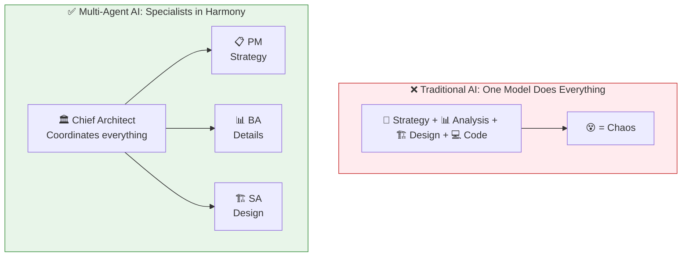
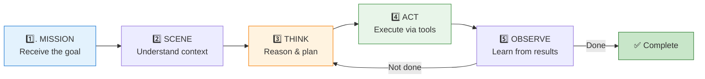
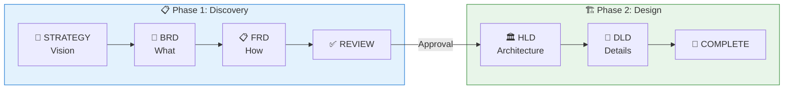

# The Orchestra: Why Multi-Agent AI Works

> One model can't do everything. Here's why the orchestra analogy changes how we build AI systems.

## The Problem

We've all been there. You ask an AI to help with a complex task—say, designing a software system. It starts well, gives you some requirements, sketches an architecture, maybe even writes some code. But then it forgets what it said earlier. Contradicts itself. Loses the thread.

**This is the monolithic model problem.**

When you ask one model to be everything—strategist, analyst, architect, engineer—you're essentially asking a one-man band to outperform an orchestra.

- 🎸 One person playing guitar, drums, and singing simultaneously
- 🎺 Limited by attention span and context windows
- 🎭 Personality switching creates inconsistency
- 📉 Quality degrades as complexity increases

## The Concept

**Multi-agent AI systems work like orchestras.**

Instead of one performer trying to do everything, you have specialized musicians—each excellent at their instrument—working in harmony under a conductor.

> 💡 **Key Insight**: Multi-agent systems don't just divide work—they enable specialization, consistency, and scale.

## How It Works

Every orchestra needs three things to perform well. So does every multi-agent system.

### The Three Pillars

| Pillar | What It Is | Human Equivalent |
|--------|------------|------------------|
| 🧠 **Model** | The reasoning brain | Your thinking capacity |
| 🤲 **Tools** | The ability to act | Your hands and instruments |
| 🎯 **Orchestration** | The coordination layer | Your conductor |

**The Conductor (Orchestrator)** doesn't play every instrument. It ensures every instrument plays at the right time, in the right way. In our systems, this is often a "supervisor" agent—like a Chief Architect—that:

1. **Receives** the user's request
2. **Decides** which specialist should handle it
3. **Routes** the work appropriately
4. **Synthesizes** the final result
5. **Ensures** quality across the board

### The Agentic Loop

Each specialist follows a consistent pattern:

This isn't just theory—it's exactly how production multi-agent systems work.

## When to Use It

| Scenario | Single Agent | Multi-Agent | Why |
|----------|--------------|-------------|-----|
| Simple Q&A | ✅ | ❌ | Overkill |
| Document summary | ✅ | ❌ | One task, one focus |
| Complex research | ⚠️ | ✅ | Multiple perspectives needed |
| End-to-end design | ❌ | ✅ | Requires different expertise |
| Production workflows | ❌ | ✅ | Needs coordination and quality gates |

**Rule of thumb**: If your task requires more than one type of expertise, or if quality gates and approvals matter, multi-agent is the way.

## Example: The Design Journey

Here's how a real multi-agent workflow handles a design request:

**Each gate matters.** Approval is required between phases. This prevents the costly mistake of building on a shaky foundation.

## Key Takeaways

- ✅ **Specialization beats generalization**: Experts at their roles outperform generalists trying to do everything
- ✅ **Orchestration is the key**: Without coordination, even great specialists produce chaos
- ✅ **Quality gates enable trust**: Approval checkpoints catch issues before they cascade
- ✅ **Context distillation matters**: Smart handoffs pass what's relevant, not everything
- ✅ **Scale by adding specialists**: New capabilities = new agents, not bigger prompts

## What's Next

- 📖 **Next article**: [The 4 Pillars: Persona, Skills, RAG, MCP](/articles/2026-01-19-four-pillars-persona-skills-rag-mcp) — A decision framework for what goes where
- 📹 **Watch the demo**: Architecture overview walkthrough
- 💬 **Discuss**: What multi-agent patterns have you tried?

---

*Building multi-agent systems? I'd love to hear about your challenges. Connect with me on [LinkedIn](link) or subscribe on [YouTube](link) for more deep dives.*
