# The 4 Pillars: Persona, Skills, RAG, MCP

> "Should I put this in RAG, a Skill, or the Persona?" — A decision framework for what goes where.

## The Problem

You're building an AI agent. You have domain knowledge to add. Where does it go?

This is one of the most common questions I hear. And the wrong answer leads to:

- **Confused agents** that hallucinate because context is missing
- **Slow agents** that burn tokens on irrelevant information
- **Brittle agents** that break when you update one piece of knowledge
- **Expensive agents** that cost more than they should

The truth is: **there are four pillars** of agent context, and each serves a different purpose.

## The Concept

Every piece of knowledge in your agent system belongs to one of four pillars:

```mermaid
flowchart TD
    START["🤔 Where should this go?"] --> Q1{"Is it about WHO<br/>the agent IS?<br/>(identity, tone, values)"}
    
    Q1 -->|Yes| PERSONA["🎭 PERSONA<br/>━━━━━━━━━━━━<br/>System prompt identity"]
    Q1 -->|No| Q2{"Is it about HOW<br/>to do something?<br/>(procedure, workflow)"}
    
    Q2 -->|Yes| SKILL["📚 SKILL<br/>━━━━━━━━━━━━<br/>Procedural knowledge"]
    Q2 -->|No| Q3{"Is it an ACTION<br/>on external systems?<br/>(APIs, databases, files)"}
    
    Q3 -->|Yes| MCP["🔌 MCP<br/>━━━━━━━━━━━━<br/>Tool integration"]
    Q3 -->|No| Q4{"Is it WHAT to know?<br/>(facts, data, docs)"}
    
    Q4 -->|Yes| RAG["📖 RAG<br/>━━━━━━━━━━━━<br/>Knowledge retrieval"]
    Q4 -->|No| HYBRID["🔀 HYBRID<br/>━━━━━━━━━━━━<br/>Combine approaches"]
    
    style PERSONA fill:#e1f5fe,stroke:#0288d1,stroke-width:2px
    style SKILL fill:#f3e5f5,stroke:#7b1fa2,stroke-width:2px
    style MCP fill:#fff3e0,stroke:#f57c00,stroke-width:2px
    style RAG fill:#e8f5e9,stroke:#388e3c,stroke-width:2px
    style HYBRID fill:#fce4ec,stroke:#c2185b,stroke-width:2px
```



> 💡 **Key Insight**: The right pillar isn't about where it fits—it's about when and how the agent needs it.

## How It Works

### The Four Pillars Compared

| Aspect | Persona | Skills | RAG | MCP |
|--------|---------|--------|-----|-----|
| **Question** | WHO is the agent? | HOW to do things? | WHAT to know? | What ACTIONS to take? |
| **Content** | Identity, tone, values | Procedures, workflows | Facts, documents | Tool definitions, APIs |
| **When Loaded** | Always in prompt | At task start | Query-time retrieval | On tool invocation |
| **Token Cost** | ~500 (always) | ~1K (per task) | Variable (per query) | ~200/tool |
| **Changes** | Rarely | Occasionally | Frequently | When APIs change |

### Pillar 1: Persona 🎭

**Purpose**: Define WHO the agent IS.

The persona sets identity, communication style, and decision frameworks. It's always present in the system prompt.

**What belongs here**:
- Behavioral guidelines ("Always explain trade-offs")
- Communication style ("Frame designs as storytelling journeys")
- Decision frameworks ("Prioritize simplicity over completeness")
- Core values ("Never compromise on security")

**Example**:
```markdown
You are a visionary Chief Architect with these traits:
- Uncompromising on quality: "Simple can be harder than complex."
- Passionate storyteller: Frame the journey, not just the destination.
- Master of logic: See risks others miss.
```

**The difference a persona makes**:

| Without Persona | With Persona |
|-----------------|--------------|
| "Here is the architecture document." | "Here's the thing about great architecture. It doesn't start with technology. It starts with the problem worth solving." |

### Pillar 2: Skills 📚

**Purpose**: Teach HOW to do things.

Skills are modular knowledge packages that agents load on demand. They solve the context overflow problem.

**What belongs here**:
- Step-by-step procedures
- Domain-specific workflows
- Templates and examples
- Best practices for specific tasks

**Example skills**:
- `c4-diagrams`: How to create C4 architecture diagrams
- `security-design`: Security patterns and considerations
- `sequential-thinking`: Structured reasoning approach

**The power of progressive disclosure**:

```mermaid
flowchart TB
    subgraph WITHOUT["❌ Without Skills"]
        W1["System Prompt: 50,000 tokens!"]
        W2["💥 Context overflow, confusion"]
        W1 --> W2
    end
    
    subgraph WITH["✅ With Skills"]
        S1["System Prompt: 5,000 tokens"]
        S2["Skills loaded when relevant"]
        S3["🎯 Focused, efficient"]
        S1 --> S2 --> S3
    end
    
    style WITHOUT fill:#ffebee,stroke:#c62828
    style WITH fill:#e8f5e9,stroke:#388e3c
```



### Pillar 3: RAG 📖

**Purpose**: Access WHAT to know—facts and documents.

RAG (Retrieval-Augmented Generation) gives agents access to external knowledge they weren't trained on.

**What belongs here**:
- Company policies and standards
- Past project documentation
- Domain-specific data
- Reference materials

**When to use**:

```mermaid
flowchart LR
    subgraph QUERY["Your Query Needs"]
        Q1["Simple lookup?<br/>What is X?"]
        Q2["Multi-hop reasoning?<br/>How does X connect to Y?"]
    end
    
    Q1 --> STANDARD["📚 STANDARD RAG<br/>Vector Search"]
    Q2 --> GRAPH["🕸️ GRAPH RAG<br/>Relationship queries"]
    
    style STANDARD fill:#e8f5e9,stroke:#388e3c
    style GRAPH fill:#e3f2fd,stroke:#1976d2
```


### Pillar 4: MCP 🔌

**Purpose**: Connect to external ACTIONS.

MCP (Model Context Protocol) is the standardized way for agents to interact with external tools and services.

**What belongs here**:
- Database queries
- File operations
- API integrations
- External service calls

**Think of it as "USB for AI"**—a universal interface that any tool can implement.

```mermaid
flowchart LR
    AGENT["🤖 AI Agent"] <--> CLIENT["🔌 MCP Client"]
    CLIENT <--> SERVER["🛠️ MCP Server"]
    
    subgraph PROVIDES["MCP Servers Provide"]
        TOOLS["⚡ Tools"]
        RESOURCES["📦 Resources"]
        PROMPTS["📝 Prompts"]
    end
    
    SERVER --> PROVIDES
```



## When to Use Each

### Decision Examples

| Scenario | Best Choice | Why |
|----------|-------------|-----|
| "Our company uses PostgreSQL, not MySQL" | **RAG** | Factual constraint that may change |
| "How to generate a C4 diagram correctly" | **Skill** | Procedural knowledge, step-by-step |
| "Always explain trade-offs" | **Persona** | Behavioral guideline |
| "Query the project database" | **MCP** | External system action |
| "List of approved vendors" | **RAG** | Document that updates periodically |
| "When to use microservices vs monolith" | **Skill** | Decision framework |
| "Frame designs as storytelling" | **Persona** | Communication style |

### The Priority Order

When content could fit in multiple places:

1. **Persona First**: If it defines WHO the agent is → Persona
2. **Skill Second**: If it's HOW to do something repeatedly → Skill
3. **RAG Third**: If it's WHAT to know (facts, data) → RAG
4. **MCP Fourth**: If it's an ACTION on external systems → MCP

### Hybrid Examples

Sometimes you need both:

> **"Always validate Mermaid syntax before outputting diagrams"**
> - Persona says "always validate" (behavioral rule)
> - Skill provides the validation method (procedure)

> **"Search past project architectures for patterns"**
> - Could be RAG (retrieve documents)
> - Could be MCP (if querying a structured database)
> - Choice depends on data source

## Key Takeaways

- ✅ **Persona** = Identity and behavior (always present)
- ✅ **Skills** = Procedures and workflows (loaded on demand)
- ✅ **RAG** = Facts and documents (retrieved at query time)
- ✅ **MCP** = External actions (invoked when needed)
- ✅ **Use the decision tree**: WHO → HOW → ACTION → WHAT

## What's Next

- 📖 **Next article**: [Skills: The Secret Weapon](/articles/2026-01-20-skills-progressive-context-disclosure) — Deep dive into Claude/Antigravity skill patterns
- 📹 **Watch the demo**: "When to use what" decision walkthrough
- 💬 **Discuss**: How do you organize context in your agents?

---

*Want to discuss agent architecture? Connect with me on [LinkedIn](link) or subscribe on [YouTube](link) for more deep dives.*
