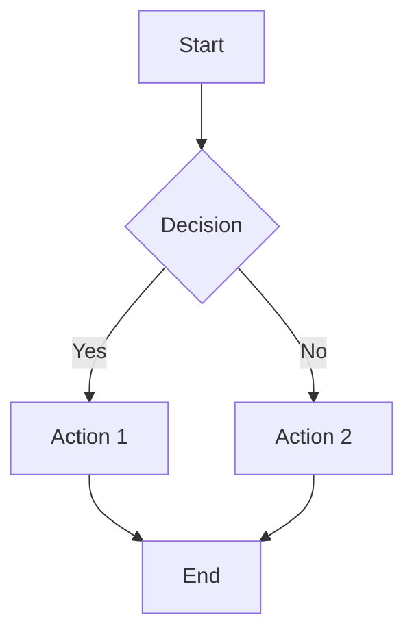
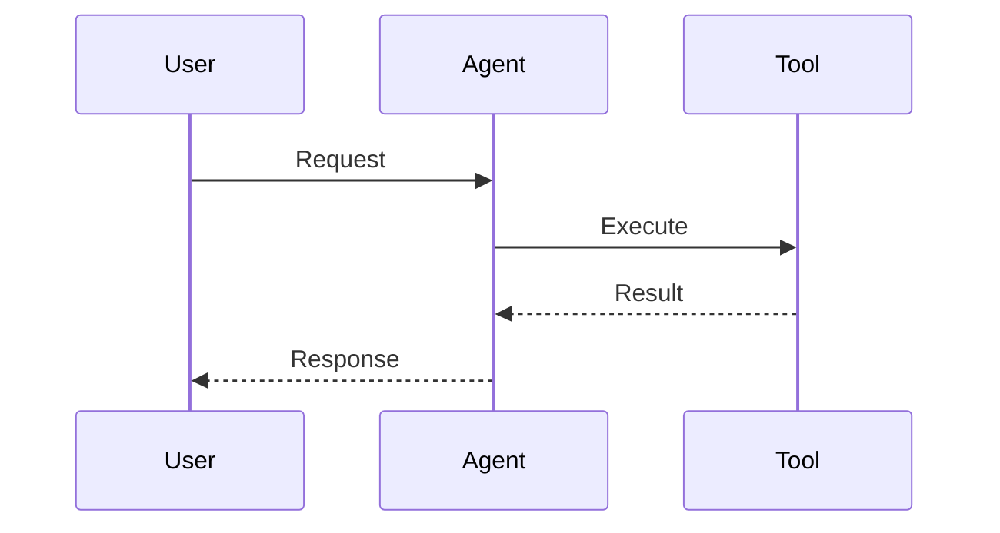

# 📊 Diagrams

> Mermaid diagrams and visual assets

## Diagram Types

| Type | Use Case | Mermaid Syntax |
|------|----------|----------------|
| Flowchart | Processes, workflows | `graph TD` or `graph LR` |
| Sequence | Interactions, APIs | `sequenceDiagram` |
| Class | Relationships, structures | `classDiagram` |
| Mindmap | Concept maps | `mindmap` |
| Timeline | Roadmaps, history | `timeline` |

## Example: Flowchart

## Example: Sequence Diagram

## Rendering

Diagrams are rendered automatically in:
- GitHub Pages (Astro with mermaid plugin)
- README files (GitHub native support)
- Markdown preview in VSCode

## Storage

- **Source**: Keep `.mmd` files for complex diagrams
- **Rendered**: Export PNG for social media sharing
- **Embedded**: Use inline mermaid blocks in articles
