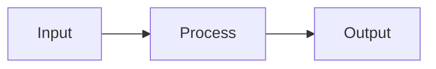

# [Title]

> [One-line hook - the key insight that makes readers want to continue]

## The Problem

Why does this matter? What pain point are we addressing?

- Pain point 1
- Pain point 2
- Pain point 3

## The Concept

Explain the core idea simply. Use analogies from everyday life.

> 💡 **Key Insight**: [The main takeaway in one sentence]

## How It Works

High-level explanation with diagrams.



### Step 1: [First Step]

Explanation...

### Step 2: [Second Step]

Explanation...

### Step 3: [Third Step]

Explanation...

## When to Use It

| Scenario | Use This When | Don't Use When |
|----------|---------------|----------------|
| Scenario 1 | Condition A | Condition B |
| Scenario 2 | Condition C | Condition D |

## Example

Brief, practical example:

```python
# Example code here
def example():
    pass
```

## Key Takeaways

- ✅ Takeaway 1: [Concise point]
- ✅ Takeaway 2: [Concise point]
- ✅ Takeaway 3: [Concise point]

## What's Next

- 📹 **Watch the demo**: [YouTube link]
- 📖 **Related article**: [Link to related content]
- 💬 **Discuss**: Share your thoughts in the comments!

---

*Want more content like this? Follow me on [LinkedIn](link) and subscribe on [YouTube](link).*
