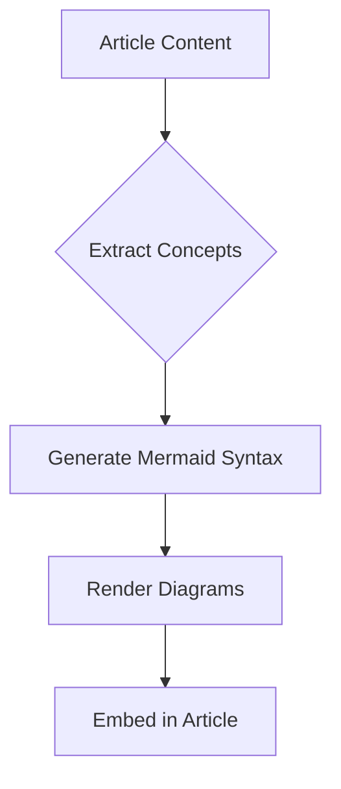

# 🏭 Content Automation Strategy

> Agent-powered content factory for Staff Architect personal brand building

---

## 🎯 Vision

Build a **world-class content automation workspace** that enables:
- **Single Source of Truth**: Write once, publish everywhere with platform optimization
- **Bidirectional Flow**: Article → Video OR Video → Article
- **Consistent Quality**: Templates, automation, and AI-assisted production
- **Compound Growth**: Evergreen pillars + fresh commentary + case studies

---

## 🏗️ Architecture Overview

```
┌─────────────────────────────────────────────────────────────────────────────┐
│                        🧠 CONTENT FACTORY ARCHITECTURE                       │
├─────────────────────────────────────────────────────────────────────────────┤
│                                                                             │
│   ┌──────────────┐     ┌──────────────┐     ┌──────────────┐               │
│   │   📝 IDEAS   │────▶│   📄 DRAFT   │────▶│  ✅ PUBLISH  │               │
│   │   Capture    │     │   Produce    │     │   Distribute │               │
│   └──────────────┘     └──────────────┘     └──────────────┘               │
│         │                    │                    │                        │
│         ▼                    ▼                    ▼                        │
│   ┌──────────────────────────────────────────────────────────────────────┐ │
│   │                    🤖 AGENT AUTOMATION LAYER                          │ │
│   ├──────────────────────────────────────────────────────────────────────┤ │
│   │  • Outline Expander (AI)      • Auto Social Posts                    │ │
│   │  • Diagram Generator          • YouTube Script Generator             │ │
│   │  • SEO Optimizer              • Thumbnail Creator                    │ │
│   │  • Cross-link Manager         • Analytics Tracker                    │ │
│   └──────────────────────────────────────────────────────────────────────┘ │
│                                                                             │
└─────────────────────────────────────────────────────────────────────────────┘
```

---

## 📦 Content Repository Structure

```
/content
├── /articles/              ← Source of truth for long-form
│   ├── multi-agent-architecture.md
│   └── ...
├── /videos/                ← Scripts, timestamps, thumbnails
│   ├── demo-agent-skills/
│   │   ├── script.md
│   │   ├── timestamps.md
│   │   └── thumbnail.png
│   └── ...
├── /social/                ← Generated posts per platform
│   ├── linkedin/
│   └── facebook/
└── /assets/                ← Diagrams, images, templates
    ├── diagrams/
    └── templates/
```

---

## 🔄 Content Flow

### Single Source of Truth (SSOT)

```
/content/articles/multi-agent-architecture.md   ← THE SOURCE
    │
    ├─▶ GitHub Pages (full article)
    ├─▶ LinkedIn (summary + insight + CTA)
    ├─▶ Facebook (teaser + discussion prompt)
    └─▶ YouTube Script (structured for video)
```

### Bidirectional Workflow

**Direction 1: Article → Video**
```
Write Article (deep research) ──▶ Record Video (article as teleprompter)
```

**Direction 2: Video → Article**
```
Record Video (spontaneous demo) ──▶ AI Transcribe ──▶ Generate Article
```

---

## 📢 Platform Strategy

| Platform | Role | Content Format | Frequency |
|----------|------|----------------|-----------|
| **GitHub Pages** | Canonical blog | Full articles (~10 min read) | 1-2/month |
| **LinkedIn** | Professional reach | Summary + key insight + link | Per article |
| **Facebook Page** | Community discussion | Teaser + discussion prompt | Per article |
| **YouTube** | Demo & showcase | Video walkthrough + article link | 1-2/month |

---

## 🤖 Automation Components

### 1. Article → Social Post Generator

Transforms source article into platform-native posts:

```markdown
INPUT: /articles/multi-agent-architecture.md

OUTPUT LinkedIn:
🧠 Multi-Agent Architecture: The Orchestra Analogy

One model can't do everything. Here's why the orchestra 
analogy changes how we build AI systems...

Key takeaway: Specialized agents > monolithic models

Read the full article: [link]

#MultiAgentAI #LLM #SoftwareArchitecture

OUTPUT Facebook:
🚀 New article: Multi-Agent Architecture

Why do orchestras work better than one-man bands?
The same principle applies to AI systems...

What's your experience building multi-agent systems? 👇

[link]
```

### 2. Diagram Generator

Auto-generate Mermaid diagrams from article content:



### 3. YouTube Script Generator

Transform article into video-optimized script:

```markdown
INPUT: Article sections

OUTPUT: Script with:
- Hook (0:00-0:30)
- Problem (0:30-2:00)
- Solution (2:00-6:00)
- Demo (6:00-8:00)
- Call to Action (8:00-10:00)
```

### 4. Cross-Link Manager

Automatically maintain bidirectional links:

```markdown
In Articles:
> 📹 **Watch the demo**: See this in action: [YouTube link]

In YouTube:
- Pinned comment: Read the full article: [link]
- Description: Full article with code examples: [link]
```

---

## 🚀 Publishing Pipeline (CI/CD)

```
┌──────────────────────────────────────────────────────────────────────┐
│                    GitHub Actions Pipeline                            │
├──────────────────────────────────────────────────────────────────────┤
│                                                                       │
│   1. Article Merged to Main                                          │
│         │                                                             │
│         ▼                                                             │
│   2. Build Blog (Astro/Hugo)                                         │
│         │                                                             │
│         ▼                                                             │
│   3. Deploy to GitHub Pages                                          │
│         │                                                             │
│         ▼                                                             │
│   4. Generate Social Posts (AI Agent)                                │
│         │                                                             │
│         ├─▶ LinkedIn post → /social/linkedin/                        │
│         └─▶ Facebook post → /social/facebook/                        │
│                                                                       │
│   5. (Optional) Schedule via Buffer/Later                            │
│                                                                       │
└──────────────────────────────────────────────────────────────────────┘
```

---

## 🗓️ Implementation Roadmap

### Phase 1: Foundation (Week 1-2)
- [ ] Set up GitHub Pages blog (Astro recommended)
- [ ] Create content repository structure
- [ ] Build article template with frontmatter
- [ ] Publish first 2 articles manually

### Phase 2: Basic Automation (Week 3-4)
- [ ] GitHub Actions → Auto-deploy on merge
- [ ] Agent: Article → LinkedIn post generator
- [ ] Agent: Article → Facebook post generator
- [ ] Mermaid diagram auto-rendering

### Phase 3: Full Automation (Month 2)
- [ ] Video transcription → Article draft pipeline
- [ ] AI thumbnail generator
- [ ] Social media scheduling integration
- [ ] YouTube script generator

### Phase 4: Optimization (Ongoing)
- [ ] Analytics dashboard
- [ ] A/B test headlines
- [ ] Engagement-driven content recommendations

---

## 📊 Success Metrics

| Metric | Target (6 months) |
|--------|-------------------|
| Articles published | 10-15 |
| YouTube videos | 10-15 |
| LinkedIn followers | +500 |
| GitHub stars on blog | 50+ |
| YouTube subscribers | 200+ |
| Avg article engagement | 100+ reactions |

---

## 🎨 Staff Architect Brand Pillars

| Pillar | Content Focus |
|--------|---------------|
| **Technical Depth** | Deep-dive articles, architecture decisions, trade-offs |
| **Strategic Thinking** | "Why" before "How", business impact framing |
| **Teaching Ability** | Clear explanations, frameworks, diagrams |
| **Production Experience** | Real examples, lessons learned, failure stories |

---

## 📚 Content Types

| Type | Description | Frequency |
|------|-------------|-----------|
| **Evergreen Pillars** | Foundational articles defining expertise | 5-10 total |
| **Fresh Commentary** | Quick takes on trends, new tools | Weekly |
| **Case Studies** | Real implementation stories | Monthly |
| **Video Demos** | Product showcases, tutorials | 1-2/month |

---

## 🔗 Related Documents

- [Content Strategy](../content-strategy.md) - Original planning document
- [Article Template](../templates/article-template.md) - Standard article format
- [Social Templates](../templates/social-templates.md) - Platform-specific formats
